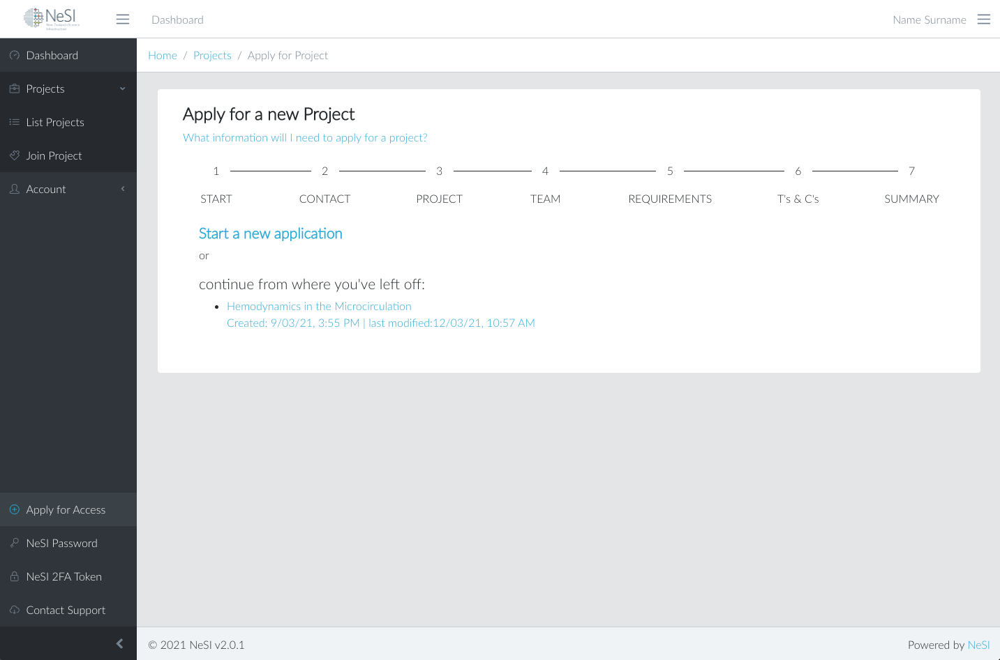

See [Applying for a NeSI project](../../Getting_Started/Accounts-Projects_and_Allocations/Applying_for_a_new_NeSI_project.md) 
for how to access the form.

## Preparing a request to use NeSI resources

The procedures for starting a request for a new NeSI project and editing
an in-progress request (draft) that you previously started are described
below.

1. Point your web browser to
    [https://my.nesi.org.nz](https://my.nesi.org.nz/projects/apply) and
    login. Select "Apply for Access" from the sidebar navigation on the
    left.  
    
2. Choose from the following items:
    - If you are returning to continue work on a draft request you
        started earlier, choose the link based on the date/time or title
        you've set.
    - For a new project request, select "Start a new
        application. Note, this is the default in case there is not
        draft request for your account.
3. When your request is ready to submit, progress through the form
    sections using the 'Next' button at the bottom of the page until you
    reach the 'Summary' section. After clicking the 'Submit' button and
    passing the validation the request is submitted for review. You will
    also receive a confirmation via email.

### Saving a Request for Later

Once you've started filling in details, the system will automatically
save a draft.

### Asterisks to indicate mandatory data next to questions

The request can only be successfully submitted once all mandatory data
has been entered. The final section in the form 'Summary' will highlight
missing data and allow you to navigate back to the relevant section.
 