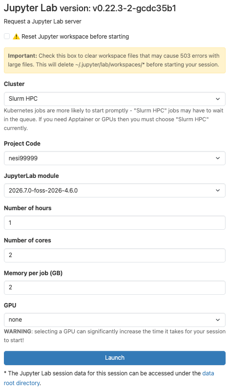

Apptainer containers can be run as kernels in JupyterLab, so that the code in
your notebook executes inside the container.

## Adding a container as a kernel to JupyterLab

There are two ways to run a container as a kernel; select the tab that suits you:

- **Tool-Assisted Management**: uses the `nesi-add-kernel` command line tool to
    automate most of the setup. This is the **recommended** approach if possible.
- **Manual Management**: you set up the kernel and its wrapper script by hand.
    This can be useful when you need more control over how the kernel is launched.

!!! warning

    To use containers you must launch your Jupyter session with **Cluster** set
    to **Slurm HPC** and the **JupyterLab module** set to
    **2026.7.0-foss-2026-4.6.0**. If you do not see **Slurm HPC** in the
    **Cluster** list, [get in touch](mailto:support@nesi.org.nz).

    <p align="center"></p>

=== "Tool-Assisted Management"

    The `nesi-add-kernel` tool can register a container as a kernel for you.
    **This is the recommended way to run a container as a kernel.**

    First you need to open a terminal. It can be from a session on Jupyter via
    OnDemand or from a regular ssh connection on the Mahuika login node.

    - If you use the ssh option, make sure to load the JupyterLab module to have
        access to the `nesi-add-kernel` tool:

        ``` sh
        module purge  # remove all previously loaded modules
        module load JupyterLab
        ```

    There are two ways to run a container as a kernel; select the tab that suits
    your container:

    === "Python kernel"

        This runs a **Python** kernel *inside* the container. The container must
        provide a Python interpreter with the `ipykernel` package installed.

        ``` sh
        nesi-add-kernel <kernel_name> -cp <container_image.sif>
        ```

        Where:

        - `<kernel_name>`: the name you want to give the kernel.
        - `<container_image.sif>`: the path to your Apptainer container image.

    === "Bash kernel"

        This runs a **bash** kernel that dispatches every cell into the
        container.

        ``` sh
        nesi-add-kernel <kernel_name> -cb <container_image.sif>
        ```

        Where:

        - `<kernel_name>`: the name you want to give the kernel.
        - `<container_image.sif>`: the path to your Apptainer container image.

    !!! tip "Passing arguments to Apptainer"

        Use the `--container-args` option to pass additional arguments through to
        the `apptainer exec` command (this works for both `-cp` and `-cb`).
        Because these arguments start with `-`, use the `=` form so they are not
        mistaken for options to `nesi-add-kernel` itself. For example, to enable
        GPU support:

        ``` sh
        nesi-add-kernel <kernel_name> -cp <container_image.sif> --container-args="--nv"
        ```

        Multiple arguments can be passed together:

        ``` sh
        nesi-add-kernel <kernel_name> -cp <container_image.sif> --container-args="--nv --pwd /opt/app"
        ```

    !!! tip

        For more information about `nesi-add-kernel`, type into the terminal:

        ``` sh
        nesi-add-kernel --help
        ```

=== "Manual Management"

    You can also set up a container kernel by hand. You can build a kernel that
    uses a container's version of python or bash:

    === "Python kernel"

        This runs a **Python** kernel *inside* the container (the manual
        equivalent of the `-cp` option), so the container must provide a Python
        interpreter with the `ipykernel` package installed.

        First, change directory into the path where you would like to place your
        wrapper script.

        - If you would like to share it with other members of your project, use
            your project folder (`cd /nesi/project/<project-code>`).
        - Avoid paths that include `00_nesi_projects` or `home`, as these cause
            issues.

        Second, create a file called `wrapper.sh` with the following contents
        (replace `<full_path_to_your_container>` with the path to your container
        image):

        ``` sh
        #!/usr/bin/env bash

        # start with a clean environment
        module purge

        # isolate the container interpreter from your ~/.local site-packages
        export APPTAINERENV_PYTHONNOUSERSITE=True

        # bind the directory holding the Jupyter connection file (the last
        # argument) so the in-container interpreter can read it
        for connection_file in "$@"; do :; done
        connection_dir="$(dirname "$connection_file")"

        # run a python kernel inside the container
        exec apptainer exec -B "$connection_dir" --nv <full_path_to_your_container> python "$@"
        ```

        Make the wrapper script executable:

        ``` sh
        chmod +x wrapper.sh
        ```

        Third, create a directory for your kernel:

        ``` sh
        mkdir -p ~/.local/share/jupyter/kernels/my-container
        cd ~/.local/share/jupyter/kernels/my-container
        ```

        and create a file called *kernel.json*. The file should look like this:

        ```json
        {
            "argv": [
                "<path_to_wrapper.sh>/wrapper.sh",
                "-m",
                "ipykernel_launcher",
                "-f",
                "{connection_file}"
            ],
            "display_name": "Container Name",
            "language": "python"
        }
        ```

        - Change `display_name` to what you would like to call your kernel by.

        After refreshing JupyterLab your new kernel should show up in the
        Launcher under the display name you set in `kernel.json` (`Container
        Name` in the example above).

    === "Bash kernel"

        This runs a **bash** kernel on the host that dispatches every cell into
        the container (the manual equivalent of the `-cb` option). To do this you
        first need to set up a Python virtual environment, in the same way as the
        Manual Management approach described on the
        [Python and R kernels in JupyterLab](./python_and_r_kernels_in_JupyterLab.md)
        page.

        In brief, the steps below create a Python virtual environment, install
        `bash_kernel` into it, write a wrapper script that points `bash_kernel` at
        your container, and then register that wrapper as a Jupyter kernel.

        First, change directory into the path where you would like to place your
        virtual environment.

        - If you would like to share it with other members of your project, use
            your project folder (`cd /nesi/project/<project-code>`).
        - Avoid paths that include `00_nesi_projects` or `home`, as these cause
            issues.

        Second, in a terminal run the following commands to load a Python
        environment module:

        ``` sh
        module purge
        module load Python/3.14.4-foss-2026
        ```

        Now create a Python virtual environment named `my-container-venv`. You can
        change the name of the environment and install other Python packages as
        required.

        ``` sh
        python3 -m venv ./my-container-venv
        source ./my-container-venv/bin/activate
        pip install --upgrade pip
        ```

        Third, install `bash_kernel` in your virtual environment.

        ??? note "What is bash_kernel?"

            `bash_kernel` runs a bash shell as a Jupyter kernel. Here we point that bash shell at your container, so every cell you run in JupyterLab executes inside the container. It feels like a normal JupyterLab session, but the commands run in your container rather than on the host.

        ``` sh
        pip install git+https://github.com/geoffreyweal/bash_kernel
        ```

        Fourth, create a wrapper for your virtual environment. Change directory
        into your `my-container-venv` folder:

        ``` sh
        cd my-container-venv
        ```

        And add the following as `wrapper.sh` into your `my-container-venv` folder:

        ``` sh
        #!/usr/bin/env bash

        # load required modules here
        module purge
        module load Python/3.14.4-foss-2026

        # activate the virtual environment that has bash_kernel installed
        source <full_path_to_your_venv>/my-container-venv/bin/activate

        # run the kernel on the host (it dispatches every command into the container)
        exec python3 "$@"
        ```

        Make the wrapper script executable:

        ``` sh
        chmod +x wrapper.sh
        ```

        Fifth, create a directory for your kernel:

        ``` sh
        mkdir -p ~/.local/share/jupyter/kernels/bash
        cd ~/.local/share/jupyter/kernels/bash
        ```

        and create a file called *kernel.json*. The file should look like this:

        ```json
        {
            "argv": [
                "<path_to_wrapper.sh>/wrapper.sh",
                "-m",
                "bash_kernel",
                "-f",
                "{connection_file}"
            ],
            "display_name": "Container Name",
            "language": "bash",
            "env": {
                "BASH_KERNEL_CMD": "apptainer exec --nv <full_path_to_your_container> bash"
            }
        }
        ```

        - Change `display_name` to what you would like to call your kernel by.
        - Update the `apptainer exec` line in `BASH_KERNEL_CMD` to match your own
            image, for example:

            ``` sh
            "BASH_KERNEL_CMD": "apptainer exec --pwd /opt/PMDM --nv /nesi/project/<project-code>/containers/PMDM/pmdm_cu130.simg bash"
            ```

        After refreshing JupyterLab your new kernel should show up in the Launcher
        under the display name you set in `kernel.json` (`Container Name` in the
        example above).

## Listing your kernels

To list all the kernels that are currently installed, run:

``` sh
module purge
module load JupyterLab
jupyter-kernelspec list
```

This works for any kernel, regardless of whether it was registered using the
Tool-Assisted Management or Manual Management approach.

## Sharing a kernel

You can also configure a shared container kernel that others with access to the
same project will be able to load. Whichever approach you use, make sure the
container image (and, for a bash kernel, the virtual environment and
`wrapper.sh`) live in a shared location such as your project folder
(`/nesi/project/<project-code>`) — other users cannot read your home directory.
How you share depends on whether you registered the kernel with the
tool-assisted or manual approach:

=== "Tool-Assisted Management"

    To share a container kernel, register it with `nesi-add-kernel` as you
    normally would, but add the `--shared` flag. This installs the kernel into
    your project's shared location, so other members of your project will see it
    automatically. Select the tab for the kind of container kernel you are
    sharing:

    === "Python kernel"

        ``` sh
        nesi-add-kernel --shared <kernel_name> -cp <container_image.sif>
        ```

        Where `<kernel_name>` is the name you want to give to the kernel. Note
        the `--shared` flag in the `nesi-add-kernel` command line.

    === "Bash kernel"

        ``` sh
        nesi-add-kernel --shared <kernel_name> -cb <container_image.sif>
        ```

        Where `<kernel_name>` is the name you want to give to the kernel. Note
        the `--shared` flag in the `nesi-add-kernel` command line.

    !!! note

        Run `nesi-add-kernel --shared` from a terminal inside a Jupyter session
        on OnDemand so it can detect your project. From a regular ssh session you
        will also need to pass the project code with the `--account` option, for
        example `nesi-add-kernel --shared --account <project-code> ...`.

=== "Manual Management"

    For a manually-created kernel, **you** first create the kernel yourself,
    following the manual steps in the **Manual Management** tab earlier on this
    page, but making sure the container image and `wrapper.sh` (and, for a bash
    kernel, the virtual environment) are all in your shared project folder.

    Next, **your team members** set up the kernel on their side by creating the
    kernelspec in their own home directory. The steps depend on the type of
    container kernel you created, so follow the matching tab:

    === "Python kernel"

        **Your team members** create a directory for the kernel:

        ``` sh
        mkdir -p ~/.local/share/jupyter/kernels/my-container
        cd ~/.local/share/jupyter/kernels/my-container
        ```

        and create a file called *kernel.json* that points at the shared
        `wrapper.sh`. The file should look like this:

        ```json
        {
            "argv": [
                "<path_to_shared_wrapper.sh>/wrapper.sh",
                "-m",
                "ipykernel_launcher",
                "-f",
                "{connection_file}"
            ],
            "display_name": "Container Name",
            "language": "python"
        }
        ```

        - Change `display_name` to what you would like to call your kernel by.

        After refreshing JupyterLab the shared kernel should show up in the
        Launcher.

    === "Bash kernel"

        **Your team members** create a directory for the kernel:

        ``` sh
        mkdir -p ~/.local/share/jupyter/kernels/bash
        cd ~/.local/share/jupyter/kernels/bash
        ```

        and create a file called *kernel.json* that points at the shared
        `wrapper.sh`. The file should look like this:

        ```json
        {
            "argv": [
                "<path_to_shared_wrapper.sh>/wrapper.sh",
                "-m",
                "bash_kernel",
                "-f",
                "{connection_file}"
            ],
            "display_name": "Container Name",
            "language": "bash",
            "env": {
                "BASH_KERNEL_CMD": "apptainer exec --nv <full_path_to_your_container> bash"
            }
        }
        ```

        - Change `display_name` to what you would like to call your kernel by.

        After refreshing JupyterLab the shared kernel should show up in the
        Launcher.

## Removing a kernel

To delete a specific kernel, run:

``` sh
module purge
module load JupyterLab
jupyter-kernelspec list
jupyter-kernelspec remove <kernel_name>
```

where `<kernel_name>` is the name of the kernel to delete, as shown by
`jupyter-kernelspec list`.
