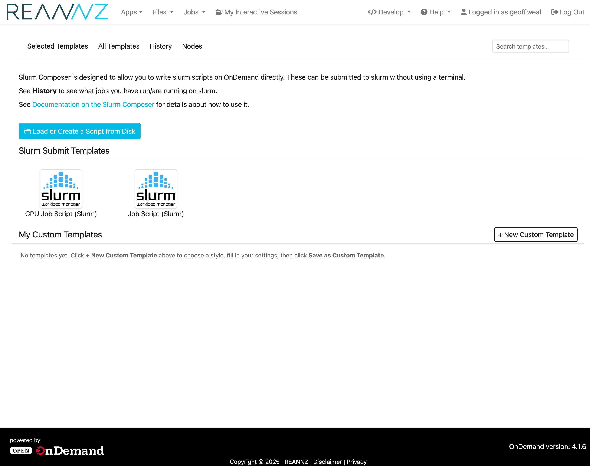
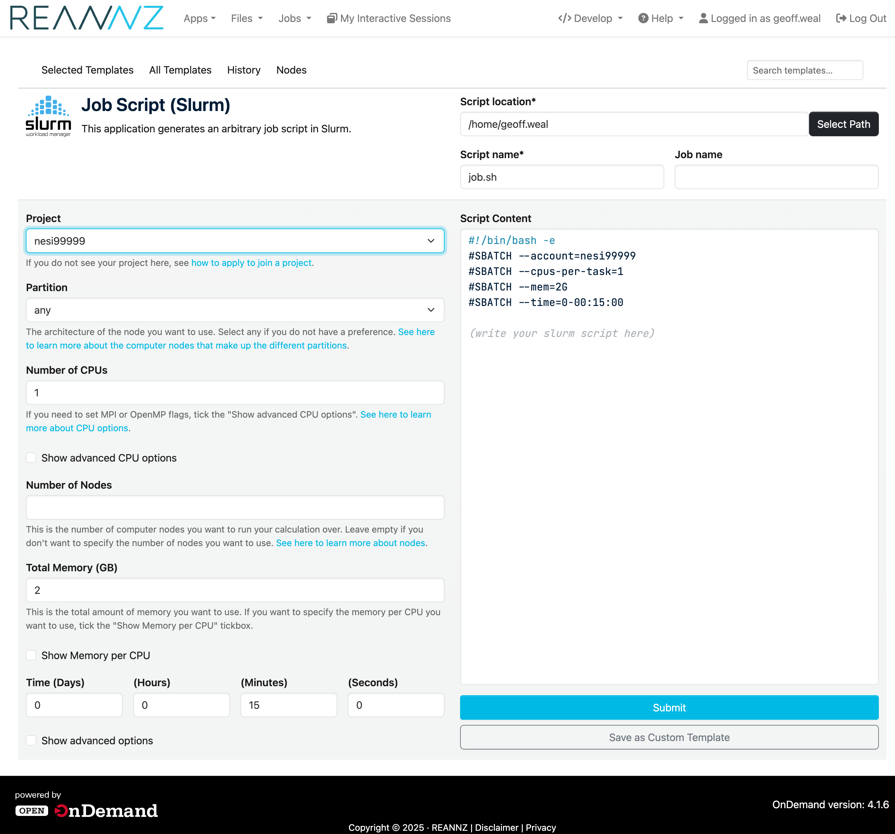
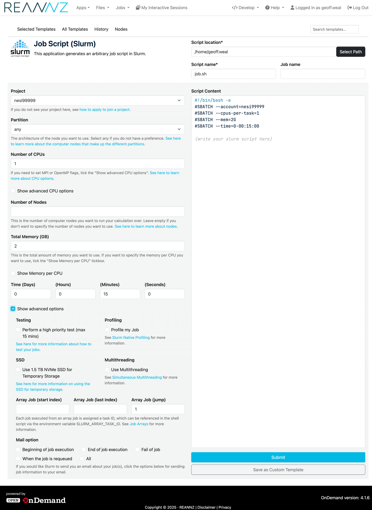
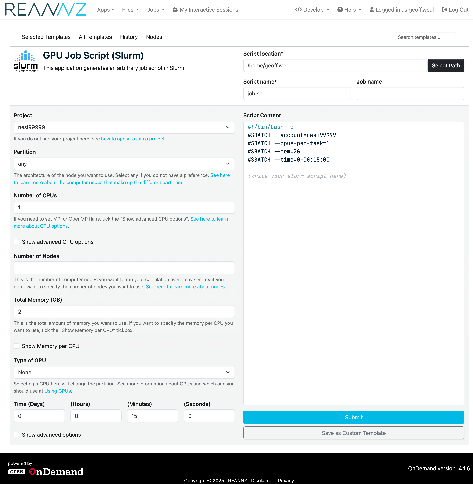
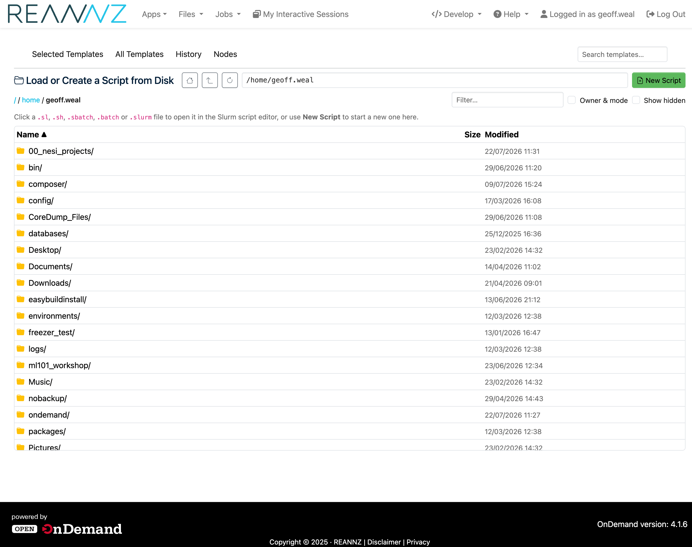
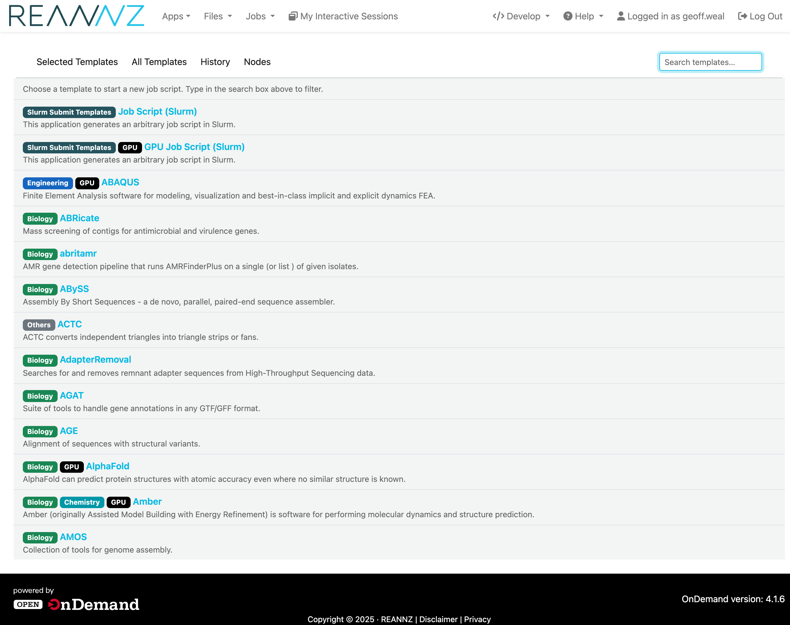
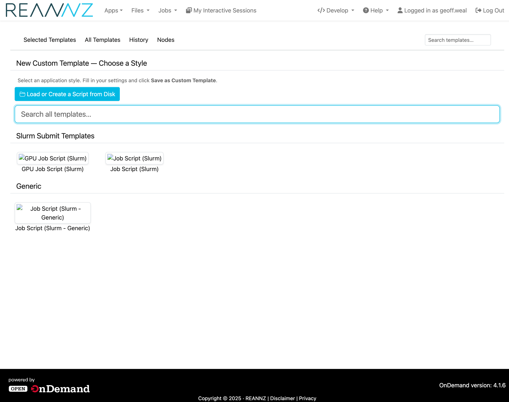
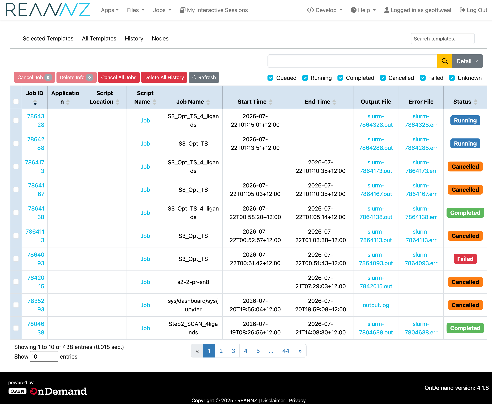
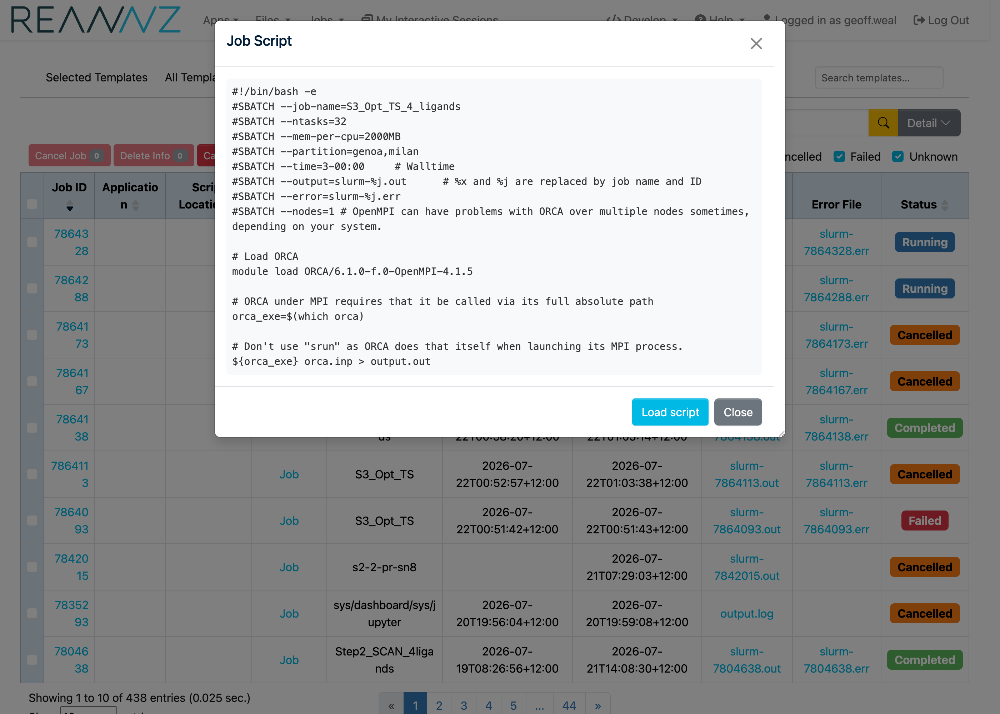
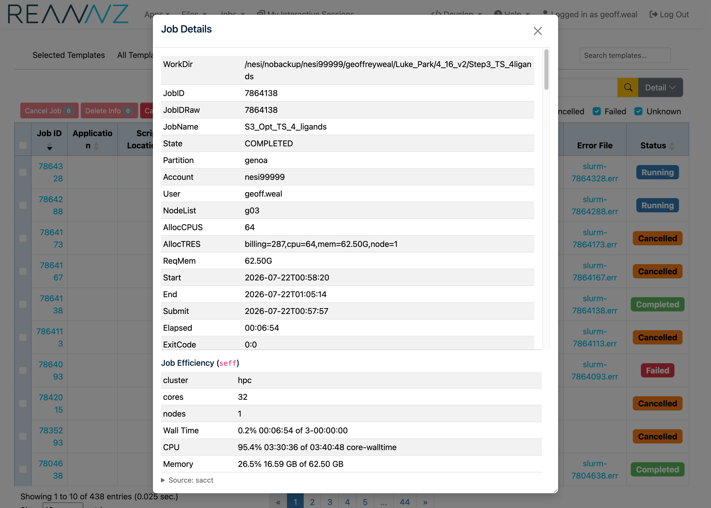

# Slurm Composer

## Introduction

**Slurm Composer** lets you write, submit and track [Slurm](../../../Batch_Computing/Batch_Computing_Guide.md) batch jobs from your web browser — no terminal required. You fill in a simple form (project, partition, CPUs, memory, time limit, …) and it builds the matching `#SBATCH` job script for you, which you can review, edit and submit directly to the scheduler.

It is well suited to people who are new to the command line, and to anyone who wants to put together a job script quickly without remembering every Slurm option.

!!! prerequisite
    Requires [an account](https://www.nesi.org.nz/researchers/apply-access-our-services) and membership of at least one [project](../../../Getting_Started/Projects/Applying_to_Join_a_Project.md).

## Opening Slurm Composer

1. Log in to [Mahuika OnDemand](https://ondemand.nesi.org.nz/).
2. From the top menu choose **Jobs → Slurm Composer** (or open the Slurm Composer tile).

The home page is the **Selected Templates** page:

The page is organised into:

- **Slurm Submit Templates** — the two starting points: **Job Script (Slurm)** for a CPU job and **GPU Job Script (Slurm)** for a job that needs a GPU.
- **My Custom Templates** — job configurations you have saved yourself (see [My Custom Templates](#my-custom-templates) below).
- The navigation bar with **History**, **Nodes**, the **File Directory**, **Mahuika SSH** (shell access) and **Return to OnDemand**.

## Building a job script

Click **Job Script (Slurm)** to open the form. The form is on the left and the **Script Content** it generates is shown live on the right — every change you make to the form updates the script.

The main fields are:

| Field | What it sets | Slurm option |
| ----- | ------------ | ------------ |
| **Project** | The project code your usage is charged to. Only projects you belong to are listed. | `--account` |
| **Partition** | The type of node to run on. Choose **any** if you have no preference. Options are either `genoa` or `milan`. [See here for more information about the nodes that make up these partitions](../../../Batch_Computing/Hardware.md#compute-nodes). | `--partition` |
| **Number of CPUs** | How many CPU cores to request. | `--cpus-per-task` |
| **Number of Nodes** | How many nodes to spread the job over (leave blank for the default). | `--nodes` |
| **Total Memory (GB)** | Total RAM for the whole job. | `--mem` |
| **Time (Days / Hours / Minutes / Seconds)** | The wall-clock time limit. | `--time` |

!!! tip
    Each field has a short explanation underneath it, and several link out to the relevant Mahuika documentation (for example [how to apply to join a project](../../../Getting_Started/Projects/Applying_to_Join_a_Project.md), [Parallel Computing](../../../Software/Parallel_Computing/Parallel_Computing.md) and [Using GPUs](../../../Batch_Computing/Using_GPUs.md)).

### Advanced CPU options

By default **Number of CPUs** requests CPU cores for a single task (`--cpus-per-task`), which is what most jobs need. If you are running an **MPI** job or want to control tasks and threads separately, tick **Show advanced CPU options**. This replaces the single field with two:

- **Number of MPI processes (`ntasks`)** — the number of separate tasks/processes (`--ntasks`).
- **Number of OpenMP threads (`cpus-per-task`)** — the cores given to each task (`--cpus-per-task`).

### Advanced options

Tick **Show advanced options** to reveal extra settings:

- **Testing** — submit as a short, high-priority test job (handy for checking a script runs before committing a long allocation).
- **Profiling** — record resource-usage information about the job (see [Slurm Native Profiling](../../../Software/Profiling_and_Debugging/Slurm_Native_Profiling.md)).
- **SSD** — request a fast local NVMe SSD for temporary storage (`--gres=ssd`). Point your job's temporary files at `${TMPDIR}` to use it.
- **Multithreading** — enable simultaneous multithreading (`--threads-per-core=2`); see [Simultaneous Multithreading](../../../Software/Parallel_Computing/Simultaneous_Multithreading.md).
- **Array Job** — run the same script many times as a [job array](../../../Batch_Computing/Job_Arrays.md), using a start index, last index and step.
- **Mail option** — email you when the job begins, ends, fails, and so on.

### Editing the script directly

The **Script Content** box is editable. You can fine-tune the generated `#SBATCH` lines or add the commands your job should run (loading modules, calling your program, etc.) before submitting. Form-driven lines stay in sync as you change widgets, while lines you add by hand are preserved.

## GPU jobs

Choose **GPU Job Script (Slurm)** for work that needs a GPU. It has the same fields as the CPU form plus a **Type of GPU** selector. Picking a GPU type automatically moves the job to a partition that provides it.

See [Using GPUs](../../../Batch_Computing/Using_GPUs.md) for guidance on choosing GPU types and counts.

## Submitting and finding your job

When you are happy with the script, click **Submit**. The script is written to the **Script location** shown at the top of the form (default: your home directory, as **Script name** e.g. `job.sh`) and submitted to Slurm. You can then track it on the [History page](#tracking-jobs-history).

## Loading or creating a script

Click **Load or Create a Script from Disk** (on the Selected Templates page, and on the New Custom Template page) to open a full-page browser of your files on the cluster.

It works much like the OnDemand **Files** app:

- **Navigate** by clicking folders, the **Home** and **Up** buttons, or by typing a path straight into the path box. **Refresh** re-reads the current folder, and your browser's Back/Forward buttons step through the folders you have visited.
- **Sort** by clicking the **Name**, **Size** or **Modified** headings; **Filter** the list by typing in the filter box; and tick **Show hidden** to include dot-files or **Owner & mode** to show each entry's owner and permissions.

### Load an existing script

Click a `.sl`, `.sh`, `.sbatch`, `.batch` or `.slurm` file to open it in the Slurm script editor, where you can review, edit and submit it — or save it as a custom template. Files that are not scripts are shown greyed-out and cannot be selected.

### Create a new script

Click **New Script** to start a new one. This opens a template picker listing every template — with **Job Script (Slurm)** and **GPU Job Script (Slurm)** at the top — which you can narrow with the search box at the top right of the screen.

Pick a template and its form opens ready to fill in, with the **Script location** already set to the folder you were browsing.

## My Custom Templates

Custom templates let you save a job configuration and reuse it later, so you do not have to fill in the form from scratch each time.

- **Create one** by clicking **+ New Custom Template**, choosing a style, filling in your settings and clicking **Save as Custom Template**.

    

- **Reuse one** by clicking its tile on the home page — the form opens pre-filled with your saved values.
- **Edit** the name/description with the pencil icon, or **delete** it with the red ✕ on its tile.
- **Search** your templates with the box next to **+ New Custom Template**.
- **Reorder** them by dragging the tiles with your mouse; the order is remembered.

## Tracking jobs (History)

The **History** page lists the jobs you have submitted, with their status, start/end times, script location and output/error files.

From here you can:

- Filter by status (**Queued**, **Running**, **Completed**, **Cancelled**, **Failed**) with the checkboxes.
- Click a **Job ID** or **Script Name** to view details, or open the **Output File** / **Error File**.
- **Cancel** a running job, or remove entries with **Delete Info** / **Delete All History**.
- **Refresh** to update statuses.

### Viewing a job's script

Click a job's **Script Name** to open the **Job Script** window, which shows the exact script that was submitted:

Click **Load script** to reopen the job in the form with its values filled in — handy for re-running it or using it as the basis for a new job.

### Checking your job's efficiency

For a job that has **finished** (Completed, Failed or Cancelled), click its **Job ID** to open the **Job Details** window. At the bottom, under **Job Efficiency (`seff`)**, you can see how much of what you requested the job actually used:

Each row shows a percentage followed by *used* **of** *requested*:

- **Wall Time** — how long the job ran versus the time limit you set (`--time`). In the example above the job ran for 8 seconds of a 5-minute limit (2.7%).
- **CPU** — how much CPU work was done versus the cores × runtime you reserved (the *core-walltime*). A low value usually means you asked for more cores than the job could keep busy.
- **Memory** — the peak memory used versus the memory you requested (`--mem`). Here only 3.70 MB of 512 MB was used (0.7%).
- **GPU Utilisation** / **GPU Memory** — shown for GPU jobs, indicating how hard the GPU and its memory were worked.

!!! tip "Right-size your next job"
    Use these numbers to adjust your next submission. If **Memory** sits well below 100%, lower **Total Memory (GB)**; if **CPU** efficiency is low, request fewer CPUs; and if **Wall Time** is a small fraction of your limit, shorten the time request. Asking for closer to what you actually use means your jobs start sooner and leave resources free for others. If you are unsure about how to improve these numbers, [contact Mahuika Support](https://www.nesi.org.nz/support/getting-help) and we will be happy to help.

## Checking node availability (Nodes)

The **Nodes** page shows the current state of the cluster's compute nodes — how many CPUs, how much memory and which GPUs are free versus in use.

## Getting help

If you run into problems, see the [OnDemand troubleshooting guide](../ood_troubleshooting.md) or [contact Mahuika Support](https://www.nesi.org.nz/support/getting-help).
