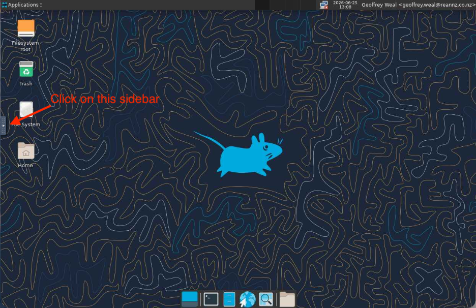
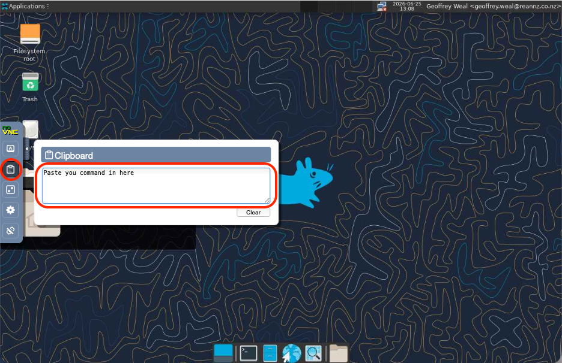

# Virtual Desktop via OnDemand

## Introduction

The Virtual Desktop application provides a full graphical Linux desktop environment running on Mahuika, accessed through your web browser. This is useful for running applications that need a graphical user interface (GUI), visualising data, or working with tools that are not well suited to a command-line-only environment.

## Using the Virtual Desktop

The Virtual Desktop behaves like a standard Linux desktop. From here you can:

- Open a terminal to run commands.
- Launch graphical applications.
- Browse files in your Mahuika home, project, and nobackup directories.

### Copy and paste

Copying and pasting between your local machine and the Virtual Desktop is handled through the clipboard tool in the control bar rather than the usual keyboard shortcuts. Use this panel to transfer text in and out of the session (if you have difficulty doing so with keyboard shortcuts).

First, open the VNC sidebar by clicking the tab on the left edge of the screen.

Then click the clipboard icon to open the **Clipboard** panel, and paste your text into it.

## Ending your session

When you have finished, return to the **My Interactive Sessions** page in OnDemand and click **Cancel** on the Virtual Desktop session to release the resources. Sessions will also end automatically once the requested time has elapsed.

!!! warning
    Any unsaved work in the Virtual Desktop will be lost when the session ends. Make sure to save your files to your home, project, or nobackup directory before deleting the session.

## External documentation

- [Mahuika OnDemand](https://ondemand.nesi.org.nz/)
