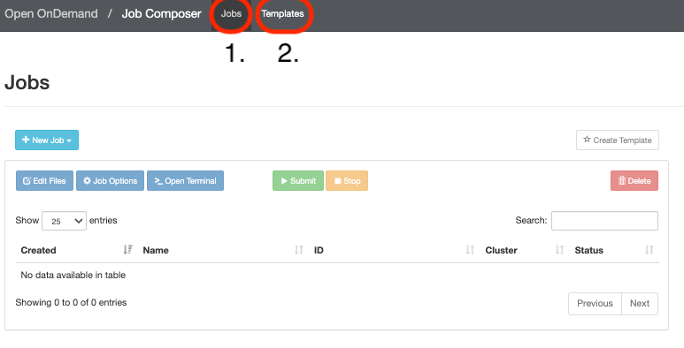
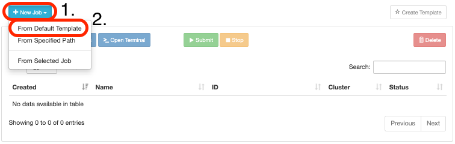
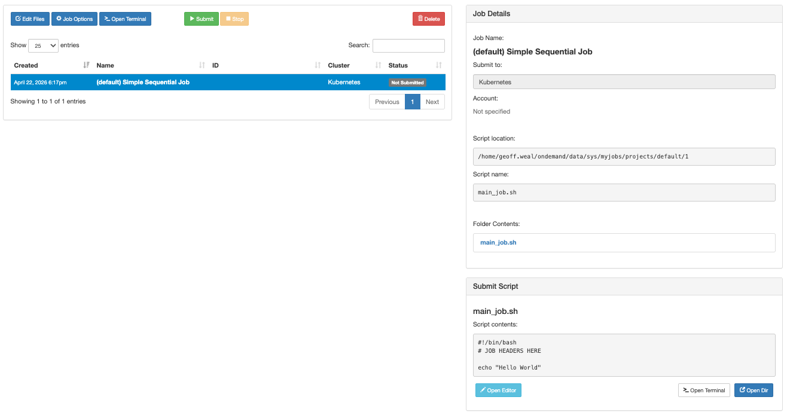

# Creating New Jobs: `Job Composer`

The `Job Composer` page allows you to set up your submit script and files for a job from within the Mahuika OnDemand platform. To access the `Job Composer` page, click the `Jobs` tab at the top left of the Ondemand screen, then click on `Job Composer`. This will open a new tab in your browser, showing the `Job Composer`

## The `Job Composer` page

There are two tabs at the top of this page:

1. [`Jobs`](#the-jobs-page): Create and run jobs
2. [`Template`](#the-template-page): Create a slurm submit template to use.

## The `Jobs` Page

This page allows you to create and submit jobs to slurm. To set-up a job:

**First**, click the `+ New Job` button `-->` `From Default Template`:

This will open allow you to select new buttons in the left hand screen. Clicking on a job will open a new window called `Job Details` on the right of the screen

**Second**, to edit the location of your 

## The `Template` Page

