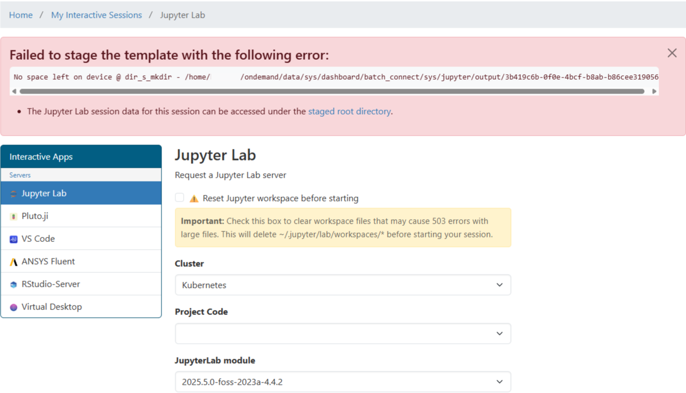
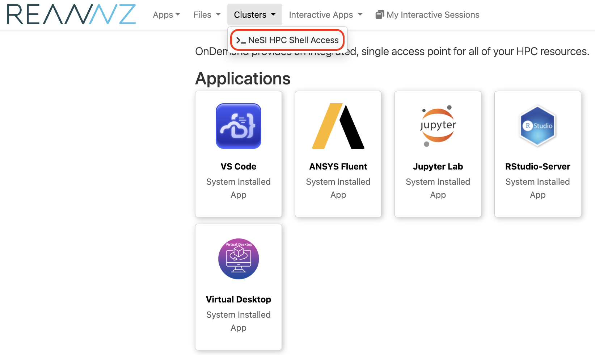
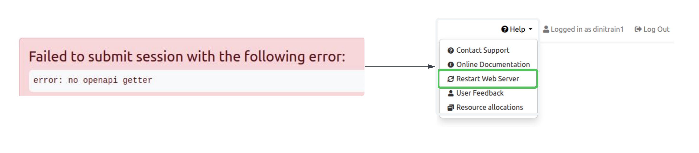
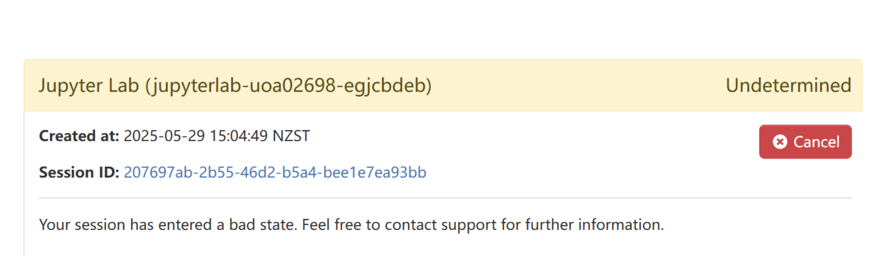
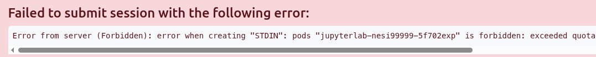

## Login

### `Error -- can't find user for`

If you see this message after logging in, It is an indication the account associated with your username was not provisioned correctly or doesn't exist.

Please  and we will be able to fix this problem.

### `We're sorry, but something went wrong`

{.center width="400"}

If you are encounter the following error during login, it is an indication of your home directory being full.
OnDemand relies on some space being available on the home directory to open and maintain per session logs.
The solution for this is to clear up some space in the home directory. You can still login to the cluster via another terminal client (`ssh`) to review and clean/delete content from home directory. If you don't have or having difficulty with setting up a terminal client setup for `ssh` access, 

### `No space left on device`

This error indicates that your home drive is full. You will probably see an image like this:



To resolve this issue:

1. Select `Clusters` -> `NeSI HPC Shell Access`

    

2. Log in to your NeSI account through the terminal.
3. Type into the terminal ```nn_storage_quota```. This will show the amount of space in your `home`, `project`, and `nobackup` directories. You will see that your `home` directory is full.

    ```sh 
    username@login03:~$ nn_storage_quota 
    Quota_Location                          AvailableGiB           UsedGiB Use%
    home_username                                     20                20  100
    ```

4. Type into the terminal:

    ```sh
    cd
    du -hs $(ls -A)
    ```

5. The `du -hs $(ls -A)` command will list the size of the files and folders that your `home` directory contains. You will need to move/remove files and folders off the `home` directory. 
6. Once you have space free in your `home` directory, try using your OnDemand Apps again. 

## App Initialisation

### `error: no openapi getter`



Restart the web server via <kbd>Help</kbd> **>** <kbd>Restart Web Server</kbd>

### Stuck in **Undetermined** state



Terminate the session with <kbd>Cancel</kbd> **>** <kbd>Delete</kbd> and re-open a new session

### `forbidden exceeded quota`



Current OnDemand implementation has a **two concurrent app sessions per account**. Above `exceeded quota` is an indication that you already have two app sessions running. ( Go to <kbd>My Interactive Sessions</kbd> to confirm this)
