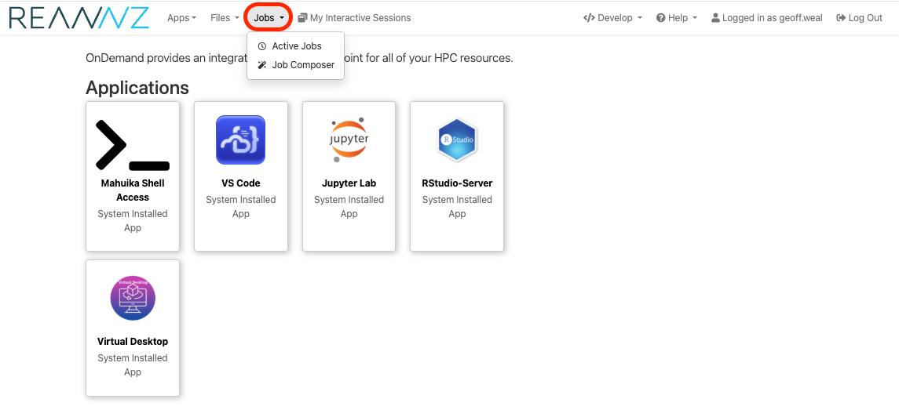
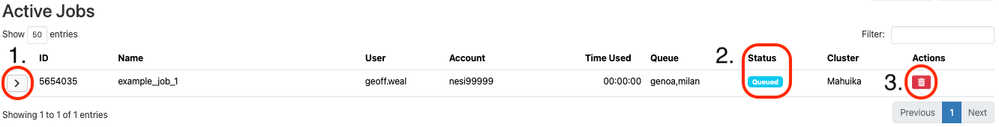
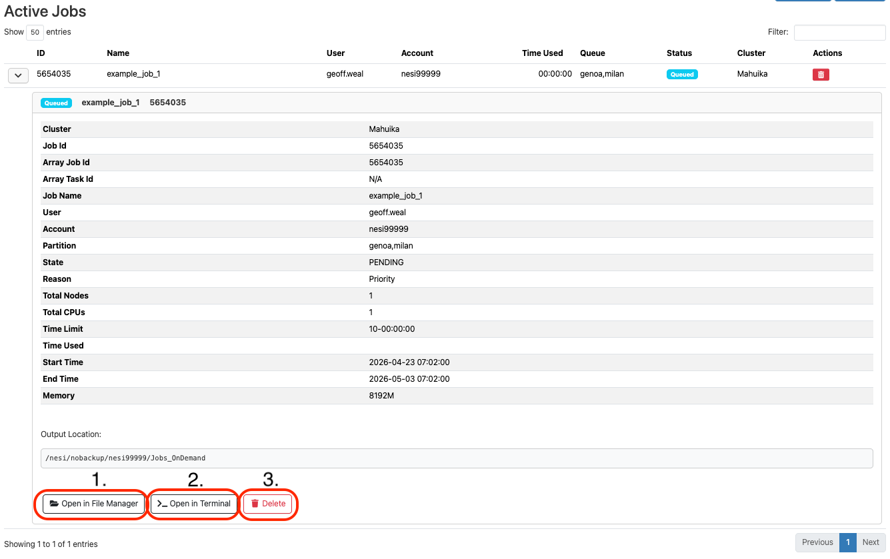
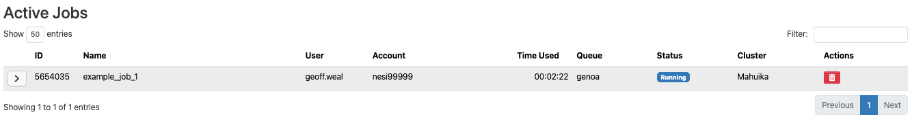
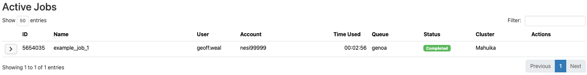
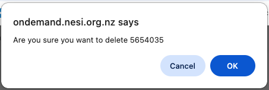

# Running Jobs from OnDemand

It is possible to submit jobs to slurm interactively from Mahuika using the `Jobs` section of Mahuika OnDemand. 

This section will explain how to submit and run jobs directly and interactively using the Mahuika OnDemand platform.

## Finding the `Jobs` Section of Mahuika OnDemand

The `Jobs` section of Mahuika OnDemand can be found in the top right of the screen, as circled in red in the image below. There are two subsections that you can choose to use:

* `Active Jobs`: This allows you to see and interactive with your active jobs
* `Job Composer`: This allows you to craft submit scripts for submitting to slurm.

## The `Active Jobs` Section

The `Active Jobs` section allows you to see what jobs are running. This section queries `squeue` and `scontrol` and reports information from these slurm command to this dashboard. 

There are two buttons of interest:

1. The Information Button: Show you more information about that specific job.
2. The Status Icon: Tells you what state your job is in (such as `Queued`, `Running`, and `Completed`).
3. The Trash Button: Allow you to cancel a specific job.

### The Information Button

Clicking this button will allow you to see more information about this job: 

This information tab contains three further buttons at the bottom left hand of the tab:

1. The File Manager: Clicking this button will take you to the directory of your job on Mahuika OnDemand. In here, you will find your output files for your job. You can view text files from here, including `.out` and `.err` files.
2. The Terminal Button: Clicking this button will take you to the terminal, where you will be placed in the directory for this job.
3. The Trash Button: Allow you to cancel a specific job.

### The Status Icon

This can be seen as `Queued`, `Running`, or `Completed`. 

!!! note

    This does not auto-refresh, so you may need to refresh your screen for up to date information.

### The Trash Button

You will get a pop-up indicating if you want to cancel a job before it is cancelled. Click `OK` to cancel your job.

## The `Job Composer` Section

The 
