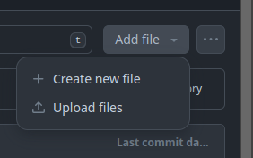
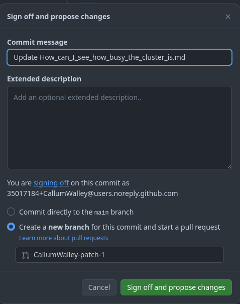
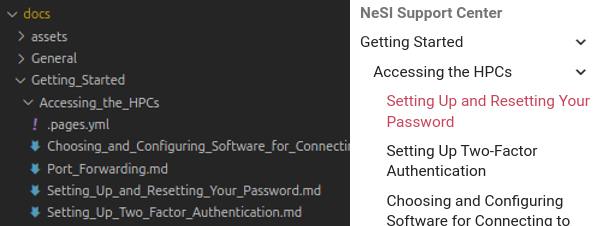

**[CLICK TO VIEW THIS PAGE RENDERED IN MKDOCS](https://nesi.github.io/support-docs/NEWPAGE/)**{ .hidden }

!!! prerequisite "See also"
    - To learn how you can contribute, [see CONTRIBUTING](CONTRIBUTING.md).
    - For examples of markdown use, [see FORMAT](FORMAT.md).

This page details how to create a new article or category in the documentation.

## In GitHub

1. Open parent category (folder)
    Navigate to the directory where you want to make a new page.

2. Create new file by clicking _Add File_, _Create New File_.

    .

3. Enter your new file name.
    Remember to use safe file names, no funky characters and use `_` instead of spaces.
    See [Article/Category Naming](#articlecategory-naming) for more info.

4. Add metadata header.
    Should at minimum contain.

    ```yml
    ---
    created: 
    description: "Will be used to generate page preview. Should not contain keywords not in the body of article."
    tags: [Tag1, Tag2]
    ---
    ```

5. Write rest of page.
    Rembember headers start at H2 (`##H2`). For more information see [FORMAT.md](FORMAT.md#headers)

6. Click `commit changes`.
    If this is a draft page, and you plan to come back to work on it, you will want to give it a descriptive branch name.
    .

    See [CONTRIBUTING](CONTRIBUTING.md#making-a-merge-request)

7. Merge pull request in order to _publish_ change.

## In Codespace

1. Open parent category (folder)
    Navigate to the directory where you want to make a new page.

2. Click the _new file_ button.

3. Enter your new file name.
    Remember to use safe file names, no funky characters and use `_` instead of spaces.
    See [Article/Category Naming](#articlecategory-naming) for more info.

4. Prefill with template (optional)
    <kbd>ctrl</kbd> + <kbd>shift</kbd> + <kbd>p</kbd>, `fill file with snippet`, 'Template New Page'.
    See [CONTRIBUTING](CONTRIBUTING.md#command-palette).

5. Write Article.
    Remember, you can add elements and autocomplete using <kbd>ctrl</kbd> + <kbd>space</kbd>.
    See [CONTRIBUTING](CONTRIBUTING.md#snippets)

6. Check problems (optional)
    Open the `PROBLEMS` tab in the bottom panel.

## Article/Category Location

Public facing articles are found in the `docs` folder:

- Any directory will be a **category**.
- Any markdown file, i.e. a text file ending with the `.md` extension, inside will be rendered as an **article**.
- A directory containing a `index.md` file, will be a **category-article**.
  (clicking on will take to the rendered markdown in `index.md`, any other markdown in the directory will be nested articles.)

!!! tip "Categories-Articles"
    When making an category-article, make sure you set `title:` in the frontmatter of the `index.md` file, as otherwise the page title will be 'Index'.

    Ideally, the page title should be the same as the category, to avoid confusion.



## Article/Category Naming

By default, the filename will be use as title of the article/category.

Try to keep your title short enough that it does not 'wrap' (become more than one line) in the nav,
this usually happens around 24-ish characters however this will vary depending on the letters being used.

!!! tip "File Name hygiene"
    Regular 'snake_case' naming conventions should be used for articles/categories, i.e. no non-alphanumeric characters (except `_` and `-`).

    When converting from filename, to title, spaces will replace `_` and the first letter of the first word will be capitalised (if it wasn't already), e.g. `My_Nice_and_Tidy_Filename.md` becomes `My Nice and Tidy Filename`

In the case of an articles (including category-articles), this title can be overridden by setting one in the page [front-matter using the 'title' keyword](#article-metadata).
If you need to rename a regular category (one without an `index.md`), this can be done in the
[`.pages.yml` file](#articlecategory-order).

## Article/Category Order

By default articles will be ordered alphabetically.

Order can be set manually with the use of a `.page.yml` file, this file determines the ordering of all of it's sibling articles and categories.

The `.page.yml` might looks like this:

```yml
---
nav: 
  - Introduction.md
  - Next_Steps.md
  - ... 
```

`...` will be replaced by all other pages, in the default order.

!!! warning
    If you do set page order manually, make sure you include the `...` else some pages will not be rendered.

When being used to order _non-article categories_ you may overwrite the name in `.page.yml`.

Don't use this method to set the names of articles or category-articles (use the `title` parameter in that pages meta).

```yml
nav:
- Getting_Started
- Māui-Mahuika (Differences) : Maui_Mahuika_Differences
- ZA̡͊͠͝LGΌ H̸̡̪̯ͨ͊̽̅̾̎Ȩ̬̩̾͛ͪ̈́̀́͘ ̶̧̨̱̹̭̯ͧ̾ͬC̷̙̲̝͖ͭ̏ͥͮ͟Oͮ͏̮̪̝͍M̲̖͊̒ͪͩͬ̚̚͜Ȇ̴̟̟͙̞ͩ͌͝S̨̥̫͎̭ͯ̿̔̀ͅ : Using_regex_to_parse_html
- ...

```

For full description of `.pages.yml` use, see the
[awesome-pages-plugin](https://github.com/lukasgeiter/mkdocs-awesome-pages-plugin).

## Article Metadata

Article metadata (or 'front-matter') is `yaml` format at the top of the markdown file between two `---`.
This content is not rendered but will inform how the article will be shown.

Here is an example of metadata header:

```yml
---
created_at: '2021-08-25T02:05:42Z'
tags:
- profiling
title: VTune
description: VTune is a tool that allows you to quickly identify where most of the execution time of a program is spent.
vote_count: 1
vote_sum: -1
zendesk_article_id: 4405523725583
zendesk_section_id: 360000278935
search:
  boost: 2
hide:
  - toc
  - nav
---
```

The following sections detail the most usual entries.

### MkDocs Parameters

| Parameter | Usage | Allowed Values | Example |
| - | - | - | - |
| `title`  | article title. | str | `title: My Title` |
| `created_at` | When article was created. Currently not shown in rendered page, but should still be filled in as it can be useful info. : `yyyy-MM-dd`, `yyyy-MM-ddThh:mm:ssZ` | `created_at: 2024-01-01` |

### Material Theme Parameters

| Parameter | Usage | Allowed Values | Example |
| - | - | - | - |
| `description` | Used for internal and external search indexing. This will appear as the page preview when searching in Google. Try not to include words and information here that is not in the body of the article. | string | `description: A short summary.` |
| `icon`        | Page icon.                                                    | Path |  |
| `status`      | Will display a symbol on nav                                  | `new` or `deprecated` | |
| `hide`        | Used to turn off features (e.g. table of content)             | [`tags` `toc` `nav`]| |
| `tags`        | Used for internal and external search indexing                | String[] | `tags: [ "slurm", "containers" ]` |
| `search: exclude` | Used to exclude page from internal search                 | Bool | `search: exclude: True`|
| `search: boost` | Used to increase or decrease weight in internal search      | Float | `search: boost: 0.1` to lower weight,  `search: boost: 10` to raise weight |

### Zendesk Imported

The following fields were imported from Zendesk Page:

- `vote_count` 
- `vote_sum`
- `zendesk_article_id`
- `zendesk_section_id`

`zendesk_article_id` and `zendesk_section_id` serve no purpose and can be deleted.
`vote_count` and `vote_sum` are useful for determining past popularity of a page, but will become less useful with time.

## Accessibility Standards

- [NZ spec](https://www.digital.govt.nz/standards-and-guidance/nz-government-web-standards/web-accessibility-standard-1-1/)
- [WCAG spec](https://www.w3.org/TR/WCAG21/)
