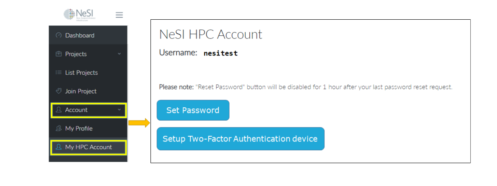
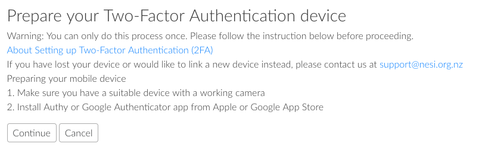

!!! prerequisite
    -  Have a [NeSI account](../../../Access/Accounts-Projects_and_Allocations/Creating_a_NeSI_Account_Profile.md).  
    -  Be a member of an [active project](../../../Access/Accounts-Projects_and_Allocations/Creating_a_NeSI_Account_Profile.md).  
    -  Have [set up your NeSI account password](../../Scientific_Computing/Getting_Started/Accessing_the_HPCs/Setting_Up_and_Resetting_Your_Password.md).  
    -  Have a device with an authentication app.

##  Authentication App

In order to generate your second factor, which you will require in order
to access to any NeSI cluster, you will need a device with an
authentication app, such as Authy or Google Authenticator installed
(generally the device is a smartphone, but there are also authentication
apps which work through the browser like Authy).

If you some reason you can't do this, please contact NeSI support.

## Linking a device to your account

1. Log in to [My NeSI](https://my.nesi.org.nz) via your browser.

2. Click **My HPC Account** on left hand panel  and then **Setup
   Two-Factor Authentication device**  
   

3. Click the "**Setup Two-Factor Authentication device**" link.  
   

4. After clicking on "Continue" you will retrieve the QR code.

5. Open your Authy or Google Authenticator app and click on the add
   button and select "**Scan a barcode**". Alternatively, if you are
   not able to scan the barcode from your device you can manually enter
   the provided authentication code into your authentication app.

## The second-factor token

The 6 digit code displayed on your app can now be used as the second
factor in the authentication process.  
This code rotates every 30 seconds, and it **can only be used once**.
This means that you can only try logging in to the lander node once
every 30 seconds.

!!! tip "What next?"
    [Getting access to the cluster](../../Scientific_Computing/Getting_Started/Accessing_the_HPCs/Choosing_and_Configuring_Software_for_Connecting_to_the_Clusters.md)
