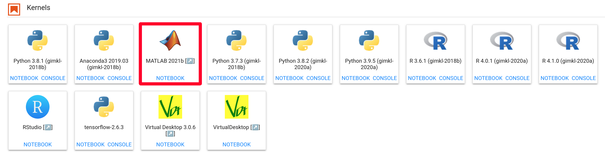
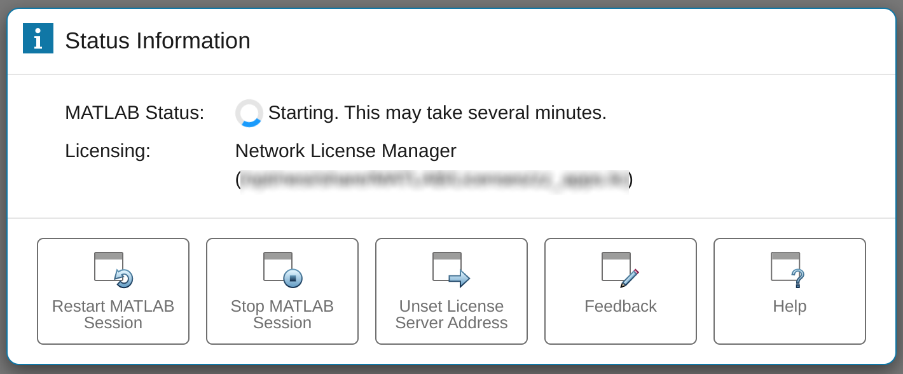
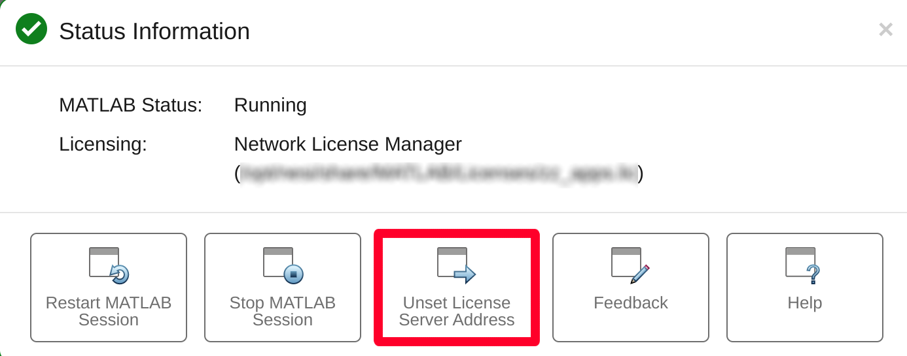
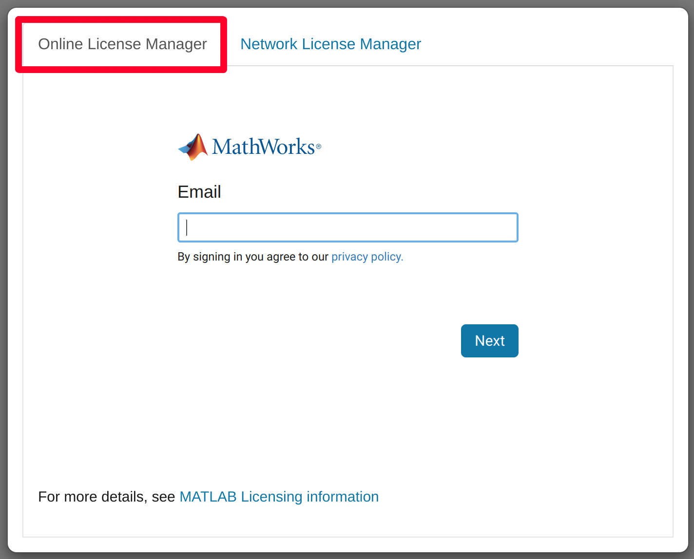

!!! warning
     This functionality is experimental and developing, which may introduce
     breaking changes in the future.
     If you would like to report a bug or propose a change see the GitHub
     repo
     [https://github.com/nesi/jupyter-matlab-proxy](https://github.com/nesi/jupyter-matlab-proxy?organization=nesi&organization=nesi)
     or .

## Getting started

MATLAB can be accessed as a web application via [Jupyter on
NeSI](../../Scientific_Computing/Interactive_computing_using_Jupyter/Jupyter_on_NeSI.md).

In the JupyterLab interface, MATLAB can be started using the
corresponding entry in the launcher.

## 

Clicking on this entry will open a separate tab in your web browser,
where you will see the following status information page.

## 

MATLAB may take a few minutes to load, once it does you will be put
straight into the MATLAB environment. 

You can open the status page at any time by clicking the

button.

!!! warning
     Your license must be valid for MATLAB 2021b or newer.

## Licensing

If you are a member of an institution that has access to MATLAB, the
corresponding network license will be selected. You can confirm this in
the info panel.

If you do not wish to use a network license you can click the 'Unset
License Server Address' button.

## 

If you have no licence address set you can instead authenticate using a
MathWorks email address, provided you have a valid license associated to
your account.

## 

## Troubleshooting

As MATLAB via Jupyter on NeSI uses MATLAB 2021a, you will see a glibc
warning whenever you run a system command, and some system commands will
not work as intended.

For more details see
[MATLAB#known\_bugs](../../Scientific_Computing/Supported_Applications/MATLAB.md#known-bugs).
