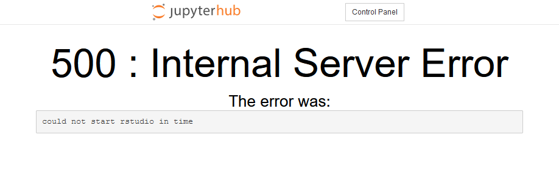

[//]: <> (REMOVE ME IF PAGE VALIDATED)
[//]: <> (vvvvvvvvvvvvvvvvvvvv)
!!! warning
    This page has been automatically migrated and may contain formatting errors.
[//]: <> (^^^^^^^^^^^^^^^^^^^^)
[//]: <> (REMOVE ME IF PAGE VALIDATED)

!!! prerequisite Note
     This functionality is experimental and may introduce breaking changes
     in the future. These notes should be read in conjunction with NeSI's
     main [R support
     page](https://support.nesi.org.nz/hc/en-gb/articles/209338087-R)
     Your feedback is welcome, please don't hesitate to contact us at
     <support@nesi.org.nz> to make suggestions.

# Getting started

RStudio can be accessed as a web application via [Jupyter on
NeSI](https://support.nesi.org.nz/hc/en-gb/articles/360001555615).

In the JupyterLab interface, RStudio can be started using the
corresponding entry in the launcher.


Clicking on this entry will open a separate tab in your web browser,
where RStudio will be accessible.

Once RStudio is launched, you should briefly see a login screen. It will
be auto-filled using a pre-generated password, unless you disabled
javascript in your web browser.

# Changing R version

You can configure a set of [environment
modules](https://support.nesi.org.nz/hc/en-gb/articles/360001113076-The-HPC-environment-)
to preload before starting RStudio. This can be useful if you want to
change the version of the R interpreter or use NeSI's *R-Geo* or
*R-bundle-Bioconductor* modules.

The module needs to be entered in the configuration file
`~/.config/rstudio_on_nesi/prelude.bash`.

In the following example, we use the module that is built for R/4.2.1

``` sl
$ echo "module load R/4.2.1-gimkl-2022a" > ~/.config/rstudio_on_nesi/prelude.bash
```

Once your configuration file is ready, make sure to restart your Jupyter
session and re-launch RStudio for these changes to be taken into
account. Check that the correct version of R has loaded and that the
correct Library Paths are available. For R/4.2.1 the command
`.libPaths()` will return the following:

``` sl
     .libPaths()
[1] "/home/YOUR_USER_NAME/R/gimkl-2022a/4.2"                            
[2] "/opt/nesi/CS400_centos7_bdw/R/4.2.1-gimkl-2022a/lib64/R/library"
```

# Package Installation

To avoid read/write issues with a small temorary directory filling up,
in a terminal run the following two lines of code. These will setup a
larger directory that will allow for packages to be installed to your
personal library. NOTE: this is not creating a library.

``` sl
$ mkdir -p /nesi/nobackup/<projectID>/rstudio_tmp
$ echo "TMP=/nesi/nobackup/<projectID>/rstudio_tmp" > .Renviron
```

Within RStudio run the command \`tempdir()\` which should return the
following (below), where \`Rtmpjp2rm8\` is a randomly generated folder
name, and is emptied with each new session. So will not fill up your
home directory.

``` sl
    tempdir()
[1] "/nesi/nobackup/<projectID>/rstudio_tmp/Rtmpjp2rm8"
```

The alternative is to install packages in a terminal session

# Advanced usage

RStudio runs in a [Singularity
container](https://support.nesi.org.nz/hc/en-gb/articles/360001107916)
prepared by the NeSI team to run on
[jupyter.nesi.org.nz](https://jupyter.nesi.org.nz). The related code is
hosted on GitHub, in the
[rstudio\_on\_nesi](https://github.com/nesi/rstudio_on_nesi) repository.

To modify the content of the container, you need to adapt the
[Singularity definition
file](https://github.com/nesi/rstudio_on_nesi/blob/main/conf/rstudio_server_on_centos7.def),
found in the `conf` folder of the repository, and then rebuild the
container.

Once your container is ready, upload it on NeSI and use the
configuration file `~/.config/rstudio_on_nesi/singularity_image_path` to
indicate the path of your container to the RStudio-on-NeSI plugin:

``` sl
$ echo PATH_TO_CONTAINER > ~/.config/rstudio_on_nesi/singularity_image_path
```

Then restart your Jupyter session and launch a new RStudio session to
make use of your container.

If your RStudio session does not start, try to reload the page, in case
the reported failure is just due to the container taking too much time
to start.

If this does not work, you will need to investigate the errors. A good
place to start is looking at the log file from jupyter, for the current
session:

``` sl
$ cat ~/.jupyter/.jupyterhub_${USER}_${SLURM_JOB_ID}.log
```

# Troubleshooting

If you get an error 500 after clicking on the launcher icon, this could
be due to RStudio taking too much time to start, which is interpreted as
a failure by JupyterLab. Please try to start RStudio again from the
launcher. If the problem persists, contact our support team at
<support@nesi.org.nz>.



If you have disabled javascript in your web browser, you will need to
enter your password manually in the RStudio login screen. To retrieve
the password, open a terminal in JupyterLab and enter the following to
print the password:

``` sl
$ cat ~/.config/rstudio_on_nesi/server_password
```

 
