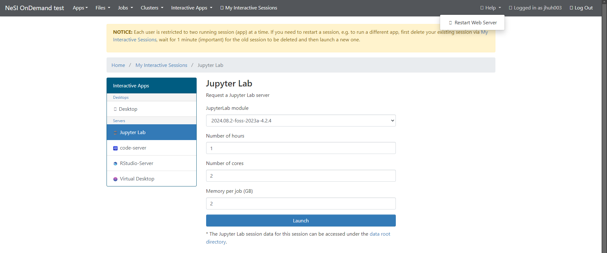

!!! Note
     ondemand is in development and accessible to early access users only.
     If you are interested in helping us test it please contact us at [support@nesi.org.nz](mailto:support@nesi.org.nz). 

# NeSI OnDemand Release Notes

## 0.3.1 - High memory option available in ondemand

This release enables high memory node to be selected by the users. Currently we support up to 32GB instance on the app launch.

It required work on K8s autoscaling and FreeIPA updates for auto-enrollment. Further work is needed for proper full autoscale, and will be coming up in the next release.

## 0.3.0 - initial release for Jupyter-only users

### Features

- JupyterLab and RStudio are available for researchers
- Tuakiri based login with OTP is ready
- Hosted on public URL: [https://ondemand.nesi.org.nz/](https://ondemand.nesi.org.nz/)
- Minor UX improvements

### Known issues

- Users with dot in the name not yet supported

## 0.2.0 - initial internal release

NeSI OnDemand is NeSI’s new offering for providing researchers with access to JupyterLab and RStudio. We are adopting Open OnDemand technology, which enables us to build and extend the catalogue of web based applications.

This is our first release to a group of early access users for feedback around NeSI OnDemand and the new login process.

### Features

- As a new step forward from Jupyter.NeSI, we have a new interactive environment NeSI OnDemand where you can launch NeSI apps for your research.

    * Currently accessible via [https://ondemand.nesi.org.nz/](https://ondemand.nesi.org.nz/)

- Apps currently supported

    * JupyterLab with the following kernels: Python 3.8.2 (gimkl-2020a), Python 3.9.5 (gimkl-2020a), Python 3.10.5 (gimkl-2022a), and Python 3.11.3 (gimkl-2022a) 
    * RStudio

- Additional Apps (under development)

    * In addition to the two core apps above, we have the following applications accessible, but are still under development, and are unsupported. We will update you with more information in the future releases as they stabilise.
    * Virtual desktop
    * Matlab
    * VS Code-Server

- New login process for the NeSI systems going forward

    * NeSI is adopting a new Tuakiri based single sign on process for logging in to all NeSI services. This will mean that you won’t have to set up a separate NeSI account and password in order to be able to access NeSI services in the future.
    * To ensure the security of our system, we have an additional OTP (one-time password) that is enforced on top of your institutional login. Over time, we will smooth out the user experience for setting this up and the frequency of having to enter the OTP.

### Current known issues

#### Link to mahuika filesystem

This release is an ephemeral environment for gathering feedback around the system therefore we have not linked it with your research data on Mahuika/Maui. Any data stored on the system during this early test phase may disappear at any point.

#### "You are already logged in" message

If you have a browser session of NeSI OnDemand that is older than ~3 hours, and try to log back into the system, you may encounter a message saying “You are already logged in” without any actionable button. This is a known bug, and for now you would need to go back to the NeSI OnDemand URL ([https://ondemand.nesi.org.nz/](https://ondemand.nesi.org.nz/)) and you will arrive on the correct landing page.

#### User accounts with dots in the username

If you have an existing NeSI account with a dot as a part of your Linux username, there is a known bug with Open OnDemand and Kubernetes which prevents us from initiating some application. Currently RStudio has this issue and we are working on a fix.

#### Token expiry

This is another known bug where the back-end system token isn’t refreshed correctly after timeouts. If you run into error messages while trying to launch an app, you can resolve this by logging out of NeSI OnDemand, logging back in again and then clicking on Help button at the top right and selecting Restart Web Server.
     

#### "Error -- can't find user for …" messages

If you see this message after logging in, please reach out to us at [support@nesi.org.nz](mailto:support@nesi.org.nz) and we will be able to fix this problem.

#### UX, wording, information display

Due to this environment being our test build, you may encounter many internal technical terms that will be addressed through future iterations.

#### User home folder default content

Pre-populated with [Desktop  Documents  Downloads  Music  Pictures  Public  Templates  Videos] folders, which is different to NeSI default.

#### User home folder permissions

Everybody seems to have read/execute access to all home folders.

### Where to log tickets and give feedback

We are in the early process of iterating and improving NeSI OnDemand. If you see any issues or suggestions, please let us know.

- Please e-mail us on [support@nesi.org.nz](mailto:support@nesi.org.nz) with NeSI OnDemand as a part of the subject line and we will get back to you ASAP
- Given that this is an early release, the SLA will not follow NeSI standard SLA (9am-5pm working days), and the environment may not be as stable as the production environment. We will support you with the best effort.

