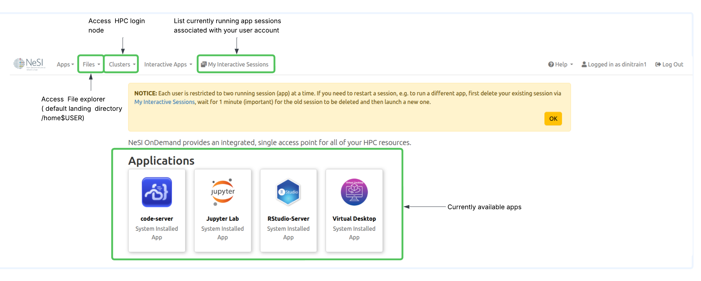
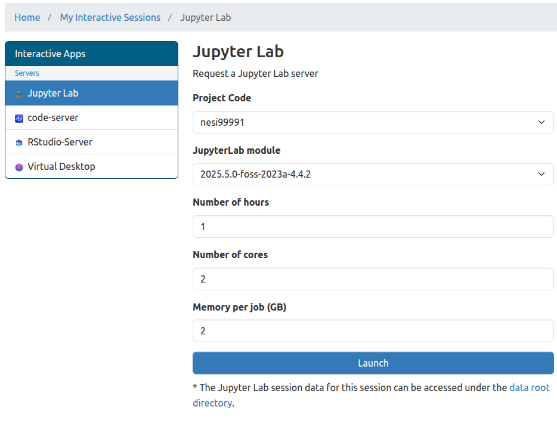
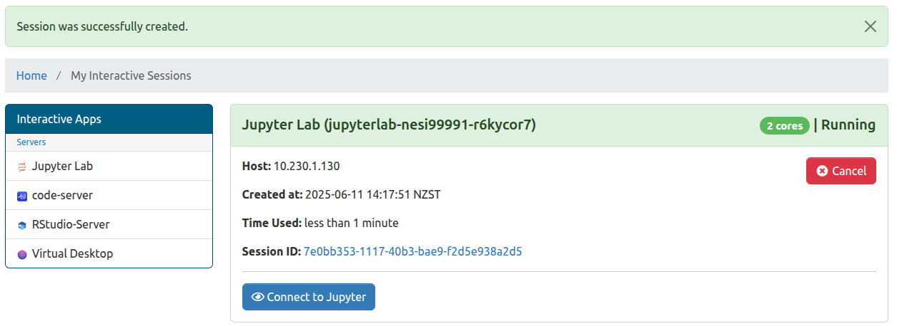

---
tags:
- jupyter
- hub
- home
- lab
- notebook
- ondemand
- rstudio
title: NeSI OnDemand how-to guide
---

# NeSI OnDemand how-to guide

## How to log in

Go to  [**NeSI OnDemand**](https://ondemand.nesi.org.nz/). It will automatically take you to the Tuakiri login screen.

??? circle-info "If you haven't logged into NeSI OnDemand or HPC3 before, part of the login process will include a step to setup a new 2FA"

    

    * Select your affiliated institution, and log in using your institutional account. Example below shows the University of Auckland login screen.

    * 

    After logging in, you will be asked to set up your OTP (one-time password) for NeSI. This is an OTP in addition to your institutional 2FA. We are currently enforcing an additional layer of OTP to make sure our system is secure, as the institutions federated by Tuakiri all have different security policies.

    

    Scan the barcode with your preferred authenticator app (e.g. Google Authenticator), and enter the one-time code (6 digit number) along with a device name (e.g. my mobile) and Submit and you are good to go.

    Once you have already set up NeSI OTP, you will be shown the following screen instead of the one above, where you can enter the 6 digit number from your authenticator app.

    

    After successfully logging in, you will be presented with the following NeSI OnDemand screen.

    

### OnDemand home page

!!! quote ""

    1. <kbd>Files</kbd> > <kbd>Home Directory</kbd> : Access to OnDemand file explorer
        - Default landing path for the file explorer is your home directory
        - There is a <kbd>00_nesi_projects</kbd> directory within home which contains symlinks to all project and nobackup directories you have access to. Refer to [How to access your project OR nobackup directory from the Interactive file explorer](#how-to-access-your-project-or-nobackup-directory-from-the-interactive-file-explorer)

    2. <kbd>Clusters</kbd>><kbd>>_NeSI HPC Shell Access</kbd>
        - Allows us to access HPC login nodes directly from OnDemand 

    3. <kbd>My Interactive Sessions</kbd>
        - List all of the currently running sessions associated with my user account

    4. **Applications**
        - Currently available apps for interactive computing 

!!! circle-info ""

## How to launch an Application

From the home page, you can click on the app you would like to launch, e.g. JupyterLab, and you will be taken to the following screen.

!!! bell "How much resources to request"

    Ideally start with the least amount of resources and scale accordingly. In other words, be as efficient as possible ☺️

    

    | Form attributes        | Maximum value |
    | ---------------------- | ------------- |
    | **Number of hours**    | 24            |
    | **Number of cores**    | 4             |
    | **Memory per job(GB**) | 32GB          |
    
    

Once the session is ready, you will see a button labeled <kbd>Connect to Jupyter</kbd> (or other app of your choice), which upon clicking will take you to the JupyterLab in this example as seen below:

!!! circle-info ""

## How to access your project OR nobackup directory from the Interactive file explorer

* If you would like to access your project or nobackup file system via the Interactive file explorer ( not the terminal), please use the <kbd>00_nesi_project</kbd> parent directory whcih containts symlinks to all file systems you have access to 

### Access from OnDemand Files app

### Access from an OnDemand app ( for an example, Jupyter file explorer)

