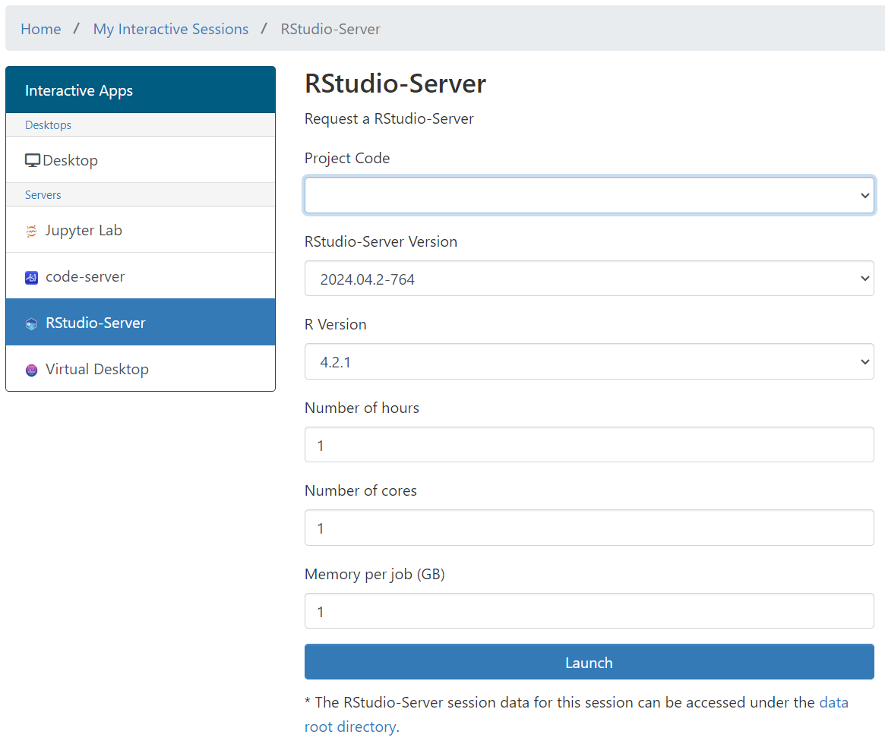
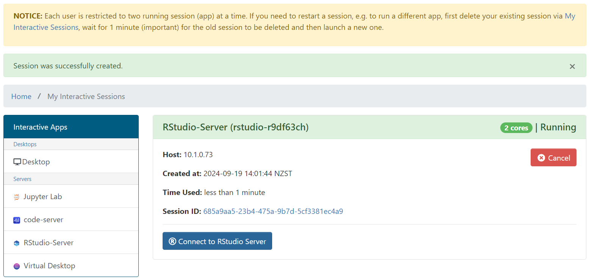
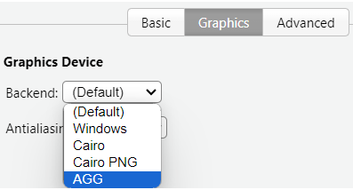

# RStudio via OnDemand

!!! warning

    NeSI OnDemand is in development and accessible to early access users only.
    If you are interested in helping us test it please [contact us](mailto:support@nesi.org.nz).

The docs for RStudio via Jupyter are [here](../../Interactive_computing_using_Jupyter/RStudio_via_Jupyter_on_NeSI.md), we'll need to decide what needs to change and what can be copied across.

## Logging in




## Settings
Recommendation to set *Save Workspace to Never* to avoid saving large files to the workspace. This can be done by going to `Tools` -> `Global Options` -> `General` and setting the `Save workspace to .RData on exit` to `Never`. This will prevent the workspace from being unable to load due to not enough memory in the selected session.

## Bugs

### Plots not showing
The current R modules on NeSI OnDemand do not support the default graphics device due to missing the depedency `cairo`. There is a one off fix for this by changing the backend graphics device from `Default` to `AGG` (Anti-Grain Geometry) in the RStudio settings. 

This can be done by going to `Tools` -> `Global Options` -> `Graphics` and switch `Default` to `AGG`. This will allow the plots to be displayed in the RStudio interface. You do not need to restart the RStudio session for this to take effect.



Modules from 4.4 onwards will have this issue fixed.

### Libraries not showing
There is a bug with the R-Geo and R-bundle-Biocondutor libraries not showing up in the RStudio interface. This is a known issue and is being worked on. There are two workarounds for this issue:

1. Manually add the library to `.libPaths()` in the R console as shown below:

```R
myPaths <- .libPaths()
myPaths <- c(myPaths, "/opt/nesi/CS400_centos7_bdw/R-Geo/4.3.2-foss-2023a")

# reorder paths
myPaths <- c(myPaths[1], myPaths[3], myPaths[2]) 

# reasign the library paths
.libPaths(myPaths)

# confirm the library paths
.libPaths()
[1] "/nesi/home/$USER/R/foss-2023a/4.3"
[2] "/opt/nesi/CS400_centos7_bdw/R-Geo/4.3.2-foss-2023a"
[3] "/opt/nesi/CS400_centos7_bdw/R/4.3.2-foss-2023a/lib64/R/library"
```
2. Permanent fix by adding the library path(s) to the `.Rprofile` file in your home directory. This will automatically add the library path to the R console when it starts up. Copy and Paste the following lines to the file:

```
# CHECK LIBRARY PATHS
myPaths <- .libPaths()
newPaths <- c("/opt/nesi/CS400_centos7_bdw/R-Geo/4.3.1-gimkl-2022a",
        "/opt/nesi/CS400_centos7_bdw/R-bundle-Bioconductor/3.17-gimkl-2022a-R-4.3.1>

# join the two lists
myPaths <- c(myPaths, newPaths)

# reassign the library paths
.libPaths(myPaths)
```
NOTE: Replace the paths with the correct paths for the libraries you want to add.