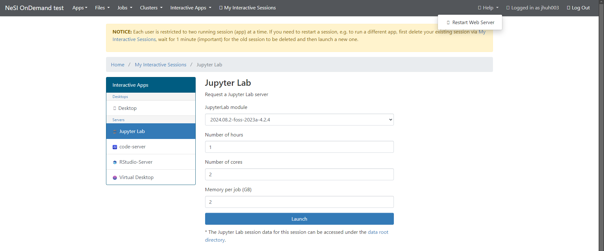

!!! Note
     ondemand is in development and accessible to early access users only.
     If you are interested in helping us test it please contact us at [support@nesi.org.nz](mailto:support@nesi.org.nz). 

# NeSI OnDemand Known Issues

This page contains a list of known issues with NeSI OnDemand, if any.

## Token expiry

This is another known bug where the back-end system token isn’t refreshed correctly after timeouts. If you run into error messages while trying to launch an app, you can resolve this by logging out of NeSI OnDemand, logging back in again and then clicking on Help button at the top right and selecting Restart Web Server.

## Filesystem synchronisation

Your data will have been copied from Mahuika into the OnDemand environment. However, any changes made in OnDemand will not be synchronised back to Mahuika.

## "You are already logged in" message

If you have a browser session of NeSI OnDemand that is older than ~3 hours, and try to log back into the system, you may encounter a message saying “You are already logged in” without any actionable button. This is a known bug, and for now you would need to go back to the NeSI OnDemand URL ([https://ondemand.nesi.org.nz/](https://ondemand.nesi.org.nz/)) and you will arrive on the correct landing page.

## User accounts with dots in the username

If you have an existing NeSI account with a dot as a part of your Linux username, there is a known bug with Open OnDemand and Kubernetes which prevents us from initiating some application. Currently RStudio has this issue and we are working on a fix.

## "Error -- can't find user for …" messages

If you see this message after logging in, please reach out to us at [support@nesi.org.nz](mailto:support@nesi.org.nz) and we will be able to fix this problem.

## UX, wording, information display

Due to this environment being our test build, you may encounter many internal technical terms that will be addressed through future iterations.

## User home folder default content

Pre-populated with [Desktop  Documents  Downloads  Music  Pictures  Public  Templates  Videos] folders, which is different to NeSI default.

## User home folder permissions

Everybody seems to have read/execute access to all home folders.

!!! Note

    We are in the early process of iterating and improving NeSI OnDemand. If you see any issues or suggestions, please let us know.

    - Please e-mail us on [support@nesi.org.nz](mailto:support@nesi.org.nz) with NeSI OnDemand as a part of the subject line and we will get back to you ASAP
    - Given that this is an early release, the SLA will not follow NeSI standard SLA (9am-5pm working days), and the environment may not be as stable as the production environment. We will support you with the best effort.

