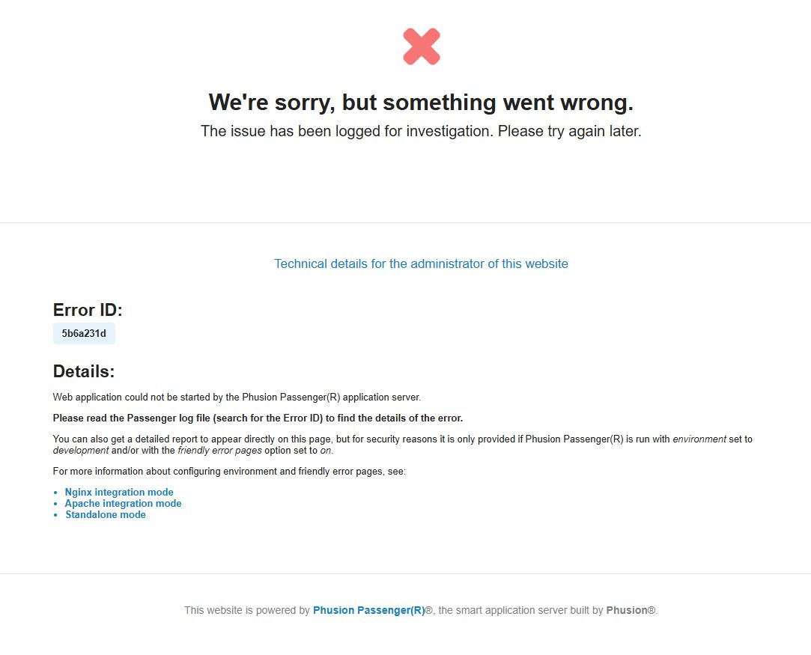

# NeSI OnDemand - Troubleshooting 

## 1. Potential issues during login 

!!! quote ""

    1. `Error -- can't find user for` … messages

        - If you see this message after logging in, It is an indication the account associated with your username was not provisioned correctly or doesn't exist. Please reach out to us at [support@nesi.org.nz](mailto:support@nesi.org.nz) and we will be able to fix this   problem. 

    2. ❌`We're sorry, but something went wrong` : If you are encounter the following error during login, it is an indication of your home directory being full .i.e. OnDemand relies on some space being available on the home directory to open and maintain per session logs. 
        - Only solution for this is to clear up some space in the home directory. You can still login to the cluster via another terminal client (`ssh`) to review and clean/delete content from home directory. If you don't have or having difficulty with setting up a terminal client setup for `ssh` access, please reach out to us at support@nesi.org.nz

        

        {width="400"}
        
 

## 2. Errors 

## NeSI OnDemand Current limitations¶

| Limitation                                |  What are the missing functions/commands associated with this|
--------------------------------------------|--------------------------------------------------------------|
|1. OnDemand apps  are not exposed to HPC3 Slurm | Commands such as `sbatch`, `sacct`, `squeue` , `scancel` will not work from OnDemand apps|
|2. Missing user Namespaces in Kubernetes pods will interfere with some Apptainer operations| Although we can run `apptainer pull` command, `apptainer exec,run,shell` commands can not be executed due to missing user Namespaces|

!!! quote ""

    🙋 If you to come across above limitations, please consider switching to a HPC3 login node via `Cluster` > `NeSI HPC Shell access` via OnDemand home page

    

    
    

