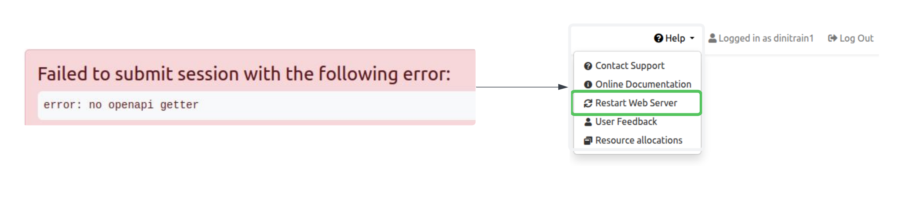
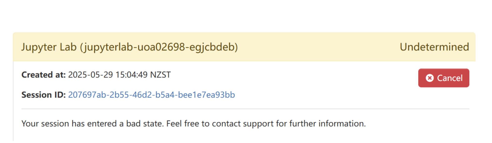
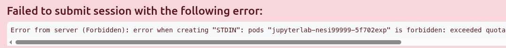

## Login

### `Error -- can't find user for`

If you see this message after logging in, It is an indication the account associated with your username was not provisioned correctly or doesn't exist. 

Please  and we will be able to fix this problem.

### `We're sorry, but something went wrong`

{.center width="400"}

If you are encounter the following error during login, it is an indication of your home directory being full.
OnDemand relies on some space being available on the home directory to open and maintain per session logs.
The solution for this is to clear up some space in the home directory. You can still login to the cluster via another terminal client (`ssh`) to review and clean/delete content from home directory. If you don't have or having difficulty with setting up a terminal client setup for `ssh` access, 

## App Initialisation

### `error: no openapi getter`

Restart the web server via <kbd>Help</kbd> **>** <kbd>Restart Web Server</kbd>

### Stuck in **Undetermined** state

Terminate the session with <kbd>Cancel</kbd> **>** <kbd>Delete</kbd> and re-open a new session

### `forbidden exceeded quota`

Current OnDemand implementation has a **two concurrent app sessions per account**. Above `exceeded quota` is an indication that you already have two app sessions running. ( Go to <kbd>My Interactive Sessions</kbd> to confirm this)
