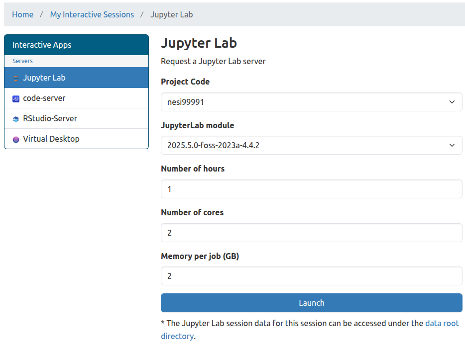
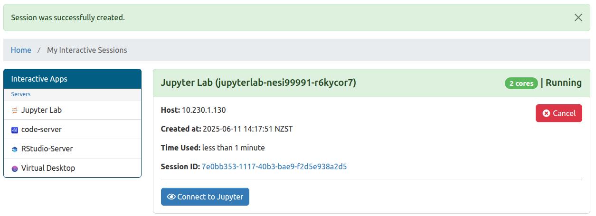

---
tags:
    - jupyter
    - lab
    - notebook
    - ondemand
    - rstudio
    - vscode
description: Getting Started With NeSI onDemand
title: NeSI OnDemand how-to guide
---

## How to log in

Go to  [**OnDemand**](https://ondemand.nesi.org.nz/). It will automatically take you to the Tuakiri login screen.

Log in with your institutional credentials.

??? info "First Time Login"

    If you haven't logged into OnDemand or our HPC platforms before, part of the login process will include a step to setup additional authentication credentials.

    

    * Select your affiliated institution, and log in using your institutional account. Example below shows the University of Auckland login screen.

    

    After logging in, you will be asked to set up an 6-digit code. This is additional authentication in addition to your institutional MFA. We are currently enforcing an additional security layer, as the institutions federated by Tuakiri all have different security policies.
    
    

    Scan the barcode with your preferred authenticator app (e.g. Google Authenticator), and enter the 6-digit code along with a device name (e.g. my mobile) and Submit and you are good to go.

    Once you have set up your additional authentication credentials, you will be shown the following screen, where you can enter the 6-digit code from your authenticator app.

    

    After successfully logging in, you will be presented with the following OnDemand screen.

    

## OnDemand home page

1. <kbd>Files</kbd> <kbd>Home Directory</kbd> : Access to OnDemand file explorer
    - Default landing path for the file explorer is your home directory
    - There is a `00_nesi_projects` directory within home which contains symlinks to all project and nobackup directories you have access to.
    Refer to [Interactive file explorer](#interactive-file-explorer)

2. <kbd>Clusters</kbd>><kbd>>_NeSI HPC Shell Access</kbd>
    - Allows us to access HPC login nodes directly from OnDemand.

3. <kbd>My Interactive Sessions</kbd>
    - List all of the currently running sessions associated with my user account

4. **Applications**
    - Currently available apps for interactive computing.

## How to launch an Application

From the home page, you can click on the app you would like to launch, e.g. JupyterLab, and you will be taken to the following screen.

{.center}

!!! bell "How much resources to request"

    Ideally start with the least amount of resources and scale accordingly. In other words, be as efficient as possible ☺️

    | Form attributes        | Maximum value |
    | ---------------------- | ------------- |
    | **Number of hours**    | 24            |
    | **Number of cores**    | 4             |
    | **Memory per job(GB**) | 32GB          |
    

Once the session is ready, you will see a button labeled <kbd>Connect to Jupyter</kbd> (or other app of your choice), which upon clicking will take you to the JupyterLab in this example as seen below:

## Interactive file explorer

If you would like to access your project or nobackup filesystem via the Interactive file explorer ( not the terminal),
please use the <kbd>00_nesi_project</kbd> parent directory which contains symlinks to all filesystems you have access to.

### OnDemand App

### Jupyter file explorer

