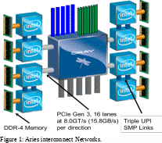

[//]: <> (REMOVE ME IF PAGE VALIDATED)
[//]: <> (vvvvvvvvvvvvvvvvvvvv)
!!! warning
    This page has been automatically migrated and may contain formatting errors.
[//]: <> (^^^^^^^^^^^^^^^^^^^^)
[//]: <> (REMOVE ME IF PAGE VALIDATED)

There are 4 dual socket nodes on blade, connected to a single Aries
(switch) chip, and there are 16 Aries chips in a chassis connected to
the backplane. On Māui, this implies each chassis contains 64 nodes, or
2,560 Skylake cores. There are 3 chassis in an XC50 cabinet, and two
XC50 cabinets are an Electrical "group". Māui has 1.5 groups.

The performance characteristics are:

<ol>

1.  Intra-Chassis
    1.  Backplane
    2.  15 links in the backplane
    3.  Rank 1 (green) Network
    4.  14 Gbps
2.  Intra-group
    1.  Copper cables
    2.  15 links in 5 connectors
    3.  Rank 2 (black) Network
    4.  14 Gbps
3.  Inter-group links
    1.  Optical
    2.  10 links in 5 connectors
    3.  Rank 3 (blue) Network
    4.  12.5 Gbps

</ol>

The centrepiece of the Aries network is dynamic routing through a large
variety of different routes from Aries A to Aries B. Therewith the
effective bandwidth is increased significantly. These dynamic routing on
alternative paths is applied on all 3 levels of the network.
