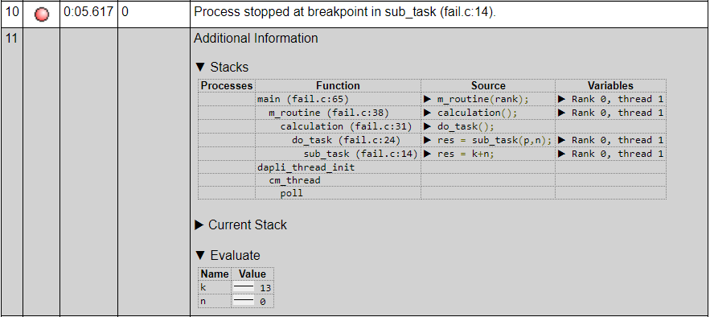

There are many reasons why a program might crash. Some Slurm job states
such as `TIMEOUT` or `OUT_OF_MEMORY` can indicate a clear reason, but when
the job state is simply FAILED and the error message in the job's log
file simply states "Segmentation Fault" or "Illegal instruction",
investigations become more complicated. In the following, a selection of
tools is presented which might assist. Most of the following approaches
require the application being built with debugging symbols (e.g. `-g`
compile option), otherwise only nameless memory address will be
provided.

## Tracing job scripts

Complex job scripts may contain several commands. To located the failing
executable and keep track of performed settings and operations the
option `set -x` (in bash) may help. It lists line by line called
commands together with the related output.

## Analysing core files with GDB

In some cases a memory dump at the time of crash can be generated by the
operating system. These core files are usually provided one for each
process. The GNU debugger (`gdb`) can extract information from them. For
example, a stack trace could be obtained by running the following
command for ONE core file:

``` sh
gdb -c core.12345 /path/to/bin/exe
```

``` gbd
bt
```

This assumes that the crashing job used the executable
`/path/to/bin/exe`, which should be built with debugging symbols. This
may already point you to the failing location. With the command `bt`
you can request a stack trace.

On Mahuika the default maximum core file size is zero, so no core files
are produced.  To enable them do:

``` sh
ulimit -S -c unlimited
```

For more detailed information see the [GDB Manual](https://www.gnu.org/software/gdb/documentation/).

## ARM DDT

The parallel debugger DDT is a commercial product from ARM (formerly
Allinea) and can handle various kinds of applications, serial, parallel,
compiled from different kind of sources (C, C++, Fortran, Python). To
work properly DDT needs to have debug symbols provided by the
application binary (compiled with e.g. `-g`  option). DDT can be used
using the module `forge`. There are basically 2 ways to use the
debugger, interactive using the GUI and on the command line (bash
script) using the so called "offline" mode.

### DDT offline mode

You can start and configure DDT directly on the command line in your job
scripts without a GUI. Which is useful especially if you have long
lasting jobs to debug or long queuing times. To use this so called
"offline mode" you just need to add `ddt --offline` in front of the
srun statement. You can add more arguments for example to print the
values of variables.

```sh
ddt --offline --break-at=fail.c:14 --evaluate="k;n" srun -n 4 <application> <arguments>
```

As a result some basic information, stack traces and more requested
information are provided into the application stdout and a HTML file is
created. Thus this could also be a handy alternative for print
statements without touching the code.



[See full example page here.](https://mand35.github.io/NeSI_docu_ext/ddt_sample.html)

For more detailed information see [DDT manual](https://developer.arm.com/docs/101136/latest/ddt/offline-debugging).

### DDT graphical user interface

The DDT GUI can be opened using:

``` sh
module load forge
ddt
```

!!! note
    You can also install forge locally and connect to the machine remotely.

In the start window you can select between attaching DDT to a running
application (ATTACH), open an existing core file (OPEN CORE) and
launching an application with DDT (RUN).

In the RUN menu the different settings for the executable need to be
specified.


Beside Application location and name, we need to specify arguments,
working directory, MPI and OpenMP settings. If we have no interactive
slurm session, we do need to specify the workload manager settings in
the "Submit to queue" section. For your first time, you net to open the
Configure menu and select in the "Job submission" tab the
`nesi_slurm.ptf` template file. You can add necessary Slurm parameters
there, e.g. hyperthreading options, accounts and QoS. In the Environment
Variables section you can load necessary modules.

After submitting the task, DDT launches the application (wait for the
workload manager if necessary) and opens the following window.


In the top part the processes and threads can be selected. The
application is paused at the initialization phase, giving the user the
opportunity to set break/watch points, and define the type execution
(in/over/out of functions or just until next break point). For more
detailed information see the [DDT manual](https://developer.arm.com/docs/101136/latest/ddt)
