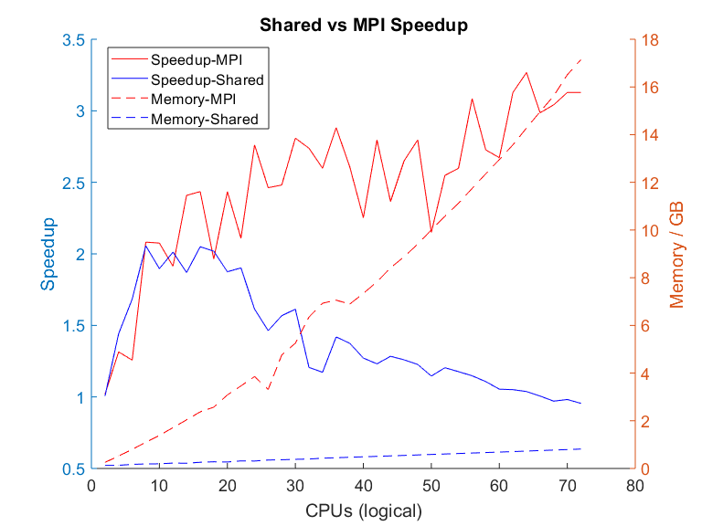




{{ app.description }}




!!! tip
    For a list of ABAQUS commands type:

    ```sh
    abaqus help
    ```

## Available Modules



## Licences

The following network licence servers can be accessed from the NeSI cluster.



If you do not have access, or want a server connected .

You can force ABAQUS to use a specific licence type by setting the
parameter `academic=TEACHING` or `academic=RESEARCH` in a relevant
[environment file](#environment-file).

!!! tip
     Required ABAQUS licences can be determined by this simple and
     intuitive formula <code>⌊ 5 x N<sup>0.422</sup> ⌋</code> where `N` is number
     of CPUs.

[Hyperthreading](../../Scientific_Computing/Running_Jobs_on_Maui_and_Mahuika/Hyperthreading.md)
can provide significant speedup to your computations, however
hyperthreaded CPUs will use twice the number of licence tokens. It may
be worth adding  `#SBATCH --hint nomultithread` to your slurm script if
licence tokens are your main limiting factor.
!!! prerequisite Tips
     Required ABAQUS licences can be determined by this simple and
     intuitive formula `⌊ 5 x N`<sup>`0.422`</sup>` ⌋` where `N` is number
     of CPUs.

You can force ABAQUS to use a specific licence type by setting the
parameter `academic=TEACHING` or `academic=RESEARCH` in a relevant
[environment file](#env_file).

## Solver Compatibility

Not all solvers are compatible with all types of parallelisation.

|                   |                    |                  |               |                |
|-------------------|--------------------|------------------|---------------|----------------|
|                   | Element operations | Iterative solver | Direct solver | Lanczos solver |
| `mp_mode=threads` | ✖                  | ✔                | ✔             | ✔              |
| `mp_mode=mpi`     | ✔                  | ✔                | ✖             | ✖              |
!!! prerequisite Note
     If your input files were created using an older version of ABAQUS you
     will need to update them using the command,
     ``` sl
     abaqus -upgrade -job new_job_name -odb old.odb
     ```
     or
     ``` sl
     abaqus -upgrade -job new_job_name -inp old.inp
     ```

<table>
<colgroup>
<col style="width: 50%" />
<col style="width: 50%" />
</colgroup>
<tbody>
<tr class="odd">
<td style="width: 506px"><h2 id="serial">Serial</h2>
<hr />
<p>For when only <span>one CPU is required</span>, generally as part of
an <a
href="../../Getting_Started/Next_Steps/Parallel_Execution.md#t_array">job
array</a>.</p>
<p> </p></td>
<td style="width: 163px"><div class="sourceCode" id="cb1"><pre
class="sourceCode bash"><code class="sourceCode bash"><span id="cb1-1"><a href="#cb1-1" aria-hidden="true" tabindex="-1"></a><span class="co">#!/bin/bash -e</span></span>
<span id="cb1-2"><a href="#cb1-2" aria-hidden="true" tabindex="-1"></a></span>
<span id="cb1-3"><a href="#cb1-3" aria-hidden="true" tabindex="-1"></a><span class="co">#SBATCH --job-name      ABAQUS-Shared</span></span>
<span id="cb1-4"><a href="#cb1-4" aria-hidden="true" tabindex="-1"></a><span class="co">#SBATCH --time          00:05:00       # Walltime</span></span>
<span id="cb1-5"><a href="#cb1-5" aria-hidden="true" tabindex="-1"></a><span class="co">#SBATCH --cpus-per-task 1              </span></span>
<span id="cb1-6"><a href="#cb1-6" aria-hidden="true" tabindex="-1"></a><span class="co">#SBATCH --mem           1500          # total mem</span></span>
<span id="cb1-7"><a href="#cb1-7" aria-hidden="true" tabindex="-1"></a></span>
<span id="cb1-8"><a href="#cb1-8" aria-hidden="true" tabindex="-1"></a><span class="ex">module</span> load ABAQUS/2019</span>
<span id="cb1-9"><a href="#cb1-9" aria-hidden="true" tabindex="-1"></a></span>
<span id="cb1-10"><a href="#cb1-10" aria-hidden="true" tabindex="-1"></a><span class="ex">abaqus</span> job=<span class="st">&quot;propeller_s4rs_c3d8r&quot;</span> verbose=2 interactive </span></code></pre></div></td>
</tr>
<tr class="even">
<td style="width: 506px"><h2 id="shared-memory">Shared Memory</h2>
<hr />
<code class="sl">mp_mode=threads</code>
<p>Uses a nodes shared memory for communication. </p>
<p>May have a small speedup compared to MPI when using a low number of
CPUs, scales poorly. Needs significantly less memory than MPI.</p>
<em>Hyperthreading may be enabled if using shared memory but it is not
recommended.</em></td>
<td style="width: 163px"><div class="sourceCode" id="cb2"><pre
class="sourceCode bash"><code class="sourceCode bash"><span id="cb2-1"><a href="#cb2-1" aria-hidden="true" tabindex="-1"></a><span class="co">#!/bin/bash -e</span></span>
<span id="cb2-2"><a href="#cb2-2" aria-hidden="true" tabindex="-1"></a></span>
<span id="cb2-3"><a href="#cb2-3" aria-hidden="true" tabindex="-1"></a><span class="co">#SBATCH --job-name      ABAQUS-Shared</span></span>
<span id="cb2-4"><a href="#cb2-4" aria-hidden="true" tabindex="-1"></a><span class="co">#SBATCH --time          00:05:00       # Walltime</span></span>
<span id="cb2-5"><a href="#cb2-5" aria-hidden="true" tabindex="-1"></a><span class="co">#SBATCH --cpus-per-task 4              </span></span>
<span id="cb2-6"><a href="#cb2-6" aria-hidden="true" tabindex="-1"></a><span class="co">#SBATCH --mem           2G        # total mem</span></span>
<span id="cb2-7"><a href="#cb2-7" aria-hidden="true" tabindex="-1"></a></span>
<span id="cb2-8"><a href="#cb2-8" aria-hidden="true" tabindex="-1"></a><span class="ex">module</span> load ABAQUS/2019</span>
<span id="cb2-9"><a href="#cb2-9" aria-hidden="true" tabindex="-1"></a></span>
<span id="cb2-10"><a href="#cb2-10" aria-hidden="true" tabindex="-1"></a><span class="ex">abaqus</span> job=<span class="st">&quot;propeller_s4rs_c3d8r&quot;</span> verbose=2 interactive <span class="dt">\</span></span>
<span id="cb2-11"><a href="#cb2-11" aria-hidden="true" tabindex="-1"></a>    cpus=<span class="va">${SLURM_CPUS_PER_TASK}</span> mp_mode=threads</span></code></pre></div></td>
</tr>
<tr class="odd">
<td style="width: 506px"><h2 id="udf">UDF</h2>
<hr />
<p>Shared memory run with user defined function (fortran or C). </p>
<p><code class="sl">user=&lt;name_of_function&gt;</code> </p>
<p>Function will be compiled at start of run. </p>
<p><em>You may need to chance the function suffix if you usually compile
on windows.</em></p></td>
<td style="width: 163px"><div class="sourceCode" id="cb3"><pre
class="sourceCode bash"><code class="sourceCode bash"><span id="cb3-1"><a href="#cb3-1" aria-hidden="true" tabindex="-1"></a><span class="co">#!/bin/bash -e</span></span>
<span id="cb3-2"><a href="#cb3-2" aria-hidden="true" tabindex="-1"></a></span>
<span id="cb3-3"><a href="#cb3-3" aria-hidden="true" tabindex="-1"></a><span class="co">#SBATCH --job-name      ABAQUS-SharedUDF</span></span>
<span id="cb3-4"><a href="#cb3-4" aria-hidden="true" tabindex="-1"></a><span class="co">#SBATCH --time          00:05:00       # Walltime</span></span>
<span id="cb3-5"><a href="#cb3-5" aria-hidden="true" tabindex="-1"></a><span class="co">#SBATCH --cpus-per-task 4              </span></span>
<span id="cb3-6"><a href="#cb3-6" aria-hidden="true" tabindex="-1"></a><span class="co">#SBATCH --mem           2G         # total mem</span></span>
<span id="cb3-7"><a href="#cb3-7" aria-hidden="true" tabindex="-1"></a></span>
<span id="cb3-8"><a href="#cb3-8" aria-hidden="true" tabindex="-1"></a><span class="ex">module</span> load imkl</span>
<span id="cb3-9"><a href="#cb3-9" aria-hidden="true" tabindex="-1"></a><span class="ex">module</span> load ABAQUS/2019</span>
<span id="cb3-10"><a href="#cb3-10" aria-hidden="true" tabindex="-1"></a></span>
<span id="cb3-11"><a href="#cb3-11" aria-hidden="true" tabindex="-1"></a><span class="ex">abaqus</span> job=<span class="st">&quot;propeller_s4rs_c3d8r&quot;</span> user=my_udf.f90 verbose=2 interactive <span class="dt">\</span></span>
<span id="cb3-12"><a href="#cb3-12" aria-hidden="true" tabindex="-1"></a>    cpus=<span class="va">${SLURM_CPUS_PER_TASK}</span> mp_mode=threads</span></code></pre></div></td>
</tr>
<tr class="even">
<td class="wysiwyg-text-align-left" style="width: 506px"><h2
id="distributed-memory">Distributed Memory</h2>
<hr />
<code class="sl">mp_mode=mpi</code>
<p>Multiple <em>processes</em> each with a single <em>thread</em>.</p>
<p>Not limited to <span>one node</span>.<br />
Model will be segmented into <code class="sl">-np</code> pieces which
should be equal to <code class="sl">--ntasks</code>.</p>
<p>Each task could be running on a different node leading to increased
communication overhead<br />
.Jobs can be limited to a single node by adding  <code
class="sl">--nodes=1</code> however this will increase your time in the
queue as contiguous cpu's are harder to schedule.</p>
<p>This is the default method if <code class="sl">mp_mode</code> is left
unspecified.</p></td>
<td style="width: 163px"><div class="sourceCode" id="cb4"><pre
class="sourceCode bash"><code class="sourceCode bash"><span id="cb4-1"><a href="#cb4-1" aria-hidden="true" tabindex="-1"></a><span class="co">#!/bin/bash -e</span></span>
<span id="cb4-2"><a href="#cb4-2" aria-hidden="true" tabindex="-1"></a></span>
<span id="cb4-3"><a href="#cb4-3" aria-hidden="true" tabindex="-1"></a><span class="co">#SBATCH --job-name      ABAQUS-Distributed </span></span>
<span id="cb4-4"><a href="#cb4-4" aria-hidden="true" tabindex="-1"></a><span class="co">#SBATCH --time          00:05:00       # Walltime</span></span>
<span id="cb4-5"><a href="#cb4-5" aria-hidden="true" tabindex="-1"></a><span class="co">#SBATCH --ntasks        8              </span></span>
<span id="cb4-6"><a href="#cb4-6" aria-hidden="true" tabindex="-1"></a><span class="co">#SBATCH --mem-per-cpu   1500          # Each CPU needs it&#39;s own.</span></span>
<span id="cb4-7"><a href="#cb4-7" aria-hidden="true" tabindex="-1"></a><span class="co">#SBATCH --nodes         1</span></span>
<span id="cb4-8"><a href="#cb4-8" aria-hidden="true" tabindex="-1"></a></span>
<span id="cb4-9"><a href="#cb4-9" aria-hidden="true" tabindex="-1"></a><span class="ex">module</span> load ABAQUS/2019</span>
<span id="cb4-10"><a href="#cb4-10" aria-hidden="true" tabindex="-1"></a></span>
<span id="cb4-11"><a href="#cb4-11" aria-hidden="true" tabindex="-1"></a><span class="ex">abaqus</span> job=<span class="st">&quot;propeller_s4rs_c3d8r&quot;</span> verbose=2 interactive <span class="dt">\</span></span>
<span id="cb4-12"><a href="#cb4-12" aria-hidden="true" tabindex="-1"></a>    cpus=<span class="va">${SLURM_NTASKS}</span> mp_mode=mpi</span></code></pre></div></td>
</tr>
<tr class="odd">
<td style="width: 506px"><h2 id="gpus">GPUs</h2>
<hr />
<p>The GPU nodes are limited to <span>16 CPUs</span></p>
<p>In order for the GPUs to be worthwhile, you should see a speedup
equivalent to <span>56 CPU</span>'s per GPU used. GPU modes will
generally have less memory/cpus</p></td>
<td style="width: 163px"><div class="sourceCode" id="cb5"><pre
class="sourceCode bash"><code class="sourceCode bash"><span id="cb5-1"><a href="#cb5-1" aria-hidden="true" tabindex="-1"></a><span class="co">#!/bin/bash -e</span></span>
<span id="cb5-2"><a href="#cb5-2" aria-hidden="true" tabindex="-1"></a></span>
<span id="cb5-3"><a href="#cb5-3" aria-hidden="true" tabindex="-1"></a><span class="co">#SBATCH --job-name      ABAQUS-gpu</span></span>
<span id="cb5-4"><a href="#cb5-4" aria-hidden="true" tabindex="-1"></a><span class="co">#SBATCH --time          00:05:00       # Walltime</span></span>
<span id="cb5-5"><a href="#cb5-5" aria-hidden="true" tabindex="-1"></a><span class="co">#SBATCH --cpus-per-task 4              </span></span>
<span id="cb5-6"><a href="#cb5-6" aria-hidden="true" tabindex="-1"></a><span class="co">#SBATCH --mem           4G         # total mem</span></span>
<span id="cb5-7"><a href="#cb5-7" aria-hidden="true" tabindex="-1"></a><span class="co">#SBATCH --gpus-per-node 1</span></span>
<span id="cb5-8"><a href="#cb5-8" aria-hidden="true" tabindex="-1"></a></span>
<span id="cb5-9"><a href="#cb5-9" aria-hidden="true" tabindex="-1"></a><span class="ex">module</span> load ABAQUS/2019 </span>
<span id="cb5-10"><a href="#cb5-10" aria-hidden="true" tabindex="-1"></a><span class="ex">module</span> load CUDA</span>
<span id="cb5-11"><a href="#cb5-11" aria-hidden="true" tabindex="-1"></a></span>
<span id="cb5-12"><a href="#cb5-12" aria-hidden="true" tabindex="-1"></a><span class="ex">abaqus</span> job=<span class="st">&quot;propeller_s4rs_c3d8r&quot;</span> verbose=2 interactive <span class="dt">\</span></span>
<span id="cb5-13"><a href="#cb5-13" aria-hidden="true" tabindex="-1"></a>    cpus=<span class="va">${SLURM_CPUS_PER_TASK}</span> gpus=<span class="va">${SLURM_GPUS_PER_NODE}</span> mp_mode=threads</span></code></pre></div></td>
</tr>
</tbody>
</table>

## User Defined Functions 

User defined functions (UDFs) can be included on the command line with
the argument `user=<filename>` where `<filename>` is the C or fortran
source code.

Extra compiler options can be set in your local `abaqus_v6.env` file.

The default compile commands are for `imkl`, other compilers can be
loaded with `module load`, you may have to change the [compile
commands](../../Scientific_Computing/HPC_Software_Environment/Compiling_software_on_Mahuika.md)
in your local `.env` file.

## Environment file

The [ABAQUS environment
file](http://media.3ds.com/support/simulia/public/v613/installation-and-licensing-guides/books/sgb/default.htm?startat=ch04s01.html) contains
a number of parameters that define how the your job will run, some of
these you may with to change.

These parameters are read, 

`../ABAQUS/SMA/site/abaqus_v6.env` Set by NeSI and cannot be changed.

`~/abaqus_v6.env` (your home directory) If exists, will be used in all
jobs submitted by you.

`<working directory>/abaqus_v6.env` If exists, will used in this job
only.

You may want to include this short snippet when making changes specific
to a job.

``` sl
# Before starting abaqus
echo "parameter=value
parameter=value
parameter=value" > "abaqus_v6.env"

# After job is finished.
rm "abaqus_v6.env"
```
!!! prerequisite Useful Links
     -   [Command line options for standard
         submission.](https://www.sharcnet.ca/Software/Abaqus610/Documentation/docs/v6.10/books/usb/default.htm?startat=pt01ch03s02abx02.html)

 



 

*Note: Hyperthreading off, testing done on small mechanical FEA model.
Results highly model dependant. Do your own tests.*