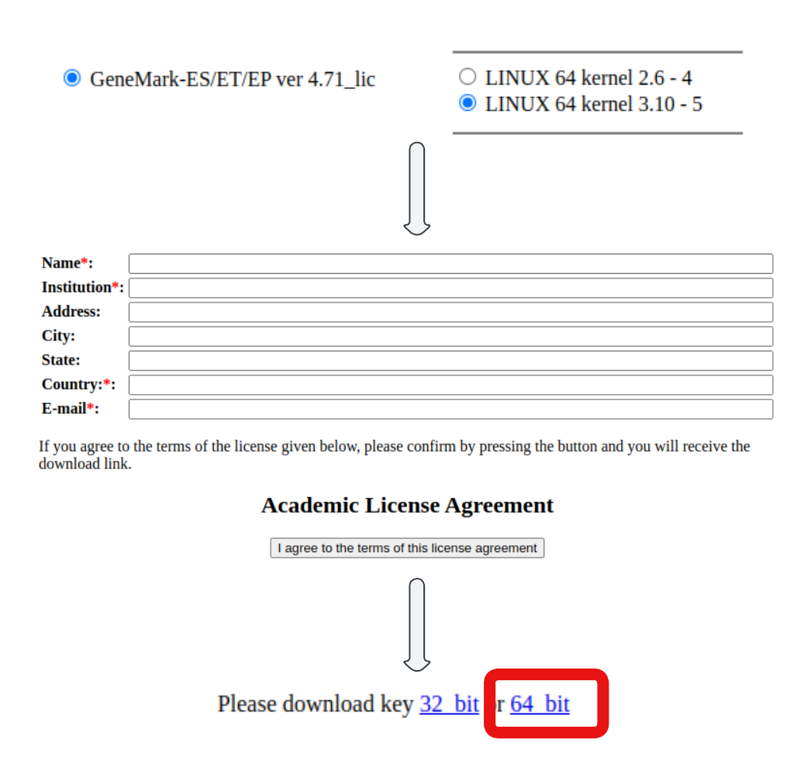

[//]: <> (APPS PAGE BOILERPLATE START)



[//]: <> (APPS PAGE BOILERPLATE END)

## Description

The rapidly growing number of sequenced genomes requires fully automated
methods for accurate gene structure annotation. With this goal in mind,
we have developed
BRAKER1<sup>[R1](https://github.com/Gaius-Augustus/BRAKER#f1)[R0](https://github.com/Gaius-Augustus/BRAKER#f0)</sup>,
a combination of
GeneMark-ET <sup>[R2](https://github.com/Gaius-Augustus/BRAKER#f2)</sup> and
AUGUSTUS <sup>[R3, ](https://github.com/Gaius-Augustus/BRAKER#f3)[R4](https://github.com/Gaius-Augustus/BRAKER#f4)</sup>,
that uses genomic and RNA-Seq data to automatically generate full gene
structure annotations in novel genome.

However, the quality of RNA-Seq data that is available for annotating a
novel genome is variable, and in some cases, RNA-Seq data is not
available, at all.

BRAKER2 is an extension of BRAKER1 which allows for **fully automated
training** of the gene prediction tools
GeneMark-EX <sup>[R14, ](https://github.com/Gaius-Augustus/BRAKER#f14)[R15, ](https://github.com/Gaius-Augustus/BRAKER#f15)[R17, ](https://github.com/Gaius-Augustus/BRAKER#f17)[F1](https://github.com/Gaius-Augustus/BRAKER#g1)</sup> and
AUGUSTUS from RNA-Seq and/or protein homology information, and that
integrates the extrinsic evidence from RNA-Seq and protein homology
information into the **prediction**.

In contrast to other available methods that rely on protein homology
information, BRAKER2 reaches high gene prediction accuracy even in the
absence of the annotation of very closely related species and in the
absence of RNA-Seq data.

BRAKER3 is the latest pipeline in the BRAKER suite. It enables the usage
of RNA-seq **and** protein data in a fully automated pipeline to train
and predict highly reliable genes with GeneMark-ETP and AUGUSTUS. The
result of the pipeline is the combined gene set of both gene prediction
tools, which only contains genes with very high support from extrinsic
evidence.

Home page : <https://github.com/Gaius-Augustus/BRAKER>

## License and Disclaimer

All source code, i.e. `scripts/*.pl` or `scripts/*.py` are under the
Artistic License
(see <http://www.opensource.org/licenses/artistic-license.php>).

## Prerequisites

!!! prerequisite "Obtain GeneMark-ES/ET Academic License"

    GeneMark-ES/ET which is one of the dependencies for BRAKER requires an individual academic license  (this is free). This can be obtained as below
     -   Download URL <http://topaz.gatech.edu/genemark/license_download.cgi>
     -   
     -   Downloaded filename will be in the format of **gm\_key\_64.gz. **
     -   Decompress this file with `gunzip gm_key_64.gz`  and move it to
         home directory as  a **hidden** file under the filename `.gm_key` .i.e. `~/.gm_key`

!!! info "Copy AUGUSTUS config to a path with read/write permissions"

    Make a copy of AUGUSTUS config from ***/opt/nesi/CS400\_centos7\_bdw/AUGUSTUS/3.4.0-gimkl-2022a/config*** to path with read/write permissions .i.e. project, nobackup,home 

### Example Slurm scripts

Following example uses the [.fa files provided BRAKER developers](https://github.com/Gaius-Augustus/BRAKER/tree/master/example)

``` sl
#!/bin/bash -e

#SBATCH --account nesi12345
#SBATCH --job-name braker-test
#SBATCH --cpus-per-task 4
#SBATCH --mem 1G
#SBATCH --time 02:00:00
#SBATCH --output slurmlogs/%x.%j.out
#SBATCH --error slurmlogs/%x.%j.err


module purge
module load BRAKER/3.0.2-gimkl-2022a-Perl-5.34.1

#export the path to augustus config copied above - prerequisites
export AUGUSTUS_CONFIG_PATH=/path/to/augustus/config

srun braker.pl --threads=${SLURM_CPUS_PER_TASK} --genome=genome.fa --prot_seq=proteins.fa
```

This will generate the output directory named **braker** in the current
working directory with content similar to below 

``` sl
augustus.hints.aa              braker.gtf   genemark_evidence.gff  prothint.gff
augustus.hints.codingseq       braker.log   genemark_hintsfile.gff seed_proteins.faa
augustus.hints.gtf             cmd.log      genome_header.map      species/
augustus.hints_iter1.aa        errors/      hintsfile.gff          uniqueSeeds.gtf
augustus.hints_iter1.codingseq evidence.gff hintsfile_iter1.gff    what-to-cite.txt
augustus.hints_iter1.gff       GeneMark-EP/ prevHints.gff 
augustus.hints_iter1.gtf       GeneMark-ES/ proteins.fa 
```
