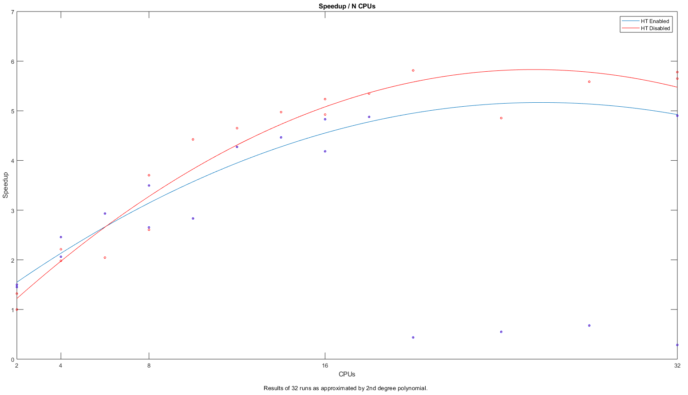

[//]: <> (APPS PAGE BOILERPLATE START)



[//]: <> (APPS PAGE BOILERPLATE END)

``` sl
comsol --help
```

Will display a list of COMSOL batch commands.

!!! tip "Useful Links"
     -   [Running COMSOL in parallel on
         clusters.](https://www.comsol.com/support/knowledgebase/1001/)
     -   [Running parametric sweeps, batch sweeps, and cluster sweeps from
         the command
         line.](https://www.comsol.com/support/knowledgebase/1250/)
     -   [COMSOL and
         Multithreading.](https://www.comsol.com/support/knowledgebase/1096/)

## Batch Submission

When using COMSOL batch the following flags can be used to control
distribution.

|                         |                                                                                                                                  |
|-------------------------|----------------------------------------------------------------------------------------------------------------------------------|
| `-mpibootstrap slurm`   |  Instructs COMSOL to get it's settings from SLURM                                                                                |
| `-np <cpus>`            | Number of CPUs to use in each task. Equivalent to slurm input `--cpus-per-task` or environment variable `${SLURM_CPUS_PER_TASK}` |
| `-nn <tasks>`           | Number of tasks total. `--ntasks` or `${SLURM_NTASKS}`                                                                           |
| `-nnhost <tasks>`       | Number of tasks per node. `--ntasks-per-node` `${SLURM_NTASKS_PER_NODE}`                                                         |
| `-f <path to hostlist>` | Host file. You wont't need to set this in most circumstances.                                                                    |

## Example Scripts

=== "Serial Job"
    Single *process* with a single *thread*
    Usually submitted as part of an array, as in the case of parameter
sweeps.

    ```
    #!/bin/bash -e
    
    #SBATCH --job-name      COMSOL-serial
    #SBATCH --licenses      comsol@uoa_foe
    #SBATCH --time          00:05:00          # Walltime
    #SBATCH --mem           1512               # total mem

    module load COMSOL/{{app.machines.mahuika.versions | last}}
    comsol batch -inputfile my_input.mph
    ```

=== "Shared Memory Job"

    ```
    #!/bin/bash -e
    #SBATCH --job-name      COMSOL-shared
    #SBATCH --licenses      comsol@uoa_foe
    #SBATCH --time          00:05:00        # Walltime
    #SBATCH --cpus-per-task 8
    #SBATCH --mem           4G              # total mem
    module load COMSOL/{{app.machines.mahuika.versions | last}}
    comsol batch -mpibootstrap slurm -inputfile my_input.mph 
    ```

=== Distributed Memory Job

    ```
    #!/bin/bash -e
    
    #SBATCH --job-name      COMSOL-distributed
    #SBATCH --licenses      comsol@uoa_foe
    #SBATCH --time          00:05:00            # Walltime
    #SBATCH --ntasks        8         
    #SBATCH --mem-per-cpu   1500                # mem per cpu
    
    module load COMSOL/{{app.machines.mahuika.versions | last}}
    comsol batch -mpibootstrap slurm -inputfile my_input.mph
    ```

=== "Hybrid Job"

    ```
    #!/bin/bash -e
    #SBATCH --job-name         COMSOL-hybrid
    #SBATCH --licenses         comsol@uoa_foe
    #SBATCH --time             00:05:00          # Walltime
    #SBATCH --ntasks           4                 
    #SBATCH --cpus-per-task    16
    #SBATCH --mem-per-cpu      1500B             # total mem
 
    module load COMSOL/{{app.machines.mahuika.versions | last}}
    comsol batch -mpibootstrap slurm -inputfile my_input.mph
    ```

=== "LiveLink"

    ```sl

    #!/bin/bash -e
    #SBATCH --job-name         COMSOL-livelink
    #SBATCH --licenses         comsol@uoa_foe
    #SBATCH --time             00:05:00
    #SBATCH --cpus-per-task    16
    #SBATCH --mem-per-cpu      1500
 
    module purge

    module load COMSOL/{{app.machines.mahuika.versions | last}}
    module load MATLAB/2021b

    comsol mphserver -silent &
    matlab -batch "addpath('/opt/nesi/share/COMSOL/comsol154/multiphysics/mli/');mphstart;MyScript"
    ```

!!! warning
     If no output file is set, using `--output` the input file will be
     updated instead.

## Interactive Use

Providing you have [set up
X11](../../Scientific_Computing/Terminal_Setup/X11_on_NeSI.md), you can
open the COMSOL GUI by running the command `comsol`.

Large jobs should not be run on the login node.

### LiveLink

If you are using COMSOL LiveLink, you will need to load a MATLAB module (in addition to the COMSOL module), e.g.

```sh
module load MATLAB/2021b
```

Then

```sh
comsol matlab -mlroot <path>
```

Where `<mlpath>`` is the root directory of the MATLAB version you are using (`dirname $(dirname $(which matlab))`).

## Best Practice

COMSOL is relatively smart with it's use of resources, if possible it is
preferable to use `--cpus-per-task` over `--ntasks`

Memory requirements depend on job type, but will scale up with number of CPUs ≈ linearly.

Multithreading will benefit jobs using less than
8 CPUs, but is not recommended on larger jobs.

*Performance is highly depended on the model used. The above should only be used as a very rough guide.*
