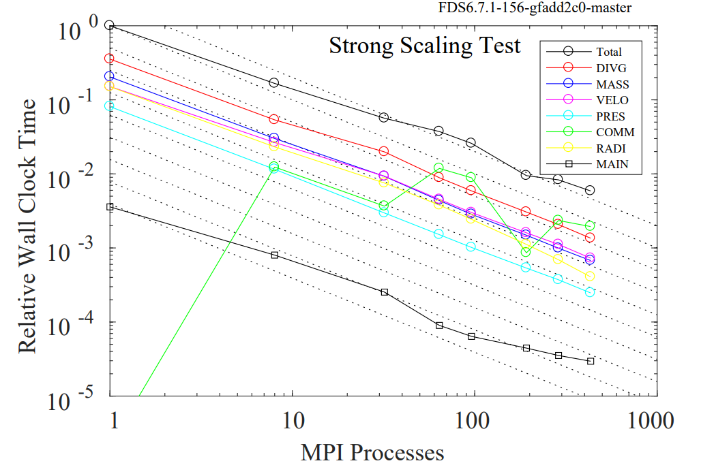
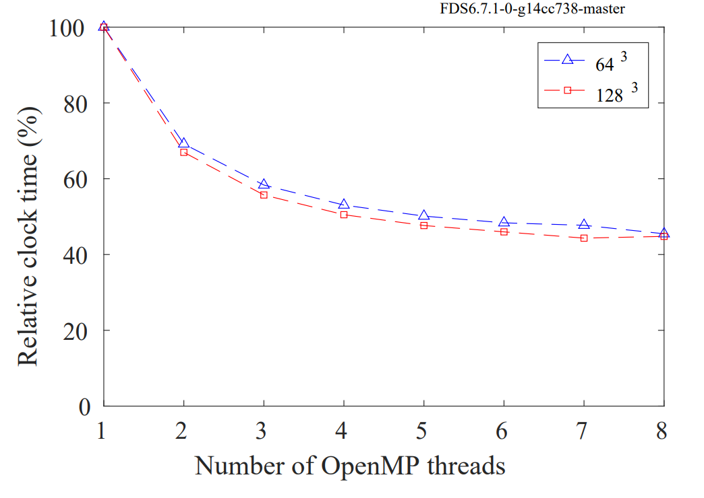

[//]: <> (REMOVE ME IF PAGE VALIDATED)
[//]: <> (vvvvvvvvvvvvvvvvvvvv)
!!! warning
    This page has been automatically migrated and may contain formatting errors.
[//]: <> (^^^^^^^^^^^^^^^^^^^^)
[//]: <> (REMOVE ME IF PAGE VALIDATED)

FDS (Fire Dynamics Simulator) was developed by the National Institute of
Standards and Technology (NIST) for large-eddy simulation (LES) of
low-speed flows, with an emphasis on smoke and heat transport from
fires.

General documentation can be found
[here](https://github.com/firemodels/fds/releases/download/FDS6.7.1/FDS_User_Guide.pdf).

FDS can utilise both
[MPI](https://support.nesi.org.nz/hc/en-gb/articles/360000690275-SLURM-Parallel-Execution#t_mpi)
and
[OpenMP](https://support.nesi.org.nz/hc/en-gb/articles/360000690275-SLURM-Parallel-Execution#t_multi)

### Example Script

``` sl
#!/bin/bash -e

#SBATCH --time           02:00:00       #Walltime
#SBATCH --ntasks         4              #One task per mesh, NO MORE
#SBATCH --cpus-per-task  2              #More than 4 cpus/task not recommended.
#SBATCH --output         %x.out     #Name output file according to job name
#SBATCH --hint           nomultithread  #Hyperthreading decreases efficiency.

module load FDS/6.7.1-intel-2017a

input="/nesi/project/nesi99999/path/to/input.fds"

srun fds ${input}
```

# Recommendations

-   FDS will run in Hybrid Parallel, but will be less efficient that
    full MPI using the same number of CPUs.
-   MPI if the preferable method of scaling, if you can partition your
    mesh more you should do that before considering multi-threading
    (OpenMP). e.g. `ntasks=2, cpus-per-task=1` is preferable
    to `ntasks=1, cpus-per-task=2`
-   Each mesh should have it's own task, assigning more tasks than there
    are meshes will cause an error.
-   Multi-threading efficiency drops off significantly after 4 physical
    cores. `--cpus-per-task 4`
-   Hyper-threading is not recommended. Set `--hint nomultithread`

## Scaling with MPI



## Scaling with oMP



 

 

 
