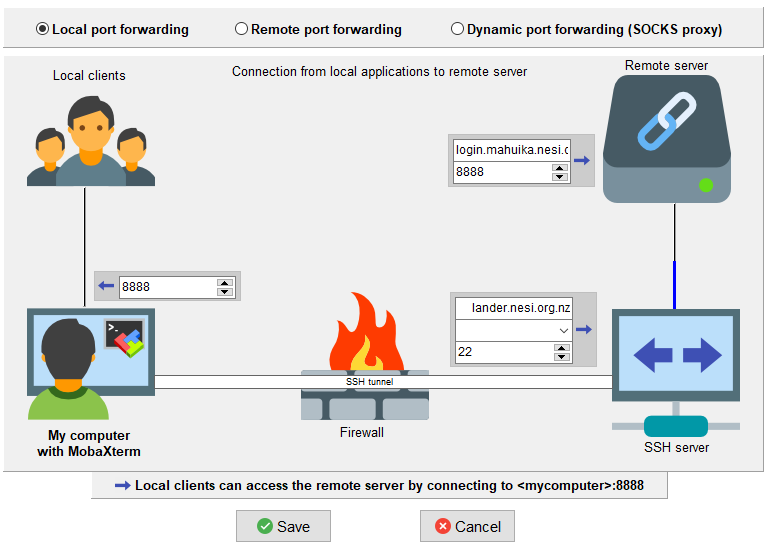
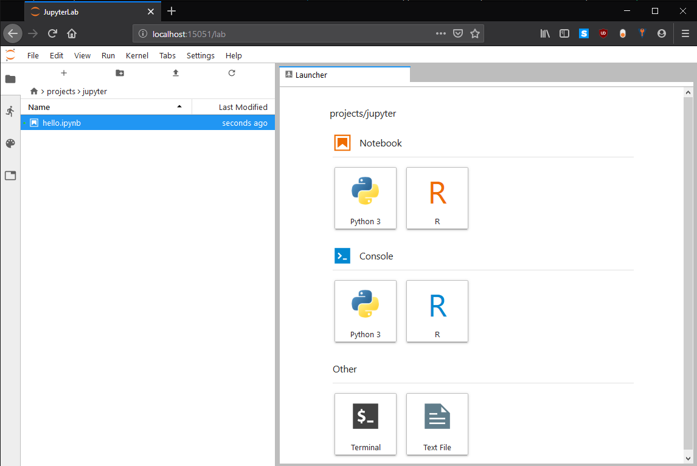

[//]: <> (REMOVE ME IF PAGE VALIDATED)
[//]: <> (vvvvvvvvvvvvvvvvvvvv)
!!! info
    This page has been automatically migrated and may contain formatting errors.
[//]: <> (^^^^^^^^^^^^^^^^^^^^)
[//]: <> (REMOVE ME IF PAGE VALIDATED)

!!! info Note
>
> This documentation contains our legacy instructions for running
> JupyterLab by tunnelling through the lander node.  
> [If you are a Mahuika cluster user, we recommend using jupyter via 
> jupyter.nesi.org.nz. Follow this link for more
> information](https://support.nesi.org.nz/hc/en-gb/articles/360001555615)

NeSI provides a service for working on Jupyter Notebooks. As a first
step JupyterLab can be used on Mahuika nodes. JupyterLab is a
single-user web-based Notebook server, running in the user space.
JupyterLab servers should be started preferably on a compute node,
especially for compute intensive or memory intensive workloads. For less
demanding work the JupyterLab server can be started on a login or
virtual lab node. After starting the server your local browser can be
connected. Therefore port forwarding needs to be enabled properly. The
procedure will be simplified in future, but now require the following
steps, which are then described in more details:

-   [Launch JupyterLab](#h_a0e4107a-358d-4db6-a7a4-c2c3273c74ed)
    -   [Connect to the NeSI system to establish SSH port
        forwarding ](#h_22b17d98-8054-4898-871e-38a42a2e3849)
        -   [SSH Command Line](#h_892370eb-662a-4480-9ae4-b56fd64eb7d0)
            OR
        -   [MobaXterm GUI](#h_cc633523-5df0-4f24-a460-391ced9a0316)
    -   open another session to the NeSI system
    -   [Launch the JupyterLab
        server](#h_a46369a1-5f2c-4ed8-82c2-f06c0c1d58b4)
        -   [on login nodes / virtual
            labs](#h_fca84ce8-3167-4c14-a128-23049417a5dd) OR
        -   [on compute nodes](#h_6cb2d7b4-f63c-49ed-ba73-f58fd903d86d)
    -   [Launch JupyterLab in your local
        browser](#h_22b17d98-8054-4898-871e-38a42a2e3849)
-   [Kernels](#h_e7f80560-91c0-420a-bccb-17bbf8c2e916)
-   [Packages](#h_04f2f4e2-8e7a-486d-aea5-e020eb9df66e)

# Launch JupyterLab

Since JupyterLab is a web based application, and at NeSI launched behind
the firewall, a **port** needs to be forwarded to your local machine,
where your browser should connected. This ports are numbers between 2000
and 65000, which needs to be unique on the present machine. The default
port for JupyterLab is 8888, but only one user can use this at a time.

To avoid the need for modifying the following procedure again and again,
we suggest to (once) select a unique number (between 2000 and 65000).
This number needs to be used while establishing the port forwarding and
while launching JupyterLab. In the following we use the port number
15051 (**please select another number**).

## Setup SSH port forwarding 
!!! info Requirements
>
> -   In the following we assume you already configured
>     your`.ssh/config` to use two hop method as described in the
>     [Standard Terminal
>     Setup](https://support.nesi.org.nz/hc/en-gb/articles/360000625535).

First, the port forwarding needs to be enabled between your local
machine and the NeSI system. Therewith a local port will be connected to
the remote port on the NeSI system. For simplicity, we kept both numbers
the same (here 15051). This can be specified on the [command line in the
terminal](#h_892370eb-662a-4480-9ae4-b56fd64eb7d0) or using the
[MobaXterm GUI](#h_cc633523-5df0-4f24-a460-391ced9a0316).

### SSH Command Line

The ssh command need to be called with following arguments, e.g. for
Mahuika:

``` sl
ssh -N -L 15051:localhost:15051 mahuika
```

Here -N means "Do not execute a remote command" and -L means "Forward
Local Port".
!!! info Tips
>
> -   For Maui\_Ancil, e.g. w-mauivlab01 you may want to add the
>     following to your `.ssh/config` to avoid establishing the
>     additional hop manually.
>
>     ``` sl
>     Host maui_vlab
>        User <username>
>        Hostname w-mauivlab01.maui.niwa.co.nz
>        ProxyCommand ssh -W %h:%p maui
>        ForwardX11 yes
>        ForwardX11Trusted yes
>        ServerAliveInterval 300
>        ServerAliveCountMax 2
>     ```
>
>     &lt;username&gt; needs to be changed. Hostnames can be adapted for
>     other nodes, e.g. `w-clim01`

### MobaXterm GUI
!!! info Tips
>
> -   MobaXterm has an internal terminal which acts like a linux
>     terminal and can be configured as described in the [Standard
>     Terminal
>     Setup](https://support.nesi.org.nz/hc/en-gb/articles/360000625535).
>     Therewith the [SSH command
>     line](#h_892370eb-662a-4480-9ae4-b56fd64eb7d0) approach above can
>     be used.

 

MobaXterm has a GUI to setup and launch sessions with port forwarding,
click 'Tools &gt; MobaSSH Thunnel (port forwarding)':

-   specify the lander.nesi.org.nz as SSH server address (right, lower
    box, first line)
-   specify your user name (right, lower box, second line)
-   specify the remote server address, e.g. login.mahuika.nesi.org.nz 
    (right, upper box first line)
-   specify the JupyterLab port number on the local side (left) and at
    the remote server (right upper box, second line)
-   Save



## Launch the JupyterLab server 

After successfully establishing the port forwarding, we need open
another terminal and login to the NeSI system in the usual way, e.g.
opening a new terminal and start another ssh session:

``` sl
ssh mahuika
```

On the Mahuika login node, load the environment module which provides
JupyterLab:

``` sl
module load JupyterLab
```

Or alternatively, and particularly if you are using a Māui ancillary
node instead of Mahuika, you can use the Anaconda version of JupyterLab
instead:

``` sl
module load Anaconda3
module load IRkernel  # optional
```

The JupyterLab server then can be started on the present node (login or
virtual lab) or offloaded to a compute node. Please launch compute or
memory intensive tasks [on a compute
node](#h_6cb2d7b4-f63c-49ed-ba73-f58fd903d86d).

### On login nodes / virtual labs

For very small (computational cheap and small memory) the JupyterLab can
be started on the login or virtual lab using: 

``` sl
jupyter lab --port 15051 --no-browser
```

Where, `--port 15051` specifies the above selected port number and
`--no-browser` option prevents JupyterLab from trying to open a browser
on the compute/login node side. Jupyter will present output as described
in the [next section](#h_6cb2d7b4-f63c-49ed-ba73-f58fd903d86d) including
the URL and a unique key, which needs to be copied in your local
browser.

### On compute node

Especially notebooks with computational and memory intensive tasks
should run on compute nodes. Therefore, a script is provided, taking
care of port forwarding to the compute node and launching JupyterLab. A
session with 60 min on 1 core can be launched using:

``` sl
srun --ntasks 1 -t 60  jupyter-compute 15051  # please change port number
```

After general output, JupyterLab prints a URL with a unique key and the
network port number where the web-server is listening, this should look
similar to:

``` sl
...
[C 14:03:19.911 LabApp]
  To access the notebook, open this file in a browser:
      file:///scale_wlg_persistent/filesets/project/nesi99996/.local/share/jupyter/runtime/nbserver-503-open.html
  Or copy and paste one of these URLs:
      http://localhost:15051/?token=d122855ebf4d029f2bfabb0da03ae01263972d7d830d79c4
```

The last line will be needed in the browser later.

Therewith the Notebook and its containing tasks are performed on a
compute node. You can double check e.g. using

``` sl
import os
os.open('hostname').read()
```

More resources can be requested, e.g. by using:

``` sl
srun --ntasks 1 -t 60 --cpus-per-task 5 --mem 512MB jupyter-compute 15051 
```

Where 5 cores are requested for threading and a total memory of 3GB.
Please do not use `multiprocessing.cpu_count()` since this is returning
the total amount of cores on the node. Furthermore, if you use
libraries, which implement threading align the numbers of threads (often
called jobs) to the selected number of cores (otherwise the performance
will be affected).

## JupyterLab in your local browser 

Finally, you need to open your local web browser and copy and paste the
URL specified by the JupyterLab server into the address bar. After
initializing Jupyter Lab you should see a page similar to:



# Kernels

The following JupyterLab kernel are installed:

-   Python3
-   R 
-   Spark

## R

verify that the module IRkernel is loaded

``` sl
module load IRkernel
```

# Spark

pySpark and SparkR is supported in NeSI Jupyter notebooks. Therefore,
the module Spark needs to be loaded before starting Jupyter. Please run
Spark workflows on compute nodes.

``` sl
module load Spark
```

# Packages

There are a long list of default packages provided by the JupyterLab
environment module (list all using `!pip list`) and R (list using
`installed.packages(.Library)`, note the list is shortened). 

Furthermore, you can install additional packages as described on the
[Python](https://support.nesi.org.nz/hc/en-gb/articles/207782537) and
[R](https://support.nesi.org.nz/hc/en-gb/articles/209338087) support
page.
