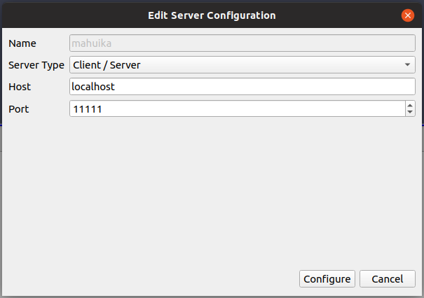

[//]: <> (APPS PAGE BOILERPLATE START)



[//]: <> (APPS PAGE BOILERPLATE END)

!!! warning
     The ParaView server loaded must be the same version as the client you
     have installed locally.

## Setting up Client-Server Mode

If you want to use ParaView in client-server mode, use the following
setup:

- Load one of the ParaView Server modules listed above and launch the
    server in your interactive visualisation session on the HPC using;

    ```sh
    module load ParaView
    ```

- To start the ParaView server run;  

    ```sh
    pvserver
    ```

- You should see;

    ```sh
    Waiting for client...
    Connection URL: cs://mahuika02:11111
    Accepting connection(s): mahuika02:11111
    ```

- Create an SSH tunnel for port "11111" from your local machine to the
    cluster. e.g.

    ```sh
    ssh mahuika -L 11111:mahuika02:11111
    ```

    Make sure the host name and socket match those given by the server
    earlier!

- Launch the ParaView GUI on your local machine and go to "File &gt;
    Connect" or click
    the  button.

- Click on "Add Server", choose server type "Client / Server", host
    "localhost" (as we will be using the SSH tunnel), and port "11111",
    then click on "Configure" .

- 

- Select the new server and click on "Connect"

## Parallelisation

The CPU based versions of ParaView use the OpenSWR rasteriser as well as
the OSPRay ray tracer for rendering graphics. These support parallel
operation for better performance, but are configured to only use a
single core by default. Run the following commands *before* launching
ParaView GUI or ParaView Server if you want to use more cores (depending
on the number of cores available in your session):

```sh
export KNOB_MAX_WORKER_THREADS=<number of cores>
export OSPRAY_THREADS=<number of cores>
```

ParaView Server also supports parallel execution using MPI.
