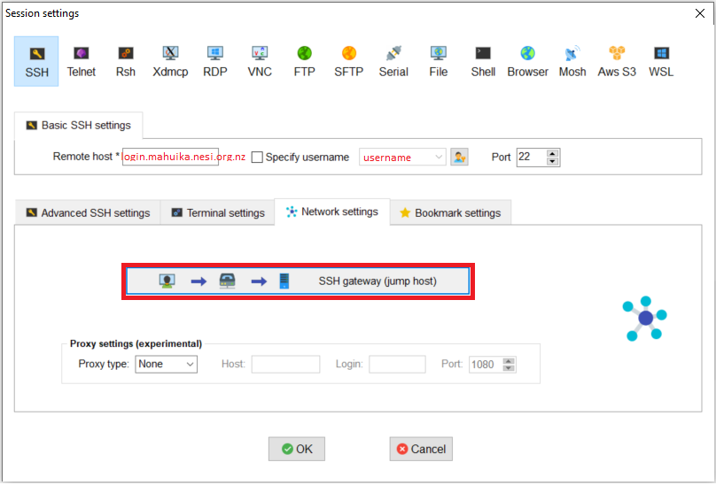
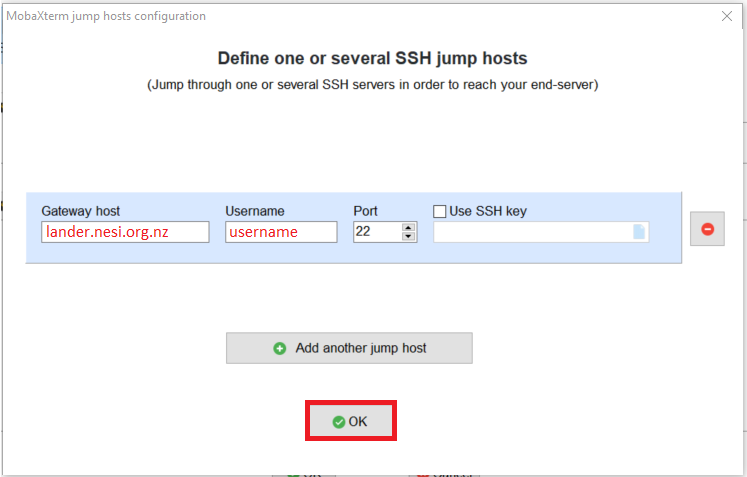
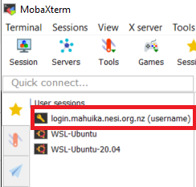

!!! WARNING  
    Logging in via the "sessions" functionality is not compatible with the new HPC's login procedure.  
    It is recommended to use [OnDemand](https://ondemand.nesi.org.nz/) for file browsing, up and downloading and terminal access if you would normally have used MobaXterm.

!!! prerequisite
     -   Have an [active account and project.](../../Getting_Started/Accounts-Projects_and_Allocations/Creating_a_NeSI_Account_Profile.md)

Setting up MobaXterm as shown below will allow you to connect to Mahuika with less keyboard inputs as well as allow use of the file
transfer GUI.

1. [Download MobaXterm](https://mobaxterm.mobatek.net/download-home-edition.html)
    - Some users have reported having issues downloading files using
        MobaXterm 23.6. We suggest using version 23.5 instead.
    - Use the Portable Edition if you don't have administrator rights
        on your machine. This is the recommended way for NIWA
        researchers.
    - Otherwise, choose freely the Portable or Installer Edition.
2. To set up a session, Click 'Session' in the top left corner:
3. In "SSH",
    - Set the remote host to `login.hpc.nesi.org.nz`.
Enter your password.

``` sh
Authenticator Code (Second Factor):
```

Enter your second factor six digit number (no space).

Then Mahuika users may be prompted again:

``` sh
Login Password:
```

Enter your password again

Māui users will instead be prompted with:

``` sh
Password:
```
    Enable the "Specify username" option and put your Username in
        the corresponding box.
        
4. In the "Advanced SSH settings"
    - Set SSH-browser type to '**SCP (enhanced speed)**'.
    - Optionally, tick the 'Follow SSH path' button.
5. In the “Network settings” tab:
    - Select "SSH gateway (jump host)" to open a popup window
    - In this window enter `lander.hpc.nesi.org.nz` in the “Gateway host”
        field, as well as your NeSI username in the Username field for
        the gateway SSH server then select OK to close the window.

    

    

6. Click 'OK' on the open window, usually this will start a new session
    immediately. *See usage below.*

!!! bug
    There is a bug which causes some users to be repeatedly prompted
    `<username>@lander.nesi.hpc.org.nz's password:`  
    This can be resolved by clicking "OK" each time you are prompted then
    logging in as normal once you are prompted for your `First Factor:` or
    `Password:`.  
    See [Login Troubleshooting](../../General/FAQs/Login_Troubleshooting.md) for more
    details

## Usage

You will see your saved session in the left hand panel under 'Sessions'.
Double click to start.



You will be prompted by dialogue box.

``` sh
Login Password (First Factor):
```

## Credential Manager

If you are using the built in credential manager you will have to make
sure to delete old entries when changing your password.

## Troubleshooting

### After Changing Password

If you are experiencing login issues after resetting your password, it
is likely due to an issue with MobaXterm saved sessions and Password
management system for saved session.

Two steps to try:

- Remove any previously saved sessions either related to `lander` OR
    `mahuika` from sessions panel on the left
- Access MobaXterm password management system as below and remove
    saved credentials
    - Go to **Settings**-&gt;**Configuration** and go to the
        **General** tab and click on **MobaXterm password management**
    - You will see the saved sessions for `lander` (and perhaps
        `mahuika` as well). I recommend removing all of it and restart
        MobaXterm before the next login attempt

Then setup a new session [according to the support doc instructions](./MobaXterm_Setup_Windows.md)
as before.

!!! prerequisite "What Next?"
     -   [Moving files to/from a cluster.](../../Getting_Started/Next_Steps/Moving_files_to_and_from_the_cluster.md)
