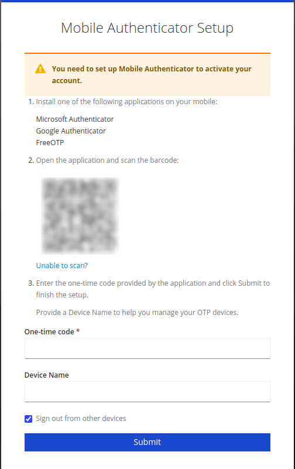



!!! prerequisite
     -   Have an [active account and project.](../../Getting_Started/Accounts-Projects_and_Allocations/Creating_a_NeSI_Account_Profile.md)
     -   Have one of:
         - Built in Linux/Mac terminal
         - [Windows Subsystem for Linux](../../Scientific_Computing/Terminal_Setup/Windows_Subsystem_for_Linux_WSL.md)
         - [VSCode](../../Scientific_Computing/Terminal_Setup/VSCode.md)

!!! warn
    The following instructions may not work when using any non-standard terminal client.

## First time setup

The login process can be simplified significantly with a few easy
configurations.

1. In a new local terminal run; `mkdir -p ~/.ssh/sockets` this will
    create a subdirectory in your home directory to store socket
    configurations.

2. Open your ssh config file (e.g. `nano ~/.ssh/config` to open with the text editor `nano`) and add the
    following (replacing **`username`** with your username):

    ```sh
    Host hpc3lander 
    User username 
    HostName lander.hpc.nesi.org.nz 

    Host nesi
    User username 
    Hostname login.hpc.nesi.org.nz 
    ProxyCommand ssh -W %h:%p hpc3lander
    ```

    Close and save with ctrl x, y, Enter
   
!!! warning
    For MobaXterm users `nano` is not available be default if you have not installed `nano` you will want to use your preferred text editor. `notepad` is available on Windows machines but you will need to move to the `.ssh/` directory. To create the `config` file with Notepad use the `cd ~/.ssh/` to enter the `.ssh/` directory and run the command `notepad config.` (ensuring the filename ends with a `.` so it does not default to a `.txt` file), this will open the Notepad GUI. Once you have copied and edit the previously specified block of text you can select "File" the "Save" from the dropdown menu and exit Notepad.
   
4. Ensure the permissions are correct by
    running `chmod 600 ~/.ssh/config`.

5. Run the command.

    ```sh
    ssh nesi
    ```

6. You will be prompted to approve host authenticity

    ```sh
    The authenticity of host 'lander.hpc.nesi.org.nz (163.7.144.68)' can't be established.
    ECDSA key fingerprint is SHA256:############################################.
    ECDSA key fingerprint is MD5:##:##:##:##:##:##:##:##:##:##:##:##:##:##:##:##.
    Are you sure you want to continue connecting (yes/no)? 
    ```

    Type `yes` and <kbd>Enter</kbd>

7. You will be presented with a link.

    ```sh
    Authenticate at https://iam.nesi.org.nz/realms/public/device?user_code=XXXX-XXXX and press ENTER.
    ```

    Depending on the terminal used, you may have to hold `ctrl` when clicking to follow the link.

!!! warn "Double Authentication"
    If you set up your `.ssh/config` as recommended you will be prompted to authenticate again. We are working on fixing this.

7. Select your institution, you will be prompted to provide your login details.

8. Click 'Yes' when prompted to trust this device. This will allow you to log in without 2FA for 7 days. The name can be anything.
    .

9. Scan the QR code with your authenticator app. Then enter the six digit code provided. You may give your device a name.

    

10. Return to your terminal, and press <kbd>enter</kbd>.

## Subsequent log in

1. `ssh nesi`
2. Follow the link.
3. You may be prompted for your 6 digit code.
4. Return to your terminal, and press <kbd>enter</kbd>.

!!! prerequisite "What Next?"
     -   [Moving files to/from a cluster.](../../Getting_Started/Next_Steps/Moving_files_to_and_from_the_cluster.md)
     -   Setting up an [X-Server](../../Scientific_Computing/Terminal_Setup/X11_on_NeSI.md) (optional).
