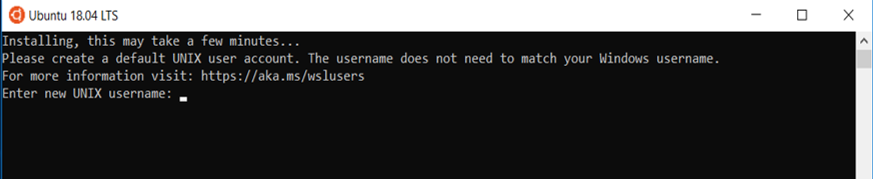
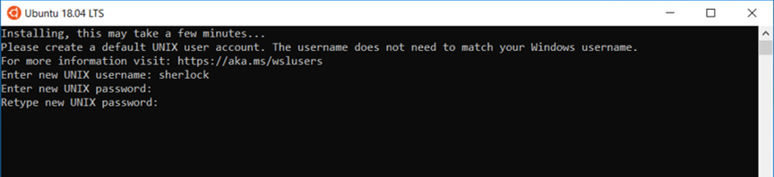

!!! prerequisite
     -   Be a [member of an active project.](../../Getting_Started/Accounts-Projects_and_Allocations/Applying_to_join_an_existing_NeSI_project.md)
     -   Windows with [WSL enabled.](../../Scientific_Computing/Terminal_Setup/Windows_Subsystem_for_Linux_WSL.md)

Currently the native Windows command prompt (even with WSL enabled) does
not support certain features, until this is fixed we recommend using the
Ubuntu LTS Terminal.


1. Open 'Windows Power Shell' and type
     ```ps
     wsl --install -d Ubuntu-20.04
     ```
2. When it has finished downloading, the Ubuntu Terminal will appear and prompt you for a username.
3. Launch “Ubuntu 18.04 LTS” from start menu and wait for the first
    time installation to complete.
4. As you are running Ubuntu on Windows for the first time, it will
    require to be configured. Once the installation was complete, you
    will be prompted to “Enter new UNIX username” and press
    <kbd>Enter</kbd>. This username can be anything you want.  
      
5. Now, type in a new password for the username you picked and press
    <kbd>Enter</kbd>. (Again this password is anything you want). Then
    retype the password to confirm and press <kbd>Enter</kbd>  
    
6. To create a symbolic link to your Windows filesystems in your home
    directory run the following command replacing c with the name of
    your Windows filesystems found in /mnt/.

    ``` sl
    ln -s /mnt/c/Users/YourWindowsUsername/ WinFS
    ```

!!! prerequisite What "Next?"
     -   Set up your [SSH config file](../../Scientific_Computing/Terminal_Setup/Standard_Terminal_Setup.md).
