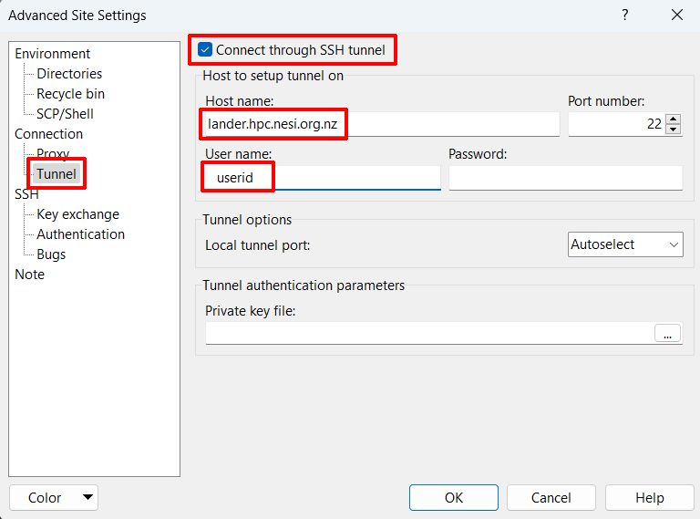

!!! prerequisite
     -   Have an [active account and project.](../../Getting_Started/Accounts-Projects_and_Allocations/Creating_a_NeSI_Account_Profile.md)
     -   Set up your [NeSI account password.](../../Getting_Started/Accessing_the_HPCs/Setting_Up_and_Resetting_Your_Password.md)
     -   Set up Second [Factor Authentication.](../../Getting_Started/Accessing_the_HPCs/Setting_Up_Two_Factor_Authentication.md)
     -   Be using the Windows operating system.

WinSCP is an SCP client for windows implementing the SSH protocol from
PuTTY.

1. [Download WinSCP](https://winscp.net/eng/download.php).

2. Upon startup:
    

3. Add a *New Site* and set:

    - Enter *Host Name:* `login.hpc.nesi.org.nz`.
    - Enter your NeSI account username into the *User name:* field

!!! tip
    For "file protocol" (the topmost drop-down menu), either SCP or SFTP
    is acceptable. If you are trying to move many small files or have a
    slow or flaky Internet connection, you may find that SFTP performs
    better than SCP. Feel free to try both and see which works best for
    you.
   

5. Open Advanced Settings.

    

6. Navigate to *Connection & Tunnel* and set:
    - Enable "Connect through SSH tunnel".
    - Under "Host name:" enter lander.hpc.nesi.org.nz
    - Under "User name:" enter your username.
7. *OK &gt; Save*

!!! note
    When logging in to the cluster using WinSCP the authentication link is clickable. You do not need to enter anything in the text box under the authentication link.

## Setup for PuTTY Terminal

The default WinSCP terminal is very basic. We
recommend you use the PuTTY terminal instead.

1. [Download PuTTY](https://www.putty.org/) and install.

2. In WinSCP open 'Tools &gt; Preferences'

3. Under *Integration &gt; Applications* enable *Remember session
password and pass it to PuTTY*

## Setup for Xming (Optional)

Xming is an X server for Windows allowing graphical interface with the
HPC and can be downloaded
[here](https://sourceforge.net/projects/xming/).

1\. Install Xming following the prompts. (Make sure 'Normal PuTTY Link
SSH Client' is selected).

2\. Under *Integration &gt; Applications* and add -X after
PuTTY/Terminal client path.

**

3\. Restart your session.
!!! prerequisite Important
     In order for X11 forwarding to work you must have an Xming server
     running before connecting to the HPC.

## Usage

Files can be dragged, dropped and modified in the WinSCP GUI just like
in any windows file system.

 Will
open a **PuTTY terminal**. Assuming you followed the steps setting up
PuTTY, this should automatically enter your details.

 Will
open the default **WinSCP terminal**. While the functionality is
identical to any other terminal the interface is slightly abstracted,
with a separate window for input and command history drop-down.

 Type
here to **change directory**. The GUI doesn't follow your current
terminal directory like MobaXterm so must be changed
manually. (Recommend making this larger as the default is hard to
type in).

 **Bookmark**
current directory.

### Troubleshooting

#### Repeated Authentication Prompts

By default, WinSCP will create multiple tunnels for file transfers.
Occasionally this can lead to an excessive number of prompts. Limiting
number of tunnels will reduce the number of times you are prompted.

1. Open settings
    

2. Under 'Transfer' -&gt; 'Background', set the 'Maximal number of
transfers at the same time' to '1' and un-tick 'Use multiple connections
for a single transfer'.

!!! warning
     As WinSCP uses multiple tunnels for file transfer you will be required
     to authenticate again on your first file operation of the session. The
     second prompt for your second-factor token can be skipped, just as
     with login authentication.

!!! prerequisite "What Next?"
     -   [Moving files to/from a cluster.](../../Getting_Started/Next_Steps/Moving_files_to_and_from_the_cluster.md)
     -   Setting up an [X-Server](../../Scientific_Computing/Terminal_Setup/X11_on_NeSI.md)(optional).
