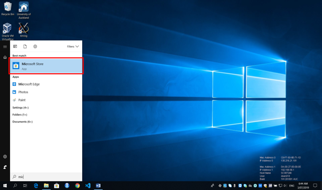
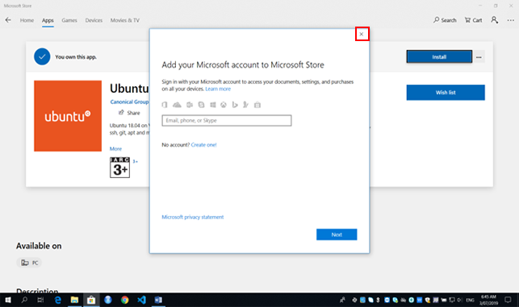
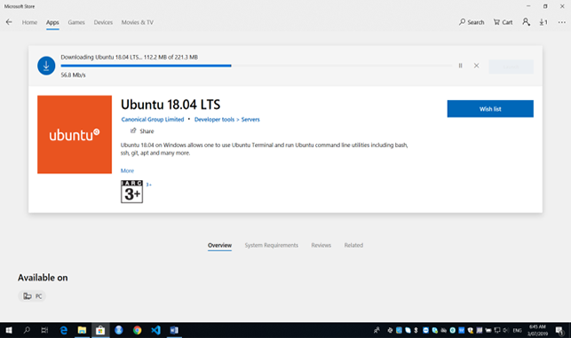

!!! prerequisite
     -   Windows 10 (version 2004) or later.

Windows Subsystem for Linux is a feature that allows you to utilise some
Linux commands and command line tools.

WSL is enabled by default on later versions of Windows 10.

!!! tip
     WSL1 has been superseded by WSL2, which is an
     [improvement in several areas](https://learn.microsoft.com/en-us/windows/wsl/compare-versions).
  
     You can see what version is installed by opening 'Windows PowerShell'
     and typing `wsl --version`.
  
     If you are still using WSL1, see
     [Upgrade version from WSL1 to WSL2](https://learn.microsoft.com/en-us/windows/wsl/install#upgrade-version-from-wsl-1-to-wsl-2)

## Installing WSL

Microsoft provides [setup instructions](https://learn.microsoft.com/en-us/windows/wsl/install) for installing both WSL and a WSL distribution.
You will need administrative access on your computer if WSL was not preinstalled.

To check if WSL is already installed on your Windows PC, open Windows Command Prompt, Terminal, or Powershell and run `wsl --list --online`.
This should return a list of available WSL distributions.

## Installing a Distribution

In order to make use of WSL features, you will also need to install a Linux distribution.

Distributions can be obtained through the Microsoft Store, or using command line.

=== "Using The Microsoft Store"
     - Open the Microsoft store, search for 'Ubuntu', find and install the
     latest version of the Ubuntu LTS it should look something like
     'Ubuntu 20.04 LTS' , though you may find a later version.

     
       
          
     - Close the “Add your Microsoft account.. dialogue box as you do not
     need an account for the installation.You may have to click “Install”
     for a second time (If the above dialogue box reappears, close as
     before and download/install will begin).
     
     
     
=== "Using Command Line"
     - Open 'Windows Power Shell' and type

     ```ps
     wsl --install -d Ubuntu-20.04
     ```
  
- When it has finished downloading, the Ubuntu Terminal will appear and prompt you to “Enter new UNIX username”
    and press <kbd>Enter</kbd>.
  
    This can be anything you want, although we reccomend using the same as your Windows username.
    
  
- Now, type in a new password for the username you picked and press
    <kbd>Enter</kbd> (this password can be anything you want, although you shouldn't need to enter it again).
    Then retype the password to confirm and press <kbd>Enter</kbd>.
    

## Creating a Symlink (optional)

You may find having a symbolic link to your Windows filesystems useful.

Within Ubuntu terminal run the following command replacing c with the name of
your Windows filesystems found in /mnt/.

```sh
ln -s /mnt/c/Users/YourWindowsUsername/ WinFS
```

!!! prerequisite What "Next?"
     -   Set up your [SSH config file](../../Scientific_Computing/Terminal_Setup/Standard_Terminal_Setup.md).
