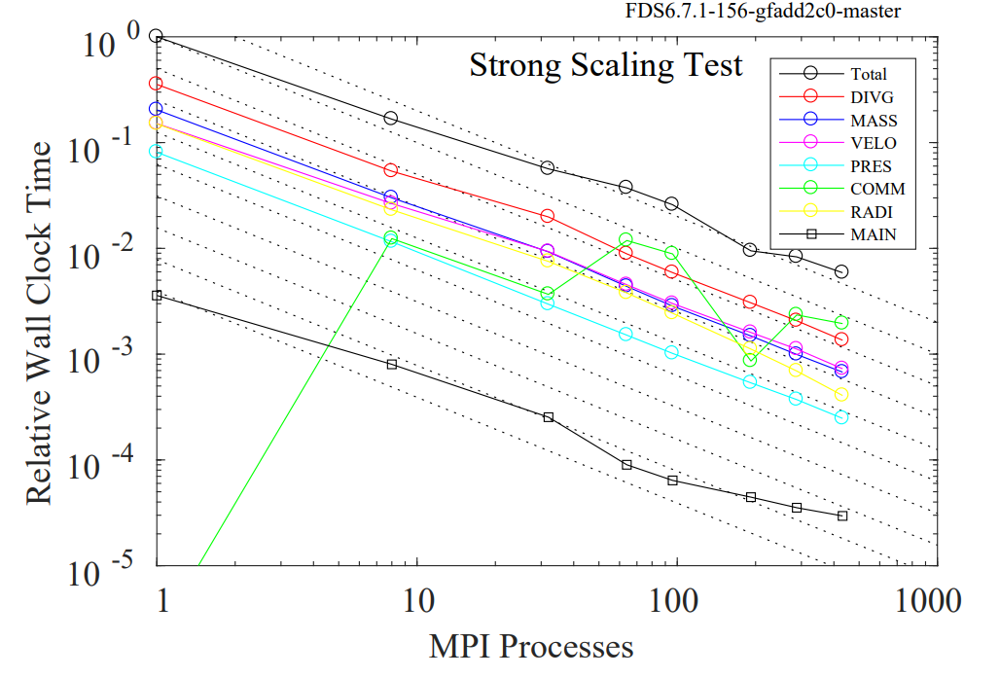
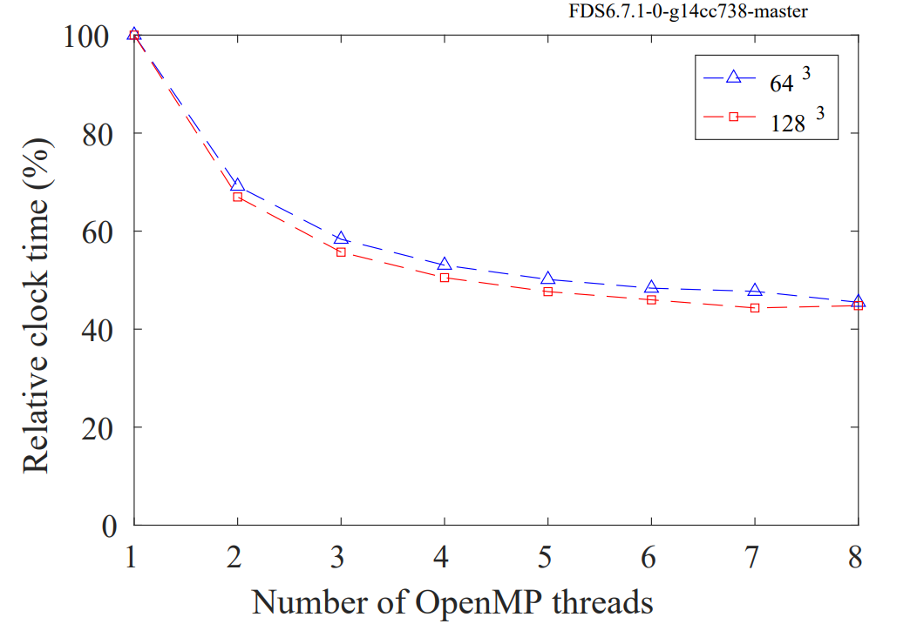

[//]: <> (APPS PAGE BOILERPLATE START)



[//]: <> (APPS PAGE BOILERPLATE END)

FDS (Fire Dynamics Simulator) was developed by the National Institute of
Standards and Technology (NIST) for large-eddy simulation (LES) of
low-speed flows, with an emphasis on smoke and heat transport from
fires.

FDS can utilise both
[MPI](../Parallel_Computing/Parallel_Computing.md#mpi)
and
[OpenMP](../Parallel_Computing/Parallel_Computing.md#multi-threading)

## Example Script

``` sl
#!/bin/bash -e

#SBATCH --job-name       FDS-job
#SBATCH --job-name       nesi99991
#SBATCH --time           02:00:00       # Walltime
#SBATCH --ntasks         4              # One task per mesh, NO MORE
#SBATCH --cpus-per-task  2              # More than 4 cpus/task not recommended.
#SBATCH --output         %x.out         # Name output file according to job name
#SBATCH --hint           nomultithread  # Hyperthreading decreases efficiency.

module load FDS/6.7.1-intel-2017a

input="/nesi/project/nesi99999/path/to/input.fds"

srun fds ${input}
```

## Recommendations

- FDS will run in Hybrid Parallel, but will be less efficient that
    full MPI using the same number of CPUs.
- MPI if the preferable method of scaling, if you can partition your
    mesh more you should do that before considering multi-threading
    (OpenMP). e.g. `ntasks=2, cpus-per-task=1` is preferable
    to `ntasks=1, cpus-per-task=2`
- Each mesh should have it's own task, assigning more tasks than there
    are meshes will cause an error.
- Multi-threading efficiency drops off significantly after 4 physical
    cores. `--cpus-per-task 4`
- Simultaneous multithreading is not recommended. Do not set `--hint multithread`

### Scaling with MPI



### Scaling with oMP


