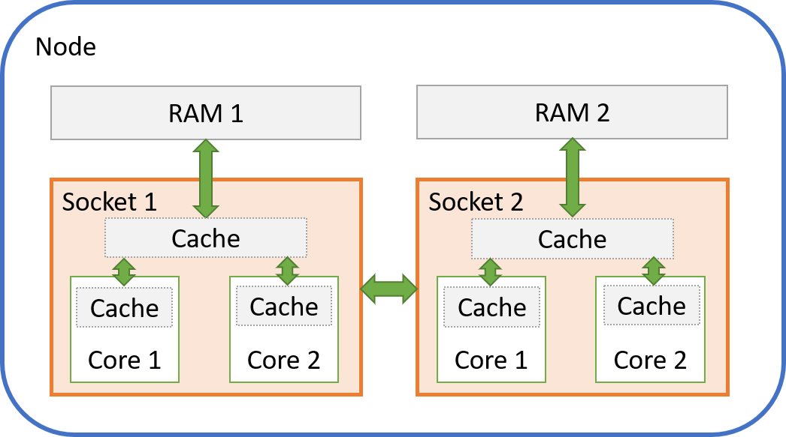

Multithreading with OpenMP and other threading libraries is an important
way to parallelise scientific software for faster execution (see our
article on [Parallel../../Getting_Started/Submitting_A_Job/Parallel_Execution.md../../../Getting_Started/Next_Steps/Parallel_Execution.md
Execution](../../Getting_Started/Next_Steps/Parallel_Execution.md) for
an introduction). Care needs to be taken when running multiple threads
on the HPC to achieve best performance - getting it wrong can easily
increase compute times by tens of percents, sometimes even more. This is
particularly important for programs that can use a large number of
threads, such as TensorFlow and other software that uses Intel oneMKL.

Understanding thread placement and affinity, and the interplay with the
Slurm workload scheduler requires some background knowledge of modern
multicore HPC nodes. After explaining a few key aspects, the article
will demonstrate how to configure thread placement and affinity using
the Intel OpenMP library which offers detailed runtime reports and its
configurations also apply to Intel oneMKL. However, the same concepts
apply to other threading libraries as well, such as the GOMP library
used by the GCC compiler family.

## Nodes, Sockets, and Physical Cores, and Logical Cores

To run parallel software effectively, a modern HPC consists of many
nodes, with multiple processors on each node. The processors are often
simply referred to as
[sockets](https://en.wikipedia.org/wiki/CPU_socket) when it comes to
performance, as a socket connects the processor to its RAM and other
processors. A processor in each socket consists of multiple physical
cores, and each physical core is split into two logical cores using a
technology called
[Hyperthreading](../../Scientific_Computing/Running_Jobs_on_Maui_and_Mahuika/Hyperthreading.md)).

A processor also includes caches - a
[cache](https://en.wikipedia.org/wiki/CPU_cache) is very fast memory
that stores data that will be needed for the next computations, which
avoids that the processor has to wait for data coming from the much
slower RAM.

The picture below shows a simplified view of a two-socket node with two
cores per socket. Most HPC nodes will have two sockets, but a lot more
cores (our current HPCs have 18 to 20 cores). Each core can also be
further divided into two logical cores (or hyperthreads, as mentioned
before).



It is very important to note the following:

- Each socket only has access to its own RAM - it will need to ask the
    processor in the other socket if it wants to access that RAM space,
    and that takes longer (this is called a
    [NUMA](https://en.wikipedia.org/wiki/Non-uniform_memory_access)
    architecture)
- Each socket has a fast cache that is shared between all cores in
    that socket
- Each core has its own private fast cache as well

For a thread that runs on a given core, this means:

- Data is "local" when it is stored in RAM or cache close to that core
    and can be accessed very quickly
- Data is "remote" when it is stored elsewhere and takes extra time to
    access

## Thread Placement and Affinity

Given the arrangement of node, sockets, and cores, with different access
to RAM and caches, we need to to make sure that our threads are located
as close as possible to their data, and as close as possible to each
other if they need to work on the same piece of data. Threads can even
share the data in a cache for maximum performance.

This configuration is is called **thread placement**.

The operating system on a computer with multiple cores can normally
freely move processes and threads around between the different cores, to
make sure that the overall workload is spread evenly across the
available cores. This is very useful on general purpose computers like
laptops that run a great number of applications at the same time.

However, moving processes and threads can cause performance problems on
an HPC, where we usually want to run only a single processe or threads
per core for best performance. The problem is that every time a process
or thread moves from one core to another, registers and caches need to
be flushed and reloaded. This can become very costly if it happens
often, and our threads may also no longer be close to their data, or be
able to share data in a cache.

The mechanism that keeps our threads on their cores is called **thread
affinity**.

## Example Program

We will use the Intel OpenMP library in the following examples. The same
configurations can be used for all software that is compiled with the
Intel compiler, or uses Intel oneMKL. Other OpenMP libraries such as
GOMP have similar configurations.

Use a text editor to save the following test program in a text file
called "hello\_world.c":

```c
#include <stdio.h>
#include <omp.h>
int main()
{
    #pragma omp parallel
    printf("Hello World from Thread %i!\n", omp_get_thread_num());
    return 0;
}
```

On Mahuika or Māui Ancil, compile the program using the commands

``` sh
module load intel/2018b
icc -o hello_world.x -qopenmp hello_world.c
```

Running the program with two threads should return the following output
(although the order of threads may be different):

``` sh
OMP_NUM_THREADS=2 ./hello_world.x
```

```out
Hello World from Thread 0!
Hello World from Thread 1!
```

## Configuring Slurm

The Slurm scheduler reserves resources on compute nodes according to our
requests. Unless we ask for a full node, we will get a subset of the
available logical cores. Let us start by asking for 1 node, and 1
process with 3 threads using only physical cores (no hyperthreading):

``` sl
#!/bin/bash -e
#SBATCH --job-name=threads
#SBATCH --time=00:00:30
#SBATCH --nodes=1
#SBATCH --ntasks=1               # We will run on a single process
#SBATCH --cpus-per-task=3        # ... and with 3 threads
#SBATCH --hint=nomultithread     # No hyperthreading

export KMP_AFFINITY=verbose      # Get detailed output
module load intel/2018b
srun hello_world.x
```

Running the script should present you with output similar to this,
although the number of "packages" (sockets) and cores may deviate if
Slurm allocates cores on more than one socket (note also that "threads"
means what we called logical cores earlier on):

``` out
OMP: Info #209: KMP_AFFINITY: decoding x2APIC ids.
OMP: Info #207: KMP_AFFINITY: Affinity capable, using global cpuid leaf 11 info
OMP: Info #154: KMP_AFFINITY: Initial OS proc set respected: {0,6,8}
OMP: Info #156: KMP_AFFINITY: 3 available OS procs
OMP: Info #157: KMP_AFFINITY: Uniform topology
OMP: Info #179: KMP_AFFINITY: 1 packages x 3 cores/pkg x 1 threads/core (3 total cores)
OMP: Info #247: KMP_AFFINITY: pid 156318 tid 156318 thread 0 bound to OS proc set {0,6,8}
OMP: Info #247: KMP_AFFINITY: pid 156318 tid 156320 thread 1 bound to OS proc set {0,6,8}
OMP: Info #247: KMP_AFFINITY: pid 156318 tid 156321 thread 2 bound to OS proc set {0,6,8}
Hello World from Thread 0!
Hello World from Thread 1!
Hello World from Thread 2!
```

The runtime library tells us that:

- Slurm provided 3 physical cores with only 1 logical core ("thread")
    per physical core - no hyperthreading
- We got the cores with IDs 0, 6, 8 in this particular example - these
    happen to be on the same socket, but that is not guaranteed!
- All our threads are "bound" to all 3 cores at once - this means that
    no affinity setup has been made, and the threads are free to move
    from one core to another

Setting "--hint=multithread" instead to activate hyperthreading should
result in output similar to this:

```out
OMP: Info #209: KMP_AFFINITY: decoding x2APIC ids.
OMP: Info #207: KMP_AFFINITY: Affinity capable, using global cpuid leaf 11 info
OMP: Info #154: KMP_AFFINITY: Initial OS proc set respected: {6,8,46}
OMP: Info #156: KMP_AFFINITY: 3 available OS procs
OMP: Info #158: KMP_AFFINITY: Nonuniform topology
OMP: Info #179: KMP_AFFINITY: 1 packages x 2 cores/pkg x 2 threads/core (2 total cores)
OMP: Info #247: KMP_AFFINITY: pid 158044 tid 158044 thread 0 bound to OS proc set {6,8,46}
OMP: Info #247: KMP_AFFINITY: pid 158044 tid 158046 thread 1 bound to OS proc set {6,8,46}
OMP: Info #247: KMP_AFFINITY: pid 158044 tid 158047 thread 2 bound to OS proc set {6,8,46}
Hello World from Thread 0!
Hello World from Thread 1!
Hello World from Thread 2!
```

- Slurm provided 2 physical cores with 2 logical cores ("threads")
    each and 3 logical cores in total (we don't get the remaining
    logical core on the second physical core, even though that logical
    core will not be given to other jobs)
- Notice that we now get logical core IDs 6, 8, 46 - IDs 6 and 46 are
    the first and second logical core inside the first physical core,
    while ID 8 is a logical core in the second physical core

## Setting up thread placement and affinity

We will now place our threads on cores in a specific order and bind them
to these cores, so that they can no longer move to another core during
execution.

!!! warning
    Slurm does NOT guarantee that all
    threads will be placed on the same socket even if our job would fit
    entirely within one socket. This needs to be taken into account when
    optimising threading setup.

Let us start with the following setup:

- Run with "--hint=multithread" so that our program can access all
    available logical cores
- Bind threads to physical cores ("granularity=core") - they are still
    free to move between the two logical cores inside a given physical
    core
- Place threads close together ("compact") - although this has little
    significance here as we use all available cores anyway, we still
    need to specify this to activate thread affinity
- Bind thread IDs to logical core IDs in simple numerical order by
    setting permute and offset specifiers to 0

``` sl
#!/bin/bash -e
#SBATCH --job-name=thread_placement_affinity
#SBATCH --time=00:00:30
#SBATCH --nodes=1
#SBATCH --ntasks=1
#SBATCH --cpus-per-task=4
#SBATCH --hint=multithread

export KMP_AFFINITY=verbose,granularity=core,compact,0,0
module load intel/2018b
srun hello_world.x
```

You should get this result:

```out
OMP: Info #209: KMP_AFFINITY: decoding x2APIC ids.
OMP: Info #207: KMP_AFFINITY: Affinity capable, using global cpuid leaf 11 info
OMP: Info #154: KMP_AFFINITY: Initial OS proc set respected: {2,7,42,47}
OMP: Info #156: KMP_AFFINITY: 4 available OS procs
OMP: Info #157: KMP_AFFINITY: Uniform topology
OMP: Info #179: KMP_AFFINITY: 1 packages x 2 cores/pkg x 2 threads/core (2 total cores)
OMP: Info #211: KMP_AFFINITY: OS proc to physical thread map:
OMP: Info #171: KMP_AFFINITY: OS proc 2 maps to package 0 core 2 thread 0
OMP: Info #171: KMP_AFFINITY: OS proc 42 maps to package 0 core 2 thread 1
OMP: Info #171: KMP_AFFINITY: OS proc 7 maps to package 0 core 10 thread 0
OMP: Info #171: KMP_AFFINITY: OS proc 47 maps to package 0 core 10 thread 1
OMP: Info #144: KMP_AFFINITY: Threads may migrate across 1 innermost levels of machine
OMP: Info #247: KMP_AFFINITY: pid 177638 tid 177638 thread 0 bound to OS proc set {2,42}
OMP: Info #247: KMP_AFFINITY: pid 177638 tid 177640 thread 1 bound to OS proc set {2,42}
OMP: Info #247: KMP_AFFINITY: pid 177638 tid 177641 thread 2 bound to OS proc set {7,47}
OMP: Info #247: KMP_AFFINITY: pid 177638 tid 177642 thread 3 bound to OS proc set {7,47}
Hello World from Thread 0!
Hello World from Thread 1!
Hello World from Thread 2!
Hello World from Thread 3!
```

As requested, pairs of threads are now bound to both logical cores
inside a given physical core and can move between those two.

Choosing "granularity=fine" instead of "granularity=core" will bind each
thread to a single logical core, and threads can no longer move at all:

```out
[...]
OMP: Info #247: KMP_AFFINITY: pid 178055 tid 178055 thread 0 bound to OS proc set {2}
OMP: Info #247: KMP_AFFINITY: pid 178055 tid 178057 thread 1 bound to OS proc set {42}
OMP: Info #247: KMP_AFFINITY: pid 178055 tid 178058 thread 2 bound to OS proc set {7}
OMP: Info #247: KMP_AFFINITY: pid 178055 tid 178059 thread 3 bound to OS proc set {47}
[...]
```

Note in the output of the last example how threads 0 and 1 fill up the
first and second logical core (IDs 2 and 42) of the first physical core,
while threads 3 and 4 are placed on the second physical core (IDs 7 and
47). We can influence placement by manipulating the "permute" and
"offset" values. Choosing "1,0" results in:

```out
[...]
OMP: Info #247: KMP_AFFINITY: pid 178741 tid 178741 thread 0 bound to OS proc set {2}
OMP: Info #247: KMP_AFFINITY: pid 178741 tid 178743 thread 1 bound to OS proc set {7}
OMP: Info #247: KMP_AFFINITY: pid 178741 tid 178744 thread 2 bound to OS proc set {42}
OMP: Info #247: KMP_AFFINITY: pid 178741 tid 178745 thread 3 bound to OS proc set {47}
[...]
```

Threads 0 and 1 are now placed on the first logical cores of each
physical core, threads 2 and 3 on the second logical cores.

We can also choose an offset - setting "0,1" shifts placement of thread
IDs onto logical core IDs by 1:

``` out
[...]
OMP: Info #171: KMP_AFFINITY: OS proc 2 maps to package 0 core 2 thread 0
OMP: Info #171: KMP_AFFINITY: OS proc 42 maps to package 0 core 2 thread 1
OMP: Info #171: KMP_AFFINITY: OS proc 3 maps to package 0 core 3 thread 0
OMP: Info #171: KMP_AFFINITY: OS proc 43 maps to package 0 core 3 thread 1
OMP: Info #247: KMP_AFFINITY: pid 180198 tid 180198 thread 0 bound to OS proc set {42}
OMP: Info #247: KMP_AFFINITY: pid 180198 tid 180200 thread 1 bound to OS proc set {3}
OMP: Info #247: KMP_AFFINITY: pid 180198 tid 180201 thread 2 bound to OS proc set {43}
OMP: Info #247: KMP_AFFINITY: pid 180198 tid 180202 thread 3 bound to OS proc set {2}
[...]
```

Please refer to the [Intel
documentation](https://software.intel.com/en-us/cpp-compiler-developer-guide-and-reference-thread-affinity-interface-linux-and-windows)
for further information on "KMP\_AFFINITY".

## Tips

Unfortunately, there is no single best choice for setting up thread
placement and affinity, it depends on the application. Also keep in mind
that:

- Job runtimes can be affected by other jobs that are running on the
    same node and share network access, memory bus, and some caches on
    the same socket
- The operating system on a node will also still need to run its own
    processes and threads

This can lead to a trade-off between restricting thread movement for
better performance while allowing some flexibility for threads that are
held up by other jobs or system processes. It is therefore worth trying
out different affinity setups to see which one works best for your
program.

It is usually a good idea to start without hyperthreading and activate
thread affinity by choosing:

``` sl
#SBATCH --hint=nomultithread
export KMP_AFFINITY=granularity=fine,compact,0,0
```

You can now try out other configurations and compare runtimes.
