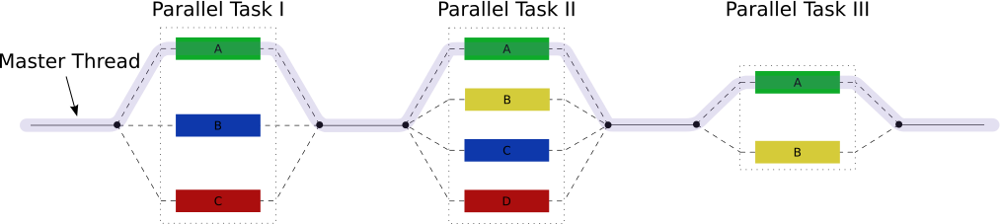

In order to properly make use of the high performance computing hardware, you will need some way of using multiple CPUs.
Many scientific software applications are written to take advantage of multiple CPUs in some way.
But often this must be specifically requested by the user at the time they run the program, rather than happening automatically.

The are three types of parallel execution we will cover are [Multi-Threading](#multi-threading), [Distributed (MPI)](#mpi) and [Job Arrays](../../Batch_Computing/Job_Arrays.md).

## Multi-threading

Multi-threading is a method of parallelisation whereby the initial single thread of a process forks into a number of parallel threads, generally *via* a library such as OpenMP (Open MultiProcessing), TBB (Threading Building Blocks), or pthread (POSIX threads).

  

  
Multi-threading involves dividing the process into multiple 'threads' which can be run across multiple cores.

Multi-threading is limited in that it requires shared memory, so all CPU cores used must be on the same node. However, because all the CPUs share the same memory environment things only need to be loaded into memory once, meaning that memory requirements will usually not increase proportionally to the number of CPUs.

Example script:

`ntasks`

```sl
#!/bin/bash -e

#SBATCH --job-name       MultithreadingTest    # job name (shows up in the queue)
#SBATCH --account        nesi99991             # 
#SBATCH --time           00:01:00              # Walltime (HH:MM:SS)
#SBATCH --mem            2048MB                # memory in MB 
#SBATCH --cpus-per-task  4                     # 2 physical cores per task.

taskset -c -p $$                               #Prints which CPUs it can use
```

The expected output being

```txt
pid 13538's current affinity list: 7,9,43,45
```

## MPI

MPI stands for *Message Passing Interface*, and is a communication protocol used to achieve distributed parallel computation.

Similar in some ways to multi-threading, MPI does not have the limitation of requiring shared memory and thus can be used across multiple nodes, but has higher communication and memory overheads.

For MPI jobs you need to set `--ntasks` to a value larger than 1, or if you want all nodes to run the same number of tasks, set `--ntasks-per-node` and `--nodes` instead.

MPI programs require a launcher to start the `ntasks` processes on multiple CPUs, which may belong to different nodes.
On Slurm systems like ours, the preferred launcher is `srun` rather than `mpi-run`.

Since the distribution of tasks across different nodes may be unpredictable, `--mem-per-cpu` should be used instead of `--mem`.

``` sl
#!/bin/bash -e

#SBATCH --job-name=MPIJob       # job name (shows up in the queue)
#SBATCH --time=00:01:00         # Walltime (HH:MM:SS)
#SBATCH --mem-per-cpu=512MB     # memory/cpu in MB (half the actual required memory)
#SBATCH --cpus-per-task=4       # 2 Physical cores per task.
#SBATCH --ntasks=2              # number of tasks (e.g. MPI)

srun pwd                        # Prints  working directory
```

The expected output being

```txt
/home/user001/demo
/home/user001/demo
```

!!! warning
    For non-MPI programs, either set `--ntasks=1` or do not use `srun` at all.
    Using `srun` in conjunction with `--cpus-per-task=1` will cause `--ntasks` to default to 2.

## Job Arrays

Job arrays are best used for tasks that are completely independent, such as parameter sweeps, permutation analysis or simulation, that could be executed in any order and don't have to run at the same time.
This kind of work is often described as *embarrassingly parallel*.  
An embarrassingly parallel problem is one that requires no communication or dependency between the tasks (unlike distributed computing problems that need communication between tasks).

A job array will submit the same script repeatedly over a designated index using the SBATCH command `#SBATCH --array`
