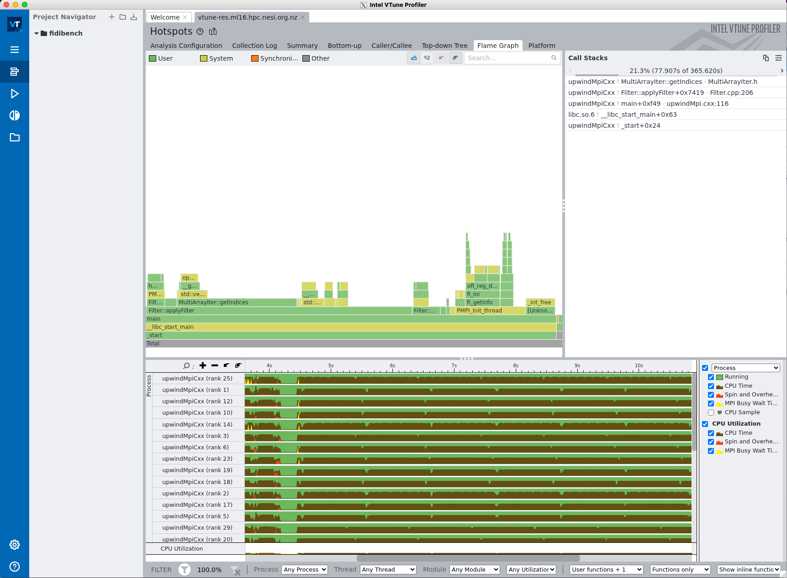

## What is VTune?

VTune is a tool that allows you to quickly identify where most of the execution time of a program is spent. This is known as profiling. It is good practice to profile a code before attempting to modify the code to improve its performance. VTune collects key profiling data and presents them in an intuitive way.

## Where to find more resources on VTune?  

- Main page is at
    [VTune Profiler](https://software.intel.com/content/www/us/en/develop/tools/oneapi/components/vtune-profiler.html#gs.bjani9)
- Tutorials are available at [VTune Tutorials](https://software.intel.com/content/www/us/en/develop/articles/vtune-tutorials.html).

## How to use VTune?

VTune is available on Mahuika by loading the VTune **module**.

``` sh
module spider VTune
```

First login to Mahuika and then run:

``` sh
module load VTune
```

We'll show how to profile a C++ code with VTune - feel free to choose your own code instead. Start with 

``` sh
git clone https://github.com/pletzer/fidibench
```

and build the code using the "gimkl" tool chain

``` sh
module load gimkl CMake
cd fidibench
mkdir build
cd build
cmake .. -D CMAKE_BUILD_TYPE=RelWithDebInfo
make
```

This will compile a number of executables. Note that VTune does not require one to apply a special compiler switch to profile.

We choose "upwindCxx" as the executable to profile. It is under upwind/cxx, so
``` sh
cd upwind/cxx
```

Run the executable with 
``` sh
rm -rf vtune-res*
srun --mem=20g --ntasks=32 vtune -collect hotspots -result-dir vtune-res ./upwindMpiCxx -numCells 512 -numSteps 10
```
This will print out 
``` out
Top Hotspots
Function                    Module          CPU Time  % of CPU Time(%)
--------------------------  --------------  --------  ----------------
MultiArrayIter::getIndices  upwindMpiCxx     78.197s             21.4%
Filter::applyFilter         upwindMpiCxx     55.929s             15.3%
operator new                libstdc++.so.6   28.083s              7.7%
_int_free                   libc.so.6        26.226s              7.2%
getdelim                    libc.so.6        18.724s              5.1%
[Others]                    N/A             158.460s             43.3%
```
which lists the functions and methods accounting for most of the execution time. A "vtune-res*" directory storing the profiling data will also be created. You can also get a graphical view of the profiling data with

``` sh
vtune-gui vtune-res.ml16.hpc.nesi.org.nz &
```
(where vtune-res.ml16.hpc.nesi.org.nz should be replaced by your results directory). 

An example is the flame graph 

