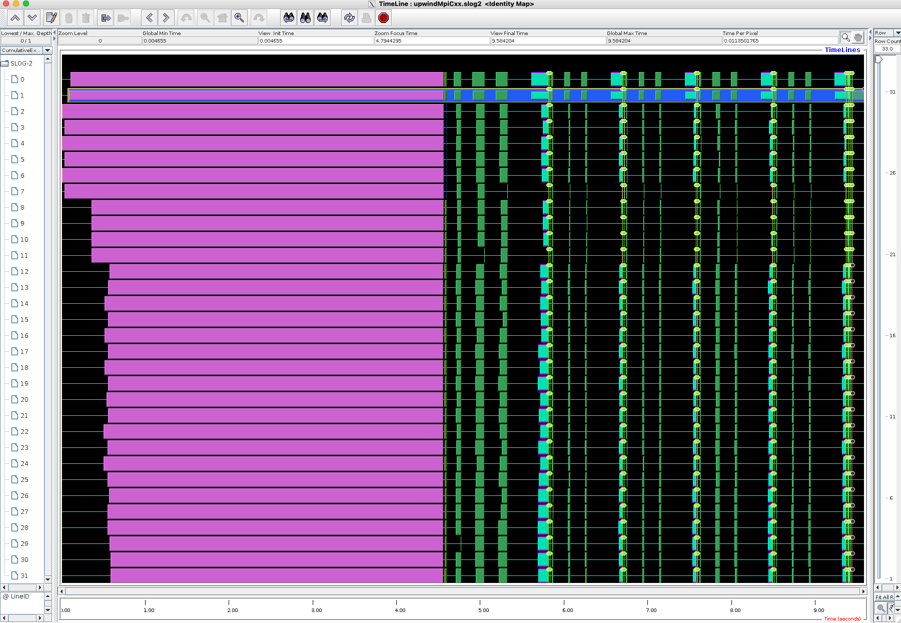

This guide shows how to use the **TAU Performance System** to trace an MPI-based C++ application on the Mahuika HPC cluster.
Tracing records a time-ordered sequence of events during program execution.
Each event is timestamped and written to a trace file so that the exact runtime behaviour of the program can be reconstructed.
Events may include entry and exit of functions, MPI communication calls and synchronization events (barriers, waits).
Tracing is particularly for identifying load imbalance, communication bottlenecks and idle time in applications.

The example uses the **fidibench** benchmark and its `upwindMpiCxx` executable.

The workflow consists of four steps:

1. Build TAU for the desired compiler toolchain.
2. Compile the application using TAU compiler wrappers.
3. Run the application with tracing enabled.
4. Inspect the results with TAU analysis tools.

## Prerequisites

Load the required modules for the compiler toolchain and MPI. TAU should be compiled against the same compiler and MPI toolchain that will be used to build and run the application. Here we use `gimkl/2022a`, adapt as required.

```bash
module purge
module load gimkl/2022a CMake
```

Confirm the versions:

```bash
g++ --version
mpicxx --version
```

## 1. Build TAU on Mahuika

Download TAU:

```bash
wget http://tau.uoregon.edu/tau.tgz
tar xf tau.tgz
cd tau-*
wget http://tau.uoregon.edu/ext.tgz
tar xf ext.tgz
wget http://tau.uoregon.edu/pdt_lite.tar.gz
tar xf pdt_lite.tar.gz
cd pdtoolkit*
./configure
make && make install
cd ..
```

Set `TAU_HOME`, the location where TAU will be installed (change!), e.g.:

```bash
export TAU_HOME=/nesi/project/nesi99999/$USER/tau
```

Configure TAU for MPI tracing using the GNU toolchain:

```bash
./configure \
  -mpi -ompt \
  -pdt=$PWD/pdtoolkit-3.25.2 \
  -bfd=download -dwarf=download -unwind=download -iowrapper \
  -otf=download \
  -prefix=$TAU_HOME
```

Build and install:

```bash
make install
```

Add TAU to your environment:

```bash
export PATH=$TAU_HOME/x86_64/bin:$PATH
```

Locate the TAU MPI makefile:

```bash
ls $TAU_HOME/x86_64/lib/Makefile.tau*
```

Set the environment variable:

```bash
export TAU_MAKEFILE=$TAU_HOME/x86_64/lib/Makefile.tau-ompt-mpi-pdt-openmp
```

Verify the TAU compiler wrappers are available:

```bash
which tau_cxx.sh
```

## 2. Obtain the example code (fidibench) and compile it

Clone the fidibench benchmark repository:

```bash
git clone https://github.com/pletzer/fidibench.git
cd fidibench
mkdir build
cd build
cmake -DCMAKE_BUILD_TYPE=RelWithDebInfo ..
```

The MPI example used in this guide is the executable `upwindMpiCxx`

```bash
cd upwind/cxx
make upwindMpiCxx
```

## 3. Run the application and analyse the results

```bash
export TAU_TRACE=1
export TAU_PROFILE=0
export TRACEDIR=traces
mkdir -p $TRACEDIR
srun --ntasks=32 tau_exec ./upwindMpiCxx -numCells 512 -numSteps 5
cd $TRACEDIR
rm -f tau.trc tau.edf
tau_treemerge.pl
tau2slog2 tau.trc tau.edf -o upwindMpiCxx.slog2
jumpshot upwindMpiCxx.slog2
```

!!! note "Mac Users"
    If you are connecting from a Mac you may need to invoke

    ```bash
    jumpshot -fix-xquartz upwindMpiCxx.slog2
    ```
    to avoid the black window issue.


