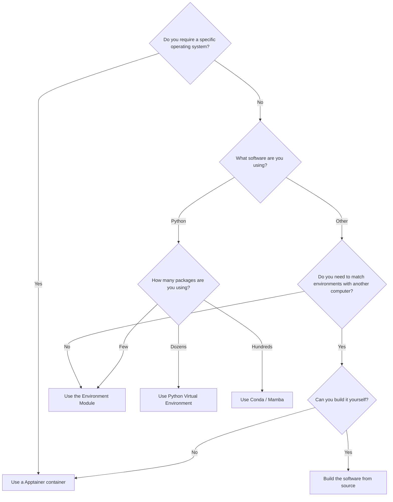

---
tags:
    - software
    - reproducible
    - reproducibility
    - environments
    - containers
---

## Research Software

According to [this article in Nature](https://www.nature.com/articles/s41597-022-01710-x):

> Research software is a fundamental and vital part of research, yet significant challenges 
> to discoverability, productivity, quality, reproducibility, and sustainability exist.

So what can we as researchers and technologists do to make our software easier to reproduce and use?
Below are some tips, tricks and best practice to help get you started.

## Established Software Environment Tools

### Environment Modules

The most simple way to access software on the cluster is using [Environment Modules]().

This will get you access to a specific version of your software, built for the clusters hardware.

If you want to exactly replicate your local environment this may not be suitable.

### Conda/Mamba Environments

TODO: find and point to existing conda

### Python Virtual Environments

TODO: find and point to venv

## New Tools for Creating Reproducible Environments

### UV

TODO: I think Jen created a page for this

### pixi

TODO: new page

### anything else work mentioning?

## Containerisation

TODO: Point to Apptainer

## Compiled Software

TODO: point to modules and maybe add something about retrieving modules and dependencies alsong with info about
    the OS and other pertinent info
