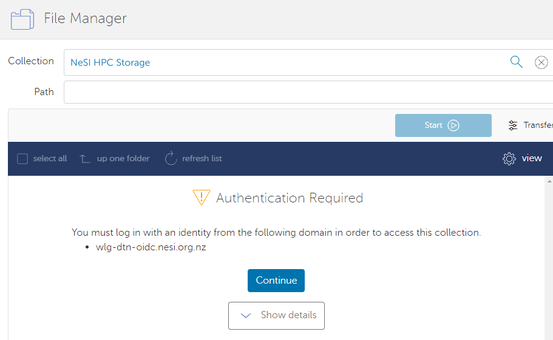
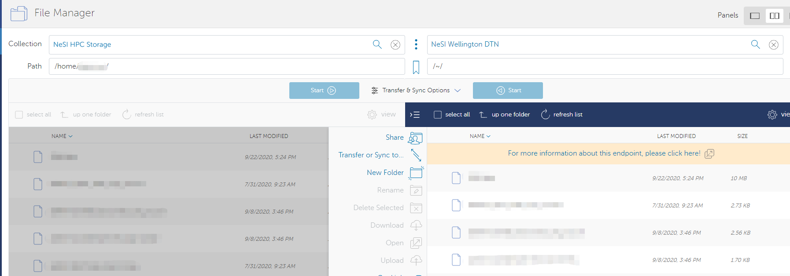
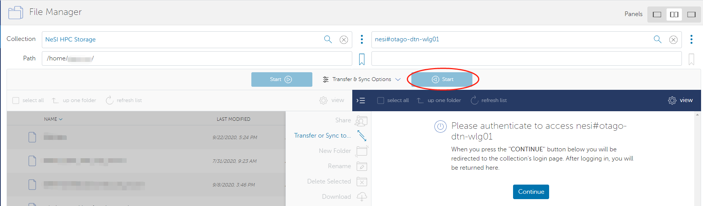
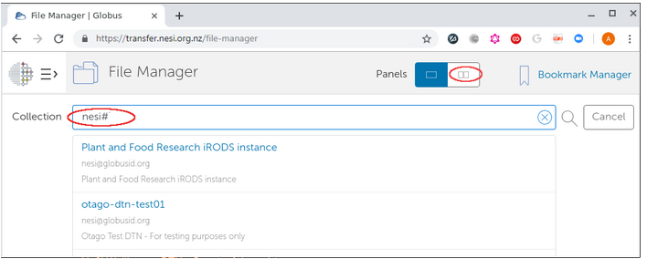

## Globus

Globus is a third-party service for transferring large amounts of data
between Globus Data Transfer Nodes (DTNs). For example you can transfer
data between the NeSI Wellington DTN V5 and your personal workstation
endpoint, or an endpoint from your institution. With Globus, high
data transfer rates are achievable. This service allows data to be
accessible to any person who has a Globus account. The newest
implementation (v5) provides [extra features and some key differences
from the previous setup](https://docs.globus.org/globus-connect-server/).

To use Globus on NeSI platforms, you need:

1. A Globus account (see
  [Initial Globus Sign-Up and Globus ID](../../Storage/Data_Transfer_Services/Initial_Globus_Sign_Up-and_your_Globus_Identities.md))
2. An active NeSI account (see
  [Creating a NeSI Account](../../Getting_Started/Accounts-Projects_and_Allocations/Creating_a_NeSI_Account_Profile.md))
3. Access privileges on the non-NeSI Globus endpoint/collection you
   plan on transferring data from or to. This other endpoint/collection
   could be a personal one on your workstation, or it could be managed
   by your institution or a third party.

    - *Note that a NeSI user account does not create a Globus account, and
        similarly a Globus account does not create a NeSI user account. Nor
        can you, as the end user, link the two through any website.*

Both your accounts (NeSI and Globus) must exist before you try to use our DTN.

The NeSI Wellington DTN endpoint is protected by a second factor
authentication (2FA).  Also note, your NeSI username and password are
case-sensitive.

## The NeSI Data Transfer Node

The NeSI Data Transfer Node (DTN) acts as an interface between our HPC
facility storage and a worldwide network of Globus endpoints. This is
achieved using Globus.org, a web-based service that solves many of the
challenges encountered moving large volumes of data between systems.
While NeSI supports use of other data transfer tools and protocols such
as `scp`, Globus provides the most comprehensive, efficient, and easy to
use service for NeSI users who need to move large data sets (more than a
few gigabytes at a time).

## Types of Globus endpoints or Data Transfer Nodes

Globus data transfers take place between *endpoints*. An endpoint is
nothing more than an operating system (Windows, Linux, etc) that has the
Globus endpoint software installed on it. Endpoints come in two kinds:
personal and server. Within a endpoint users can access data via
collections, with specific permissions and the ability to shared with
others.

The NeSI DTN is an example of a *server endpoint*. These type of
endpoints are usually configured to access large capacity and
high-performance parallel filesystems. Endpoints can be unmanaged or
managed by a subscription. NeSI DTN is a server type, managed endpoint
(by NeSI subscription) which allows authorised users to provide data
transfer and data sharing services on behalf of their Globus accounts.

Your institution may have its own managed server endpoint, and if so we
encourage you to use that endpoint for your data transfers between your
institution and NeSI. You may need to apply to the person or group
administering the managed server endpoint, most likely your IT team, to
get access to the endpoint. Your institution may even have several
endpoints, in which case we recommend that you consider which one would
be best suited for your data transfer requirements. If you need any help,
 or
consult your institution's IT team.

If your institution doesn't have a managed server endpoint, you can set
up a personal endpoint using software provided by Globus (see below).
Please be aware that even if you set up a personal endpoint, you may
still need to consult your IT team in order to make it usable,
especially if your institution has an aggressive firewall.

## Transferring data using a managed endpoint

As an example, to move files between the NeSI HPC Storage (accessible
from Māui and Mahuika) and the Otago University high-capacity central
file storage (another managed server endpoint):

!!! info
    Log in to the [NeSI File Manager](https://transfer.nesi.org.nz/file-manager) where you are able to search for DTNs in the Collection field.
    [Listing of available endpoints on the New Zealand Data Transfer Platform](National_Data_Transfer_Platform.md)

Find the NeSI endpoint by typing in "NeSI Wellington DTN V5". Select the
endpoint "NeSI Wellington DTN V5" from the list, and you will be asked
to authenticate your access to the endpoint. Click Continue to the next
step.

You can choose either of **&lt;username&gt;@wlg-dtn-oidc.nesi.org.nz**
or NeSI Wellington OIDC Server (wlg-dtn-oidc.nesi.org.nz), they are all
linked to the same website. If this is your first time login, you may
ask to *bind* your primary identity to the OIDC login, you need to allow
that.

The NeSI Wellington DTN V5 endpoint is protected by a second factor
authentication (2FA-same as accessing NeSI clusters).  In the
'**Username'** field, enter your Māui/Mahuika username. In the
'**Password'** field, your `Password` will be equal to
`Login Password (First Factor)` +
`Authenticator Code (Second Factor)` e.g. `password123456`. (***Do
not*** use any additional characters or spaces between your password and
the token number.)

After the login, you will navigate to the default root(display as "/")
path, then you could change the path to

\(1\) your ***/home/&lt;username&gt;*** directory,

\(2\) project directory (read-only)
***/nesi/project/&lt;project\_code&gt;***

\(3\) project sub-directories of
***/nesi/nobackup/&lt;project\_code&gt;***  - see
[Globus Paths,Permissions, Storage Allocation](../../Storage/Data_Transfer_Services/Globus_V5_Paths-Permissions-Storage_Allocation.md).  
  
Navigate to your selected directory. e.g. the `nobackup` filesystem
`/nesi/nobackup/<project_code>` and select the two-endpoint panel
for transfer.

Select the target endpoint and authenticate.

When you have activated endpoints in both transfer windows, you can
start transferring files between them.

Select files you wish to transfer and select the corresponding "Start"
button:  
  

To find other NeSI endpoints, type in "nesi#":

## In brief

- Sign in to the NeSI Globus Web App <https://transfer.nesi.org.nz/>.
  You will be taken to the *File Manager* page
  <https://transfer.nesi.org.nz/file-manager>
- If this is your first time, you will need to create a Globus
  account.
- Open the two-endpoint panel
  {: style="height:2em;"} located
  on the top-right of the *File Manager* page.
- Select the Endpoints you wish to move files between (start typing
  "nesi#" to see the list of NeSI DTNs to select from).
  [Authenticate](../../Storage/Data_Transfer_Services/Globus_V5_endpoint_activation.md)
  at both endpoints.
- At Globus.org the endpoint **defaults to
  `/home/<username>` path** (represented by `~`) on Mahuika or
  Māui. We do not recommend uploading data to your home directory, as
  home directories are very small. Instead, navigate to an appropriate
  project directory under /nobackup (see
  [Globus Paths, Permissions,  Storage  Allocation](../../Storage/Data_Transfer_Services/Globus_V5_Paths-Permissions-Storage_Allocation.md)).
- Transfer the files by clicking the appropriate
  {: style="height:1em;"} button
  depending on the direction of the transfer.
- Check your email for confirmation about the job completion report.

## Transferring data using a personal endpoint

To transfer files into/out of your laptop, desktop computer or any other
system you control, configure it as a [Globus Personal
Endpoint](https://www.globus.org/globus-connect-personal) (see
[Personal Globus Endpoint Configuration](../../Storage/Data_Transfer_Services/Personal_Globus_Endpoint_Configuration.md)
for transfers between personal endpoints).

## File sharing

To share files with others outside your filesystem,
see [https://docs.globus.org/how-to/share-files/](https://docs.globus.org/how-to/share-files/).

## Using Globus to transfer data to or from the cloud

Globus connectors enable a uniform interface for accessing, moving, and
sharing across a variety of cloud providers. We do not currently have a
connector subscription (note a subscription is required per cloud
provider) so we can’t use globus to transfer to/from cloud storage. If
you see this as key for you, please .

Our current advice for moving data to or from the cloud is to use tools
such as Rclone  ([https://rclone.org/](https://rclone.org/)) or the
cloud CLI's such as aswcli for S3 [https://aws.amazon.com/cli/](https://aws.amazon.com/cli/) or
gcloud CLI
([https://cloud.google.com/sdk/gcloud](https://cloud.google.com/sdk/gcloud)).
If you have any trouble or would like further advice, please .
