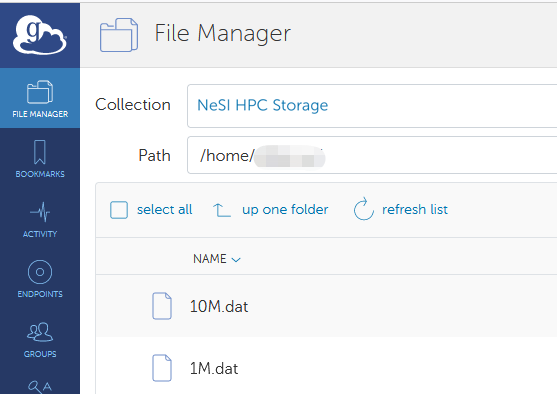

## Globus default directory

If you point Globus File Manager to an endpoint collection where you
have an account/access, it will open a single panel pointing to the root
path directory, displayed as '`/home/<username>`'.

*Note: The example pictured below uses an old endpoint for the NeSI platforms. The current endpoint (launched June 2025) is called 'NeSI HPC storage'.* 



###  On NeSI platforms this means

| Globus path                     | Visible to Globus | HPC Filesystem                  | Globus usage              | Permissions           |
|---------------------------------|-------------------|---------------------------------|---------------------------|-----------------------|
| `/home/<username>`              | yes (default)     | `/home/<username>`              | possible, not recommended | read and write access |
| `/nesi/nobackup/<project_code>` | yes               | `/nesi/nobackup/<project_code>` | yes                       | read and write access |
| `/nesi/project/<project_code>`  | yes               | `/nesi/project/<project_code>`  | yes                       | **read only** access  |

For more information about NeSI filesystem, check
[NeSI_File_Systems_and_Quotas](../../Storage/File_Systems_and_Quotas/NeSI_File_Systems_and_Quotas.md).

## Performing Globus transfers to/from NeSI platforms

- If transferring files off the cluster, move/copy files onto
    `/nesi/project` or `/nesi/nobackup` first, via your HPC access
- Sign in to Globus and navigate the file manager to the path
    associated with your project (viz. `/nesi/project/<project_code>` or
    `/nesi/nobackup/<project_code>`)
- Click the "two-panels" area in the file manager and select the other
    endpoint
- Select source of transfer
- Transfer data (from), using the appropriate "start" button
- If transferring files onto the cluster, the fastest location will be
    `/nesi/nobackup/<project_code>`

### Tips

1.  Globus bookmarks can be created for `/nesi/project` or
`/nesi/nobackup` paths and these bookmarks pinned.

2.  Symbolic links can be created in your *project* directories and
*nobackup* directories to enable easy moving of files to and from.  
To create a symbolic link from a first to a second directory and
vice-versa (using *full* paths for &lt;first&gt; and &lt;second&gt;):

``` sh
cd <first>
ln -s <full_path_to_second> <alias_to_second>
 
cd <second>
ln -s <full_path_to_first>  <alias_to_first>
```

Alias can be any value which is convenient to you, i.e. easy to
identify.
After you do this, there will be an alias listed in each directory that
points to the other directory. You can see this with the `ls` command,
and `cd` from each to the other using its alias.
