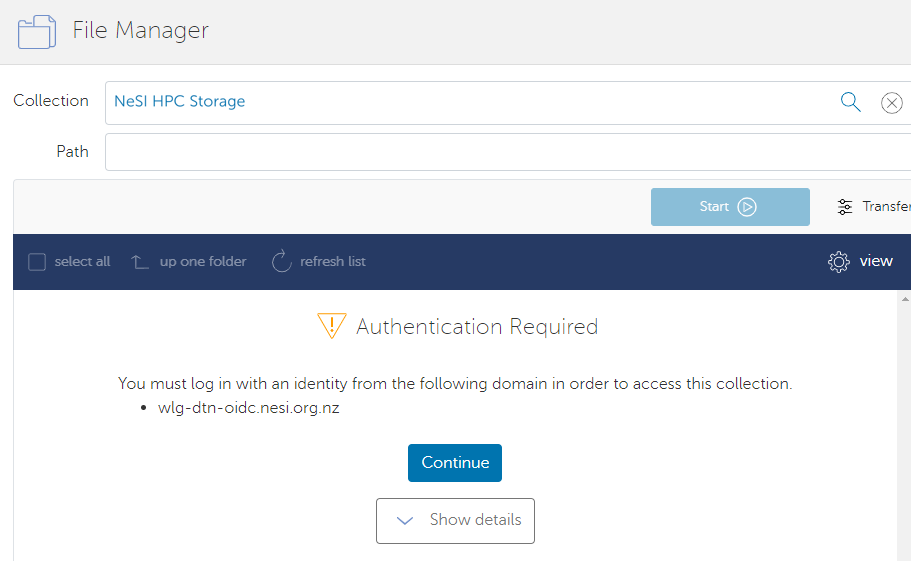

## Activating an Endpoint

When you select an endpoint to transfer data to/from, you may be asked
to authenticate with that endpoint.

*Note: The example pictured below uses an old endpoint for the NeSI platforms. The current endpoint (launched June 2025) is called 'NeSI HPC storage'.*

  
Transfers are only possible once you have supplied credentials that
authenticate your access to the endpoint. This process is known as
"activating the endpoint". The endpoint remains active for 24 hours.  

The NeSI HPC Storage endpoint is protected by a second-factor
authentication (2FA), similar to accessing NeSI clusters. 

In the
'**Username'** field, enter your NeSI account username. In the
'**Password'** field, your `Password` will be equal to
`Login Password (First Factor)` +
`Authenticator Code (Second Factor)` e.g. `password123456`. (***Do
not*** use any additional characters or spaces between your password and
the token number.)

Check the status of your endpoints at [https://www.globus.org/app/console/endpoints](https://www.globus.org/app/console/endpoints)

## Managing Endpoint Activation

If a transfer is in progress and will not finish in time before your
credentials expire, that transfer will pause and you will need to
reauthenticate for it to continue.
