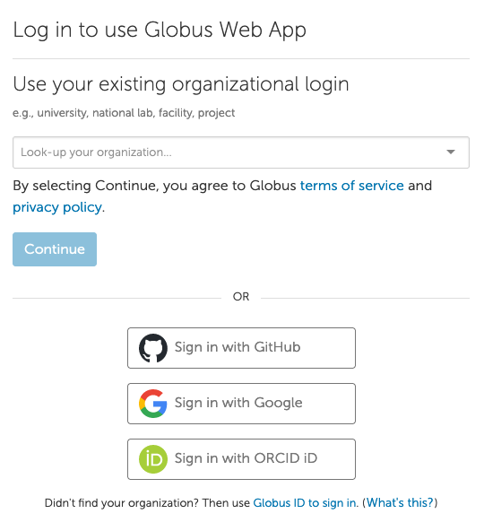

[//]: <> (REMOVE ME IF PAGE VALIDATED)
[//]: <> (vvvvvvvvvvvvvvvvvvvv)
!!! warning
    This page has been automatically migrated and may contain formatting errors.
[//]: <> (^^^^^^^^^^^^^^^^^^^^)
[//]: <> (REMOVE ME IF PAGE VALIDATED)

 

Globus provides logins for NeSI users via their organisation, GitHub,
Google or GlobusID.

To sign up to Globus, please go to <https://transfer.nesi.org.nz/>

#### 1) Sign-Up to Globus

To sign up to globus, you can look for your organisation in the
drop-down box. If your organisation is not present in the drop-down box,
you can also use any of the available methods - this then becomes your
primary identity in Globus.

####  

#### 2) Link other Globus identities to your primary identity

From the Globus docs:

*Login to a Globus account, via its primary identity or one of its
linked identities, implies login to the account’s primary identity and
all identities linked to that account’s primary identity. In other
words, login to a Globus account potentially grants access to all
resources accessible via all identities linked to that Globus account’s
primary identity.*

If you have other identities in Globus (for example, a globusID), link
them  to your Google ID account following the instructions at
<https://docs.globus.org/how-to/link-to-existing/>:

 

 

 

Note: 

If you had a Globus account before February 2016, that account ID is now
your "GlobusID".

Your groups and data-shares are associated with your login so you should
ensure that your primary identity is the login you will generally use.

 

 

 

 

 

 

 

 

 
