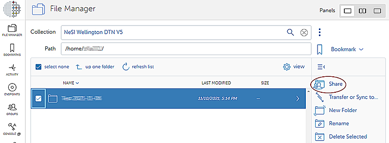
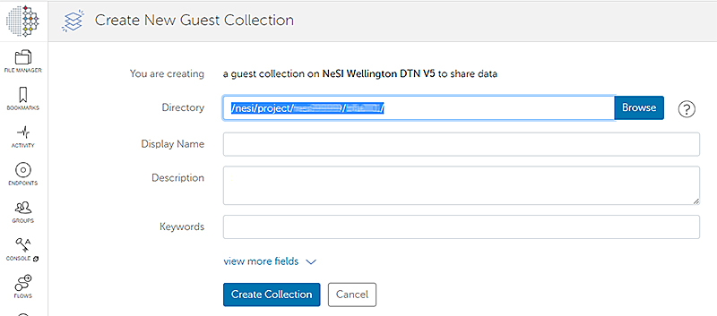
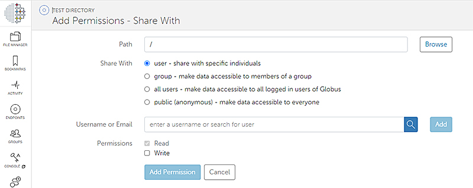
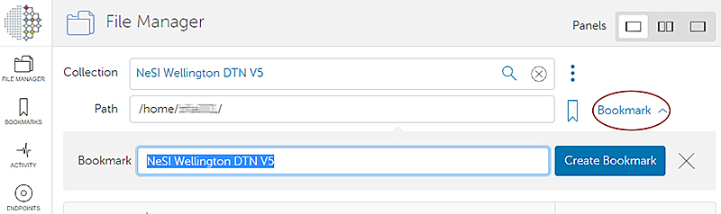
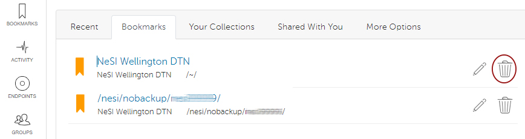

Guest Collections created in the previous NeSI endpoint **NeSI
Wellington DTN V5** need to be re-created in the new endpoint **NeSI
HPC storage**.
  
## Guest Collections

[Instructions on creating and sharing Guest Collections](https://docs.globus.org/how-to/share-files/)

In summary:

1. To re-create existing Collections, select *Share* and *Create Guest
    Collection*

*Note: The example pictured below uses an old endpoint for the NeSI platforms. The current endpoint (launched June 2025) is called 'NeSI HPC storage'.*  

    

2. Enter the [file path](../../Storage/Data_Transfer_Services/Globus_Paths-Permissions-Storage_Allocation.md)
    of the directory to be shared.

*Note: The example pictured below uses an old endpoint for the NeSI platforms. The current endpoint (launched June 2025) is called 'NeSI HPC storage'.*
    

3. Add Permissions for an individual or a Group (existing, or create a new group)  
      

4. Users you share with will receive an email notification containing a
    link to the new *Guest Collection*.

## Bookmarks

1. Create bookmarks to **NeSI HPC storage** and new Guest
    Collections (*Note: The example pictured below uses an old endpoint for the NeSI platforms. The current endpoint (launched June 2025) is called 'NeSI HPC storage'.*):

    

2. Delete any Bookmarks to *NeSI Wellington DTN V5* or Shared Collections on *NeSI
    Wellington DTN V5*.

  
