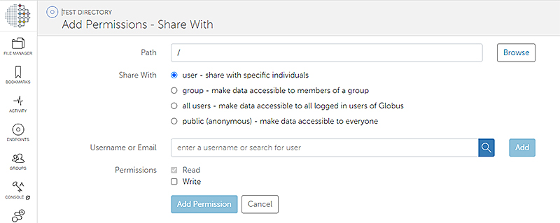
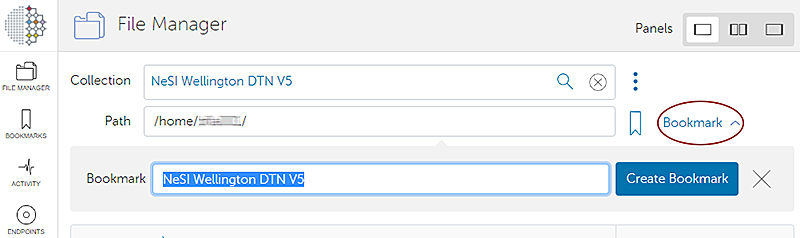
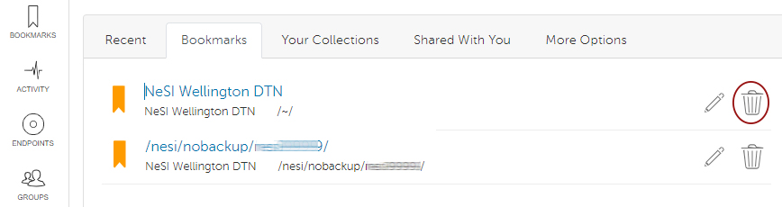

[//]: <> (REMOVE ME IF PAGE VALIDATED)
[//]: <> (vvvvvvvvvvvvvvvvvvvv)
!!! warning
    This page has been automatically migrated and may contain formatting errors.
[//]: <> (^^^^^^^^^^^^^^^^^^^^)
[//]: <> (REMOVE ME IF PAGE VALIDATED)

Shared Collections created in the previous NeSI endpoint **NeSI
Wellington DTN ** need to be re-created in the new endpoint **NeSI
Wellington DTN V5.** (The Shared Collections have been renamed *Guest
Collections*).    
  

## Guest Collections

Instructions on creating and sharing Guest Collections are available
[here](https://docs.globus.org/how-to/share-files/)

In summary:

1.  To re-create existing Collections, select *Share* and *Create Guest
    Collection  
      
      
      
    *
2.  Enter the [file
    path](../../Storage/Data_Transfer_Services/Globus_V5_Paths-Permissions-Storage_Allocation.md)
    of the directory to be shared.  
      
      
      
    This can also be copied from your existing Shared Collection on
    *NeSI Wellington DTN  
      
      
      
    *
3.  Add Permissions for an individual or a Group (existing, or create a
    new group)  
      
      
      
4.  Users you share with will receive an email notification containing a
    link to the new *Guest Collection*.

##  Bookmarks

1.  Create bookmarks to **NeSI Wellington DTN V5** and new Guest
    Collections  
      
      
      
2.  Bookmarks to *NeSI Wellington DTN* and Shared Collections on *NeSI
    Wellington DTN* should be deleted.

  
  
  

 