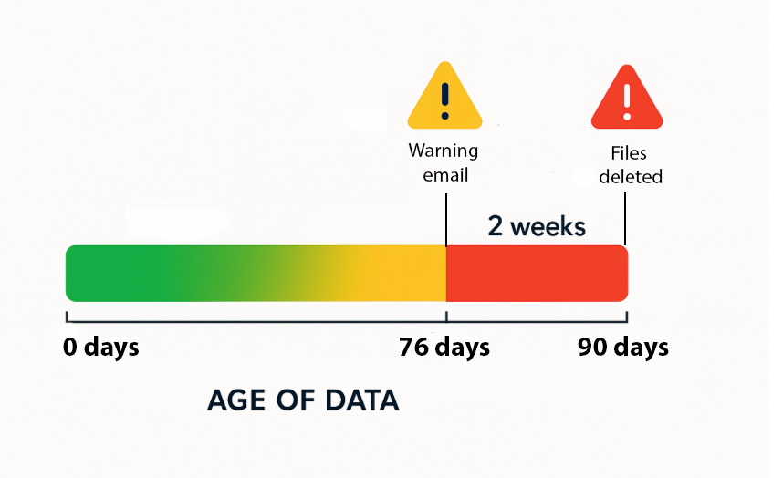

The automatic cleaning feature is a programme to regularly delete selected files from project directories in our scratch filesystem (`/nesi/nobackup`). 

We do this to optimise the availability of this filesystem for active research computing workloads and to ensure we can reliably support large-scale compute and analytics workflows.

## How it works

Files are deleted if they meet **all** of the following criteria:

- The file was first created more than 90 days ago
- The file has not been accessed, and neither its data nor its metadata has been modified, for at least 90 days
- The file was identified as a candidate for deletion two weeks previously (and as such is listed by the command `nn_doomed_list`)

The general process follows a schedule of:

- Fortnightly, we review files stored in the scratch filesystem and identify candidates for expiry.
- Project teams will be notified by email if they have file candidates for deletion. Emails will be sent two weeks in advance of any deletion taking place.
- Immediately after deletion is complete, a new set of candidate files will be identified for expiry during the next automated cleanup. These candidate files are all files within the project's scratch filesystem that have not been created, accessed or modified within the last 76 days.

In summary, we **notify** at 76 days (2 weeks advance notice) and then **delete** at 90 days.
There will be ***no exclusions*** to this auto-deletion process. If you need to store data for longer than 90 days, [get in touch with our Support Team](mailto:support@nesi.org.nz).



Objects other than files, such as directories and symbolic links, are not yet deleted under this policy (we will be reviewing the directory deletion policy in the next few months), even if at deletion time they are empty, broken, or otherwise redundant. These entities typically take up no disk space apart from a small amount of metadata, but still count towards the project's inode (file count) quota.

### GUFI: The Engine behind the Autocleaner

The autocleaner uses the GUFI (Grand Unified File Index) indexing tool to quickly and efficiently list all the files on your nobackup directories that are order than 90 days and have not been accessed within 90 days. 

GUFI performs indexing every weekend. Therefore if you have already deleted a file that was in your `nn_doomed_list` list, it will still appear in `nn_doomed_list` until the next week (when GUFI will re-index the files in `nobackup`. 

See [the GUFI manual page](../../Software/Available_Applications/GUFI.md) for more information about GUFI.

## How will I be notified that my data is a candidate for deletion?

Prior to data being deleted, we’ll send you an email identifying what has been marked for deletion. These email notifications are optional so if you do not want to receive them, you can ‘unsubscribe’ through [my.nesi.org.nz](https://my.nesi.org.nz/login).

## How can I check which files are scheduled for deletion?

You can manually check at any time if you have any data that's scheduled for deletion. 
When you are connected to the HPCs via ssh, run the command ```nn_doomed_list``` command to get the list of candidates for deletion during the next cleanup.

```sh
$ nn_doomed_list --project nesi12345 
/nesi/nobackup/nesi12345/
  .file1
  file2.log
  .directory1/ - 94232 files
  directory2/ - 464151 files
  directory3/
    file3.log
    file4/ - 263 files
    file5/ - 299 files
```

By default, the output produced contains 40 lines. 
If you want a full list of the files, run ```nn_doomed_list --unlimited --project <yourprojectcode>```.
In order to control the output summary length and level, use the --limited option eg. ```nn_doomed_list --limited 100 --project <yourprojectcode>```

If you are trying to access a project you do not have access to, the script will fail and on the last line of the output you will get
```
PermissionError: [Errno 13] Permission denied: '/search/autocleaner/filelists/<projectcode>.gz'
```

!!! tip
    
    Use this command to get a txtfile of everything scheduled for deletion: 
    ```bash
    gunzip -c /search/autocleaner/filelists/current/<project code>.gz > list_to_delete_<project code>.txt
    ```
    
    Use this command to find files with keywords in them that are scheduled for deletion: 
    ```bash
    zgrep KEYWORD /search/autocleaner/filelists/current/<project code>.gz > files_that_will_be_deleted.txt
    ```

## I have just deleted a file from ```nn_doomed_list```, but it still appears in ```nn_doomed_list```?

If you have already deleted or moved files that appeared in ```nn_doomed_list```, they will still appear in ```nn_doomed_list```. This is because 
```nn_doomed_list``` reads from a file (`/search/autocleaner/filelists/<projectcode>.gz`) for speed. 

!!! tip
    
    If you would like to get an updated list of files for autodeletion (because they are 90 days old or more):
    ```bash
    find /nesi/nobackup/<project code> -type f -atime +90 -ctime +90 -printf '%u : %p\n'
    ```
    
    To direct this to a file (you will not see the output of this as it runs): 
    ```bash
    find /nesi/nobackup/<project code> -type f -atime +90 -ctime +90 -printf '%u : %p\n > files_that_will_be_deleted.txt'
    ```

## How can I check which files have been deleted in the last deletion cycle?

If you would like to see what was contained in your previous fortnight's ```nn_doomed_list```:
```bash
nn_doomed_list --project nesi99999 --cycle last
```

!!! tip
    
    Use this command to get a txtfile of everything that was deleted in the last auto-clean: 
    ```bash
    gunzip -c /search/autocleaner/filelists/last/<project code>.gz > last_autoclean_list_<project code>.txt
    ```
    
    Use this command to find files with keywords in them that were deleted in the last auto-clean: 
    ```bash
    zgrep KEYWORD /search/autocleaner/filelists/last/<project code>.gz > files_that_were_deleted_with_keyword.txt
    ```

## What should I do with expiring data on the nobackup filesystem?

If you have files identified as candidates for deletion that you need to keep beyond the scheduled expiry date, you have the following options:

- Move the file(s) to your project directory, e.g., /nesi/project/nesi12345. You may need to request more disk space in your project directory before you can do this. [Contact our Support Team](mailto:support@nesi.org.nz). We assess such requests on a case-by-case basis. Note: You can save space by [compressing data](https://docs.nesi.org.nz/Storage/File_Systems_and_Quotas/Data_Compression/). Standard tools such as gzipbzip2 etc are available.
- Move the file(s) to Freezer, our [long-term storage service](https://docs.nesi.org.nz/Storage/Long_Term_Storage/Freezer_long_term_storage/). Note: Freezer is intended for use with relatively large files and should not be used for a large number of small files. To apply for a Freezer allocation, [contact our Support Team](mailto:support@nesi.org.nz) or request a new Freezer allocation in [my.nesi.co.nz](https://my.nesi.org.nz/login).
- Move or copy the file to a storage system at your institution. We expect projects to do this for finalised output data and appreciate prompt egress of data once it is no longer used for processing.

## Where should I store my data?

Generally: 
-  the project directory should be used for reference data, tools, and job submission and management scripts.
-  the scratch filesystem should be used for holding large reference working datasets (e.g., an extraction of compressed input data) and as a destination for writing and modifying temporary data. It can also be used to build and edit code, provided that the code is under version control and changes are regularly checked into upstream revision control systems.
-  Freezer, our [long-term storage service](https://docs.nesi.org.nz/Storage/Long_Term_Storage/Freezer_long_term_storage/), should be used for larger datasets that you only access occasionally and do not need to change in situ.

| Frequency of data being read | Frequency of data being written | Recommended option                                                                                         |
| -------------------------------------------------------- | -------------------------------------------------------- | ---------------------------------------------------------------------------------------------------------- |
| Often                                                    | Often (at least once every two months)                   | Store in your /nobackup/<projectcode> directory (but ensure key result data is copied to the persistent project directory) |
| Often                                                    | Seldom                                                   | Store in your /project/<projectcode> directory                                                                    |
| Seldom                                                   | Seldom                                                   | Apply for an allocation to use Freezer or store the data elsewhere (e.g. at your institution)                                                        |

## If I need a file that was deleted from nobackup, what should I do?

Please [contact our Support Team](mailto:support@nesi.org.nz) as soon as possible after you find that the file is missing. We can’t guarantee that it can be recovered, but we will do our best to retrieve the data.

## I have research data on nobackup that I can't store in my project directory or at my institution right now. What should I do?

Please [contact our Support Team](mailto:support@nesi.org.nz) so we can discuss your short-, medium- and long-term data storage needs. 

## I would like to delete the data that is up for autocleaning

If you would like to delete the files that have been marked for deletion, run this command:
    
```bash
find /nesi/nobackup/<project code> -type f -atime +TIME -ctime +TIME -delete
```

where `TIME` is 90 days minus number of days until autocleanup. For example, if there is 8 days until the autocleaning date, `TIME` should equal 90 - 8 = 82. 

Please refer to the autocleaning email to determine the autocleaning date. 

## More information

If you have any questions or would like to discuss our storage facilities and policies in more detail, come to one of our [weekly Online Office Hours](https://docs.nesi.org.nz/Getting_Started/Getting_Help/Weekly_Online_Office_Hours/) or [email our Support Team](mailto:support@nesi.org.nz) . 

