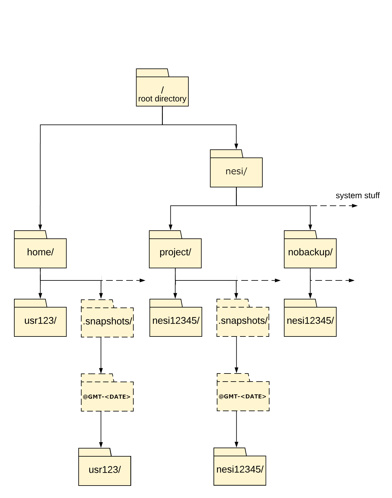

[//]: <> (REMOVE ME IF PAGE VALIDATED)
[//]: <> (vvvvvvvvvvvvvvvvvvvv)
!!! warning
    This page has been automatically migrated and may contain formatting errors.
[//]: <> (^^^^^^^^^^^^^^^^^^^^)
[//]: <> (REMOVE ME IF PAGE VALIDATED)

!!! prerequisite New Feature
     [Transparent File Compression](#h_01GZ2Q7PG53YQEKFDDWTWHHDVT) - we
     have recently started rolling out compression of inactive data on the
     NeSI Project filesystem. Please see the [documentation
     below](#h_01GZ2Q22EAZYMA7E9XG9F5FC1Z) to learn more about how this
     works and what data will be compressed.

 

[Māui](https://support.nesi.org.nz/hc/articles/360000163695) and
[Mahuika](https://support.nesi.org.nz/hc/articles/360000163575), along
with all the ancillary nodes, share access to the same IBM Storage Scale
file systems. Storage Scale was previously known as Spectrum Scale, and
before that as GPFS, or General Parallel File System - we'll generally
refer to it as "Scale" where the context is clear.

You may query your actual usage and disk allocations using the following
command: 

`$ nn_storage_quota`

The values for 'nn\_storage\_quota' are updated approximately every hour
and cached between updates.

## 

# File System Specifications

<table class="table table-bordered"
style="tr td: first-child {    white-space:nowrap;">
<colgroup>
<col style="width: 20%" />
<col style="width: 20%" />
<col style="width: 20%" />
<col style="width: 20%" />
<col style="width: 20%" />
</colgroup>
<tbody>
<tr class="odd">
<td
style="width: 84.1875px"><strong>Filesystem</strong></td>
<td style="width: 119px"><strong>/home</strong></td>
<td
style="width: 135px"><strong>/nesi/project</strong></td>
<td
style="width: 188px"><strong>/nesi/nobackup</strong></td>
<td
style="width: 116.09375px"><strong>/nesi/nearline</strong> </td>
</tr>
<tr class="even">
<td style="width: 84.1875px"><strong>Default disk space 
</strong></td>
<td style="width: 119px"> </td>
<td style="width: 135px"> </td>
<td style="width: 188px"> </td>
<td rowspan="3" style="width: 116.09375px">No default; allocations
are based on eligibility and technical requirements 
  </td>
</tr>
<tr class="odd">
<td style="width: 84.1875px"><strong>    - soft
quota</strong></td>
<td style="width: 119px">20 GB</td>
<td style="width: 135px">100 GB 
</td>
<td style="width: 188px">10 TB</td>
</tr>
<tr class="even">
<td style="width: 84.1875px"><strong>    - hard
quota</strong></td>
<td style="width: 119px"> </td>
<td style="width: 135px">110 GB</td>
<td style="width: 188px">12 TB</td>
</tr>
<tr class="odd">
<td style="width: 84.1875px"><strong>Default file count
(inode) 
</strong></td>
<td style="width: 119px"> </td>
<td style="width: 135px"> </td>
<td style="width: 188px"> </td>
<td rowspan="3" style="width: 116.09375px">No default; allocations
are based on eligibility and technical requirements 
  </td>
</tr>
<tr class="even">
<td style="width: 84.1875px"><strong>    - soft
quota</strong></td>
<td style="width: 119px">1,000,000 files</td>
<td style="width: 135px">100,000 files</td>
<td style="width: 188px">1,000,000 files</td>
</tr>
<tr class="odd">
<td style="width: 84.1875px"><strong>    - hard
quota</strong></td>
<td style="width: 119px">1,100,000 files</td>
<td style="width: 135px">110,000 files</td>
<td style="width: 188px">1,100,000 files</td>
</tr>
<tr class="even">
<td style="width: 84.1875px"><strong>Intended
use</strong></td>
<td style="width: 119px">User-specific files such as configuration
files, environment setup, source code, etc.</td>
<td style="width: 135px">Persistent project-related data,
project-related software, etc.</td>
<td style="width: 188px">Data created or used by compute jobs that
is intended to be temporary</td>
<td style="width: 116.09375px">Medium- to long-term storage of
research data associated with past, present or planned compute
projects</td>
</tr>
<tr class="odd">
<td style="width: 84.1875px"><strong>Total
capacity</strong></td>
<td style="width: 119px">175 TB</td>
<td style="width: 135px">1,590 TB</td>
<td style="width: 188px">4,400 TB</td>
<td style="width: 116.09375px">Will grow as tapes are
purchased</td>
</tr>
<tr class="even">
<td style="width: 84.1875px"><strong>Data retention
time</strong></td>
<td style="width: 119px">180 days after the user ceases to be a
member of any active project</td>
<td style="width: 135px">90 days after the end of the project's
last HPC Compute &amp; Analytics allocation. See also Transparent File
Data Compression.</td>
<td style="width: 188px">With certain exceptions, individual files
will be deleted after being untouched for 120 days. See <a
href="https://support.nesi.org.nz/hc/en-gb/articles/360001162856">Automatic
cleaning of nobackup file system</a> for more information.
90 days after the end of the project's last HPC Compute
&amp; Analytics allocation, all remaining data is subject to
deletion.</td>
<td style="width: 116.09375px">180 days after the end of the
project's last nearline storage allocation</td>
</tr>
<tr class="odd">
<td style="width: 84.1875px"><strong>Data backup schedule 
(Excluding snapsots)</strong></td>
<td style="width: 119px">Daily, last 10 versions of any given file
retained for up to 90 days.</td>
<td style="width: 135px">Daily, last 10 versions of any given file
retained for up to 90 days.</td>
<td style="width: 188px">None</td>
<td style="width: 116.09375px">Replication  between Wellington and
Auckland tape libraries (under development)</td>
</tr>
<tr class="even">
<td
style="width: 84.1875px"><strong>Snapshots</strong></td>
<td style="width: 119px">Daily (retention period 7
days)</td>
<td style="width: 135px">Daily (retention period 7
days)</td>
<td style="width: 188px">None</td>
<td style="width: 116.09375px">None</td>
</tr>
<tr class="odd">
<td style="width: 84.1875px"><strong>Access
speed</strong></td>
<td style="width: 119px">Moderate</td>
<td style="width: 135px">Moderate</td>
<td style="width: 188px">Fast</td>
<td style="width: 116.09375px">Slow</td>
</tr>
<tr class="even">
<td style="width: 84.1875px"><strong>Access
interfaces</strong></td>
<td style="width: 119px"><ul>
<li>Native Scale mounts</li>
<li>SCP</li>
<li>Globus data transfer</li>
</ul></td>
<td style="width: 135px"><ul>
<li>Native Scale mounts</li>
<li>SCP</li>
</ul></td>
<td style="width: 188px"><ul>
<li>Native Scale mounts</li>
<li>SCP</li>
<li>Globus data transfer</li>
</ul></td>
<td style="width: 116.09375px">Nearline commands</td>
</tr>
</tbody>
</table>

### **Soft versus hard quotas**

We use Scale soft and hard quotas for both disk space and inodes.

-   Once you exceed a fileset's soft quota, a one-week countdown timer
    starts. When that timer runs out, you will no longer be able to
    create new files or write more data in that fileset. You can reset
    the countdown timer by dropping down to under the soft quota limit.
-   You will not be permitted to exceed a fileset's hard quota at all.
    Any attempt to try will produce an error; the precise error will
    depend on how your software responds to running out of disk space.

When quotas are first applied to a fileset, or are reduced, it is
possible to end up with more data or files in the fileset than the quota
allows for. This outcome does not trigger deletion of any existing data,
but will prevent creation of new data or files.

### **Notes:**

-   You may request an increase in storage and inode quota if needed by
    a project. This may in turn be reduced as part of managing overall
    risk, where large amounts of quota aren't used for a long period (~6
    Months).
-   If you need to compile or install a software package that is large
    or is intended for use by a project team, please build it
    in `/nesi/project/<project_code>` rather than `/home/<username>`.
-   As the `/nesi/nobackup` file system provides the highest
    performance, input files should be moved or copied to this file
    system before starting any job that makes use of them. Likewise, job
    scripts should be written so as to write output files to the
    `/nesi/nobackup` file system. If you wish to keep your data for the
    long term, you can include as a final part of your job script an
    operation to copy or move the output data to the `/nesi/project`
    file system.
-   Keep in mind that data on `/nesi/nobackup` is not backed up,
    therefore users are advised to move valuable data
    to `/nesi/project/<project_code>`, or, if the data is seldom used,
    to other storage such as an institutional storage facility, as soon
    as batch jobs are completed. Please do **not** use the `touch`
    command to prevent the cleaning policy from removing files, because
    this behaviour would deprive the community of a shared resource.

## /home

This file system is accessible from login, compute and ancillary nodes.
Users should **not** run jobs from this filesystem. All home directories
are backed up daily, both via the Spectrum Protect backup system, which
retains the last 10 versions of all files for up to 90 days, and via
[Scale snapshots](https://support.nesi.org.nz/hc/articles/360000207315).
No cleaning policy will be applied to your home directory as long as
your My NeSI account is active and you are a member of at least one
active project.

## /nesi/project

This filesystem is accessible from all login, compute and ancillary
nodes. Contents are backed up daily, via the Spectrum Protect backup
system, which retains the last 10 versions of all files for 90 days. No
cleaning policy is applied.

It provides storage space for datasets, shared code or configuration
scripts that need to be accessed by users within a project, and
[potentially by other
projects](https://support.nesi.org.nz/hc/articles/360000205435). Read
and write performance increases using larger files, therefore you should
consider archiving small files with the `nn_archive_files` utility, or a
similar archiving package such as `tar` .

Each NeSI project receives quota allocations for
`/nesi/project/<project_code>`, based on the requirements you tell us
about in your [application for a new NeSI
project](https://my.nesi.org.nz/html/request_project), and separately
covering disk space and number of files.

## /nesi/nobackup

The `/nesi/nobackup` file system has the highest performance of all NeSI
file systems, with greater than 140 GB/s bandwidth from compute nodes to
disk. It provides access to a very large (4.4 PB) resource for
short-term project usage.

To prevent project teams from inadvertently bringing the file system
down for everyone by writing unexpectedly large amounts of data, we
apply per-project quotas to both disk space and number of files on this
file system. The default per-project quotas are as described in the
above table; if you require more temporary (scratch) space for your
project than the default quota allows for, you can discuss your
requirements with us during [the project application
process](https://support.nesi.org.nz/hc/en-gb/articles/360000202136), or
[contact our support team](https://support.nesi.org.nz/hc/requests/new)
at any time.

To ensure this file system remains fit-for-purpose, we have a regular
cleaning policy as described in [Automatic cleaning of nobackup
filesystem](https://support.nesi.org.nz/hc/en-gb/articles/360001162856).

Do not use the `touch` command or an equivalent to prevent the cleaning
policy from removing unused files, because this behaviour would deprive
the community of a shared resource.

The purpose of this policy is to ensure that any user will be able to
analyse datasets up to 1 PB in size.

## /nesi/nearline
!!! prerequisite Note
     The nearline service, including its associated file systems, is in an
     Early Access phase, and allocations are by invitation. We appreciate
     your patience as we develop, test and deploy this service. If you
     would like to participate in the Early Access Programme, please
     [contact our support
     team](https://support.nesi.org.nz/hc/requests/new).

The `/nesi/nearline` filesystem is a data cache for the Hierarchical
Storage Management System, which automatically manages the movement of
files between high performance disk storage and magnetic tape storage in
an Automatic Tape Library (ATL). Files will remain on `/nesi/nearline`
temporarily, typically for hours to days, before being moved to tape. A
catalogue of files on tape will remain on the disk for quick access.

See [this
page](https://support.nesi.org.nz/hc/en-gb/articles/360001169956) for
more information about the nearline service.

# Snapshots

If you have accidentally deleted data you can recover it from
a [snapshot](https://support.nesi.org.nz/knowledge/articles/360000207315/en-gb?brand_id=30406).
Snapshots are taken daily of `home/` and `project` directories If you
cannot find it in a snapshot, please ask us to recover it for you by
emailing [NeSI
Support](mailto:support@nesi.org.nz?subject=Please%20Recover%20a%20File).

# Contributions of Small Files Towards Quotas

The Scale file system makes use of a feature called *data-in-inode*.
This feature will ensure that, once all of a (non-encrypted) file's
required metadata has been written to our metadata storage, if all the
file's data is able to fit within the file's remaining inode space (4
KiB minus metadata), it will be written there instead of to the data
storage.

For files larger than 4 KiB (minus the space needed to store the file's
metadata), the data written to disk will be stored in one or more
sub-blocks of 256 KiB each (which are 1/32 of the filesystem Block
Size), and the "size" allocated on disk will be rounded up to the
nearest 256 KiB. Users or projects requiring many small files may find
themselves using large amounts of disk space. Use of *data-in-inode*
mitigates the effect of a large block size on such people and project
teams.

However, very small files, as well as zero-size entities such as
directories and symbolic links, still count towards the relevant
fileset's inode quota. If therefore you expect you will need to store
large numbers of very small files in your home directory or in a
project's persistent storage, please [contact our support
team](https://support.nesi.org.nz/hc/en-gb/requests/new) to discuss your
storage needs.

# Transparent File Data Compression

The Scale file system has the ability to transparently compress file
data. That is, file contents/data can be compressed behind the scenes,
taking up less space on disk, while appearing uncompressed to
applications reading or altering the file. Scale automatically handles
decompression before passing data to user-space applications. This
in-line decompression may have a small IO performance/latency impact,
though this is mitigated by space and bandwidth savings.

Transparent file data compression can be controlled and applied by users
via file attributes, you can find out more about using this method on
our [Data Compression support
page](https://support.nesi.org.nz/hc/en-gb/articles/6359601973135). File
data compression can also be automatically applied by administrators
through the Scale policy engine. We leverage this latter feature to
regularly identify and compress inactive data on the `/nesi/project`
file system.

## What Project data is automatically compressed?

Our current policy compresses files that have not been accessed (either
read from or written to) within the last 365 days, i.e., very inactive
cold data. We may decrease this in future.

Additionally, we only automatically compress files in the range of 4kB -
10GB in size. Files larger than this can be compressed by user
interaction - see the instructions for the `mmchattr` command on
the [Data Compression support
page](https://support.nesi.org.nz/hc/en-gb/articles/6359601973135). Also
note that the Scale filesystem will only store compressed blocks when
the compression space saving is &gt;=10%.
