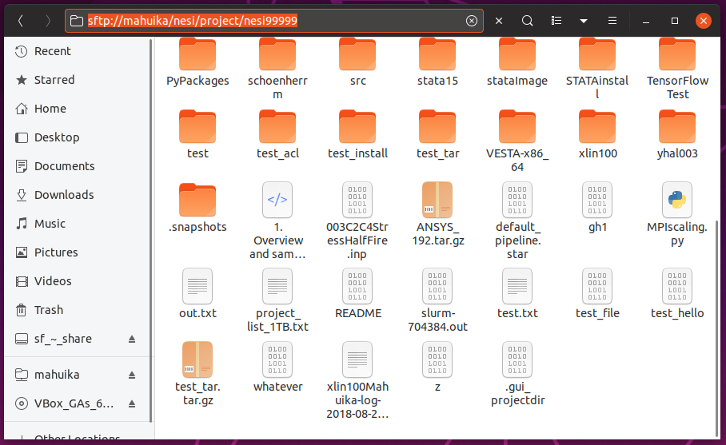

!!! prerequisite
    Have an [active account and project.](../Getting_Started/Creating_an_Account.md)

Find more information on [our filesystem](./File_Systems_and_Quotas/Filesystems_and_Quotas.md).

## OnDemand

Requiring only a web browser, the instructions are same whether your are connecting from a Windows, Mac or a Linux computer.
See [OnDemand how to guide](../Interactive_Computing/OnDemand/how_to_guide.md) for more info.

## Standard Terminal

!!! prerequisite
    Have SSH setup as described in [Standard Terminal Setup](../Getting_Started/Accessing_the_HPCs/Standard_Terminal_Setup.md)

In a local terminal the following commands can be used to:

Move a file from your local machine to Mahuika.

```bash
scp <path/filename> mahuika:<path/filename>
```

Move a file from Mahuika to your local machine.

```bash
scp mahuika:<path/filename> <path/filename>
```

!!! note
    - This will only work if you have set up aliases as described in
      [Terminal Setup](../Getting_Started/Accessing_the_HPCs/Standard_Terminal_Setup.md).
    - As the term 'mahuika' is defined locally, the above
      commands *only works when using a local terminal* (i.e. not on Mahuika).
    - If you are using Windows subsystem, the root paths are different
      as shown by Windows. e.g. `C:` is located at `/mnt/c/`

`scp` stands for Secure CoPy and operates in a similar way to regular cp
with the source file as the left term and destination on the right.

These commands make use of *multiplexing*, this means that if you
already have a connection to the cluster you will not be prompted for
your password.

## File Managers

!!! prerequisite
    Have SSH setup as described in [Standard Terminal Setup](../Getting_Started/Accessing_the_HPCs/Standard_Terminal_Setup.md)

Most file managers can be used to connect to a remote directory simply
by typing in the address bar provided your have an active connection to
the cluster.

For Nautilus (Ubuntu default) just prepend the path you want to connect
to with `sftp://mahuika`. (ctrl + L opens address bar)

This **does not** work for File Explorer (Windows default)

This **does not** work for Finder (Mac default)



If your default file manager does not support mounting over SFTP, see
[Can I use SSHFS to mount the cluster filesystem on my local machine?](../Getting_Started/FAQs/Can_I_use_SSHFS_to_mount_the_cluster_filesystem_on_my_local_machine.md).

## MobaXterm

!!! prerequisite
    [MobaXterm Setup Windows](../Getting_Started/Accessing_the_HPCs/MobaXterm_Setup_Windows.md)

See [Standard Terminal](Moving_files_to_and_from_the_cluster.md#standard-terminal), [Rclone](Moving_files_to_and_from_the_cluster.md#rclone), or [Rsync](Moving_files_to_and_from_the_cluster.md#rsync) for information on how to move files to and from the HPC in the terminal.

## WinSCP

!!! prerequisite
    [WinSCP-PuTTY Setup Windows](../Getting_Started/Accessing_the_HPCs/WinSCP-PuTTY_Setup_Windows.md)

As WinSCP uses multiple tunnels for file transfer you will be required
to authenticate again on your first file operation of the session. The
second prompt for your second factor authentication can be skipped, just the same as with login
authentication.

## Globus

Globus is available for those with large amounts of data, security
concerns, or connection consistency issues.
You can find more details in
[Data_Transfer_using_Globus](./Data_Transfer_Services/Data_Transfer_using_Globus.md).

## Rclone

Rclone is available for those that need to transfer data from cloud
storage services like Google drive or OneDrive.

To use Rclone on Mahuika, you first need to module load it:

```bash
module load rclone
```

The basic command syntax of Rclone:

```bash
rclone subcommand options source:path dest:path
```

The most frequently used Rclone subcommands:

- `rclone copy` - Copy files from the source to the destination, skipping what has already been copied.
- `rclone sync` - Make the source and destination identical, modifying only the destination.
- `rclone move` - Move files from the source to the destination.
- `rclone delete` - Remove the contents of a path.

A more extensive list can be found in the [Rclone documentation](https://rclone.org/docs).

## Rsync

Rsync is an utility that provides fast incremental file transfer and
efficient file synchronization between a computer and a storage disk.
The basic command syntax of:

```bash
rsync -options source target
```

If the data source or target location is a remote site, it is defined
with syntax:

```txt
userame@server:/path/in/server
```

The most frequently used Rsync options:

- `-r` - Recurse into directories.
- `-a` - Use archive mode: copy files and directories recursively and preserve access permissions and time stamps.
- `-z` - Compress.
- `-e ssh` - Specify the remote shell to use.
- `-n` - Show what files would be transferred.

A more extensive list can be found in the [Rsync documentation](https://download.samba.org/pub/rsync/rsync.1).
