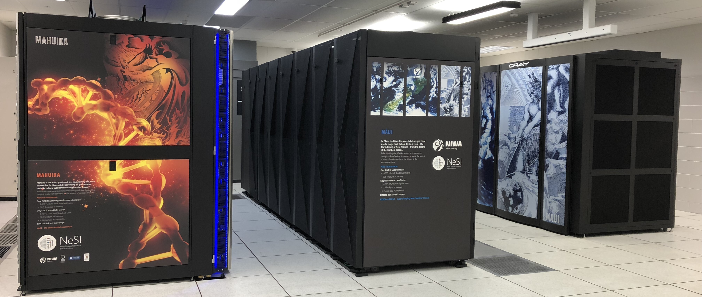

!!! time "10 Minutes"

!!! objectives
    - Understand key terminology.
    - Distinguish between remote and local hardware.
    - Describe key components of cluster architecture.

## What Is an HPC System?

The words "cloud", "cluster", and the phrase "high-performance computing" or
"HPC" are used a lot in different contexts and with various related meanings.
So what do they mean? And more importantly, how do we use them in our work?

A *Remote* computer is one you have no access to physically and must connect via a network (as opposed to *Local*)

*Cloud* refers to remote computing resources
that are provisioned to users on demand or as needed.

*HPC*, *High Performance Computer*, *High Performance Computing* or *Supercomputer* are all general terms for a large or powerful computing resource.

*Cluster* is a more specific term describing a type of supercomputer comprised of multiple smaller computers (nodes) working together.
Almost all supercomputers are clusters.

*The REANNZ High Performance Computers*

## Access

You will connect to a cluster over the internet either with a web client ([OnDemand](../../Interactive_Computing/OnDemand/index.md)) or with [SSH (**S**ecure **Sh**ell)](../../Getting_Started/Accessing_the_HPCs/Connecting_to_the_Cluster.md).
Your main interface with the cluster will be using command line.

## Nodes

Individual computers that compose a cluster are typically called *nodes*.
On a cluster, there are different types of nodes for different
types of tasks. The node where you are now will be different depending on
how you accessed the cluster.

You will be on a *login node*.

Both OnDemand and SSH login nodes serve as an access point to the cluster.

The real work on a cluster gets done by the *compute nodes*.
Compute nodes come in many shapes and sizes, but generally are dedicated to long
or hard tasks that require a lot of computational resources.

## What's in a Node?

A node is similar in makeup to a regular desktop or laptop, composed of *CPUs* (sometimes also called *processors* or *cores*), *memory*
(or *RAM*), and *disk* space. Although, where your laptop might have 8 CPUs and 16GB of memory, a compute node will have hundreds of cores and GB of memory.

- **CPUs** are a computer's tool for running programs and calculations.

- **Memory** is for short term storage, containing the information currently being operated on by the CPUs.

- **Disk** is for long term storage, data stored here is permanent, i.e. still there even if the computer has been restarted.
It is common for nodes to connect to a shared, remote disk.

!!! info "Differences Between Nodes"
    Many HPC clusters have a variety of nodes optimized for particular workloads.
    Some nodes may have larger amount of memory, or specialized resources such as
    Graphical Processing Units (GPUs).

!!! info "Dedicated Transfer Nodes"
    If you want to transfer larger amounts of data to or from the cluster, REANNZ
    offers dedicated transfer nodes using the Globus service.  
    More information on using Globus for large data transfer to and from the cluster can be found on the
    [Globus Transfer Service](../../Data_Transfer/Globus/Globus_Overview.md) page.

<quiz>
I think it would be good to have a question here to introduce the concept of the 'quiz'

- [x] Yes, agreed
- [] No, I don't think so.

Correct! It would be a good idea.
</quiz>

!!! keypoints
    - A 'cluster' describes a particular architecture of HPC.
    - Remote hardware must be accessed via SSH, or a dedicated web client.
    - Clusters have specialised nodes for different tasks.

!!! postrequisites "What Next"
    - [Bash Shell](Bash_Shell.md)
