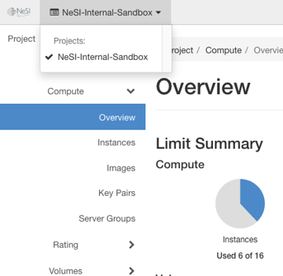

## Create a Network

Log into the [NeSI FlexiHPC Dashboard](https://dashboard.cloud.nesi.org.nz/)

Select the project you would like to deploy the new instance too (Use the project selector on the top left-hand side):

<figure markdown>
  
</figure>

Open the `Identity` tab and click `Application Credentials` category

<figure markdown>
  
</figure>

Click `Create Application Credentials`

Within the `Create Application Credentials` dialog we have the following options

`Name`
:   This is a required field. A name for your Application Credentials, an example could be terraform-deployment

`Description`
:   A friendly description for the Application Credentials 

`Secret`
:   If this field is left blank then one will be automatically generated for you, however you have the ability to provide one yourself should you choose.

`Expiration Date`
:   The day that you wish for this Application Credentials to expire, example is you may only want these to last 1 month and as part of maintenance each month you roll new credentials. If left blank it will default to never expire

`Expiration Time`
:   The time you wish for this Application Credentials to expire, example could be 23:59 on the first Monday of each month so it gives you the Monday morning to roll new credentials. If left blank and `Expiration Date` is set it will default to 00:00:00

!!! note
    Expiration Date and Time will be in UTC format.

`Roles`
:   You may select one or more roles for this application credential. If you do not select any, all of the roles you have assigned on the current project will be applied to the application credential. Example here is my user has `[admin, member, reader]` associated with it so if I don't pick any roles the `Application Credentials` will be given the same permissions.

`Access Rules`
:   If you want more fine-grained access control delegation, you can create one or more access rules for this application credential. The list of access rules must be a JSON- or YAML-formatted list of rules each containing a service type, an HTTP method, and a URL path, for example:
    ``` json title="JSON example"
    [
      {
        "service": "compute",
        "method": "POST",
        "path": "/v2.1/servers"
      }
    ]
    ```

    ``` yaml title="YAML example"
    - service: compute
    method: POST
    path: /v2.1/servers
    ```

`Unrestricted (Dangerous)`
:   By default, for security reasons, application credentials are forbidden from being used for creating additional application credentials or keystone trusts. If your application credential needs to be able to perform these actions, check "unrestricted".

    !!! warning
        This is potentially dangerous behavior and is disabled by default

Once all the required fields are completed click on `Create Application Credential`

Another dialog will appear that has your newly created `Application Credential` secret. The application credential secret will not be available after closing this page, so you must capture it now or download it. If you lose this secret, you must generate a new application credential.

## Deleting Application Credentials

Log into the [NeSI FlexiHPC Dashboard](https://dashboard.cloud.nesi.org.nz/)

Select the project you would like to deploy the new instance too (Use the project selector on the top left-hand side):

<figure markdown>
  
</figure>

Open the `Identity` tab and click `Application Credentials` category

Using the check box select the `Application Credentials` you would like to delete and the `Delete Application Credentials` should become clickable in the top right

<figure markdown>
  
</figure>

Click `Delete Application Credentials` and a confirmation dialog will appear

Confirm the deletion by clicking `Delete Application Credentials`