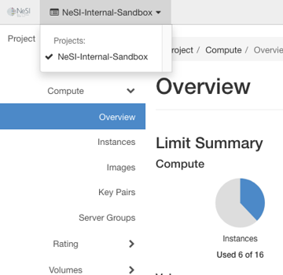
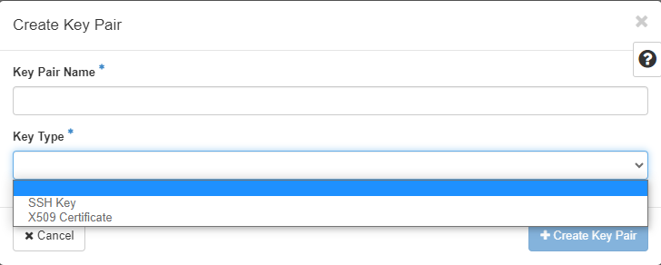
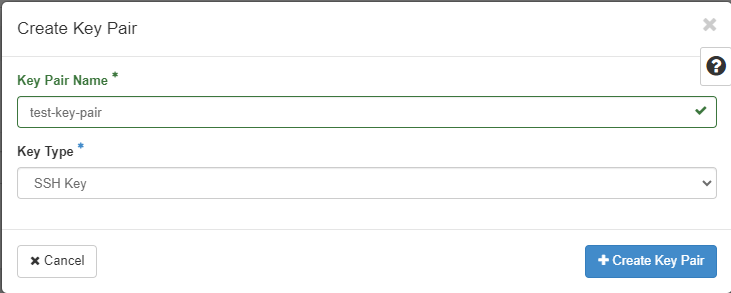
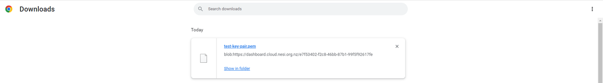

## Create a Keypair

Log into the [NeSI FlexiHPC Dashboard](https://dashboard.cloud.nesi.org.nz/)

Select the project you would like to deploy the new instance too (Use the project selector on the top left-hand side):

<figure markdown>
  
</figure>

Open the `Project` tab, open the `Compute` tab and select the `Key Pairs` category

Click `Create Key Pair`.

<figure markdown>
  
</figure>

In the `Create Key Pair` dialog box, enter a name for your `key pair,` and select a `Key Type`

`Key Type`
:   Select one of the following options

    - `SSH Key`
    :   This will be the common picked `Key Type` as we will use this to SSH to most compute instances.

    - `X509 Certificate`
    :   This will be used to generate an Certificate based key.

<figure markdown>
  
</figure>

Once all fields are supplied click `Create Key Pair`

The private key will be downloaded automatically

<figure markdown>
  
</figure>

To change its permissions so that only you can read and write to the file, run the following command:

```
chmod 0600 yourPrivateKey.pem
```

!!! note
    If you are using the Dashboard from a Windows computer, use PuTTYgen to load the `*.pem` file and convert and save it as `*.ppk`. For more information see the [WinSCP web page for PuTTYgen](https://winscp.net/eng/docs/ui_puttygen).

To make the key pair known to SSH, run the ssh-add command.

```
ssh-add yourPrivateKey.pem
```

## Import a Key Pair

Log into the [NeSI FlexiHPC Dashboard](https://dashboard.cloud.nesi.org.nz/)

Select the project you would like to deploy the new instance too (Use the project selector on the top left-hand side):

<figure markdown>
  
</figure>

Open the `Project` tab, open the `Compute` tab and select the `Key Pairs` category

Click `Import Key Pair`.

In the `Import Key Pair` dialog box, enter the name of your key pair, copy the public key into the `Public Key` box, and then click `Import Key Pair`.

The Compute database registers the public key of the key pair.

The Dashboard lists the key pair on the `Key Pairs` tab.