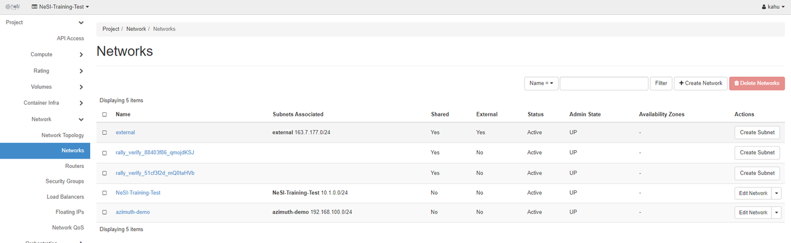
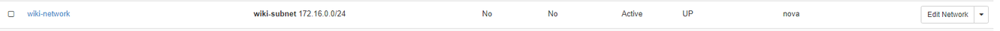
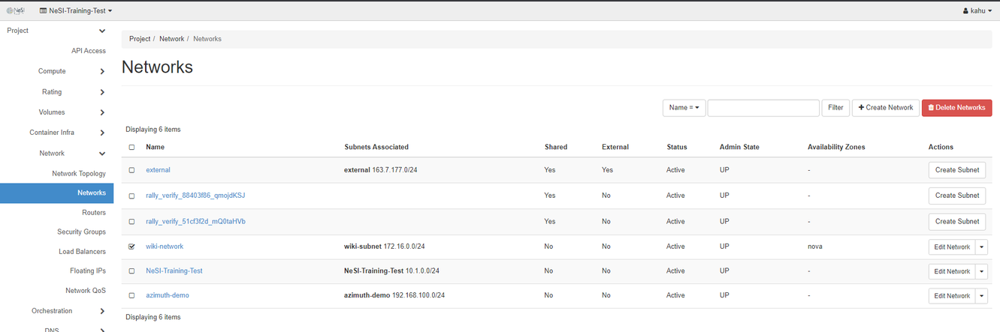

## Create a Network

Log into the [NeSI FlexiHPC Dashboard](https://dashboard.cloud.nesi.org.nz/)

Select the project you would like to deploy the new instance too (Use the project selector on the top left-hand side):

<figure markdown>
  
</figure>

Open the `Project` tab, open the `Network` tab and select the `Networks` category

<figure markdown>
  
</figure>

Click `Create Network` on the right hand side

Within the `Create Network > Network` dialog you have the following options.

`Network Name`
:   A friendly name for your network

`Enable Admin State`
:   If checked this will enable the network, by default leave this set to true

`Create Subnet`
:   If checked this will enable the creation of a subnet, by default leave this set to true

`Availability Zone Hints`
:   Availability zones where the DHCP agents can be scheduled. Leaving this unset is the same as selecting all Availability zones. As FlexiHPC only has 1 zone nova this value can be left unset

`MTU`
:   Maximum Transmission Unit. An MTU is the largest size frame or packet -- in bytes or octets (eight-bit bytes) -- that can be transmitted across a data link. Leaving this unset is the default unless you know what you are doing here.

Click `Next`

Within the `Create Network > Subnet dialog` you have the following options

`Subnet Name`
:   A friendly name for your subnet

`Network Address`
:   The network address in CIDR format e.g. 192.168.0.0/24 if its IPv4

`IP Version`
:   If your Network Address is an IPv4 then pick that otherwise pick IPv6. IPv4 is generally the default

`Gateway IP`
:   IP address of the gateway is generally the first IP of the network address, from our Network Address example above it would be 192.168.0.1. To use the default leave this blank.

`Disable Gateway`
:   Should you not want a gateway then check this. By default you will want your network to have a gateway.

Click `Next`

Within the `Create Network > Subnet Details` dialog you have the following options

`Enable DHCP`
:   This allows the network to auto assign an IP when a compute instance is attached to it

`Allocation Pools`
:   The IP’s you would like to allocate to compute instances when they are attached. The format should be start_ip_address,end_ip_address using our Network Address example it would be 192.168.0.20,192.168.0.50. Leave blank if you want to use any IP addresses from the specified Network Address

`DNS Name Servers`
:   Should you wish to use different name servers then the ones FlexiHPC uses please enter then here, one per line.

`Host Routes`
:   Additional Routes announced to the hosts. The format should be destination_cidr,nexthop. This is used should you wish to have separate networks that want to communicate with each other. 

Click `Create` and it should start to create your new network

<figure markdown>
  
</figure>

## Delete a network

Log into the [NeSI FlexiHPC Dashboard](https://dashboard.cloud.nesi.org.nz/)

Select the project you would like to deploy the new instance too (Use the project selector on the top left-hand side):

<figure markdown>
  
</figure>

Open the `Project` tab, open the `Network` tab and select the `Networks` category

Select the network you wish to delete with the check box

<figure markdown>
  
</figure>

The `Delete Network` button should become a solid red

Click `Delete Network`

Within the `Confirm Delete Network` dialog ensure you have selected the correct network that is displayed.

Click `Delete Networks`

The network should now be deleted